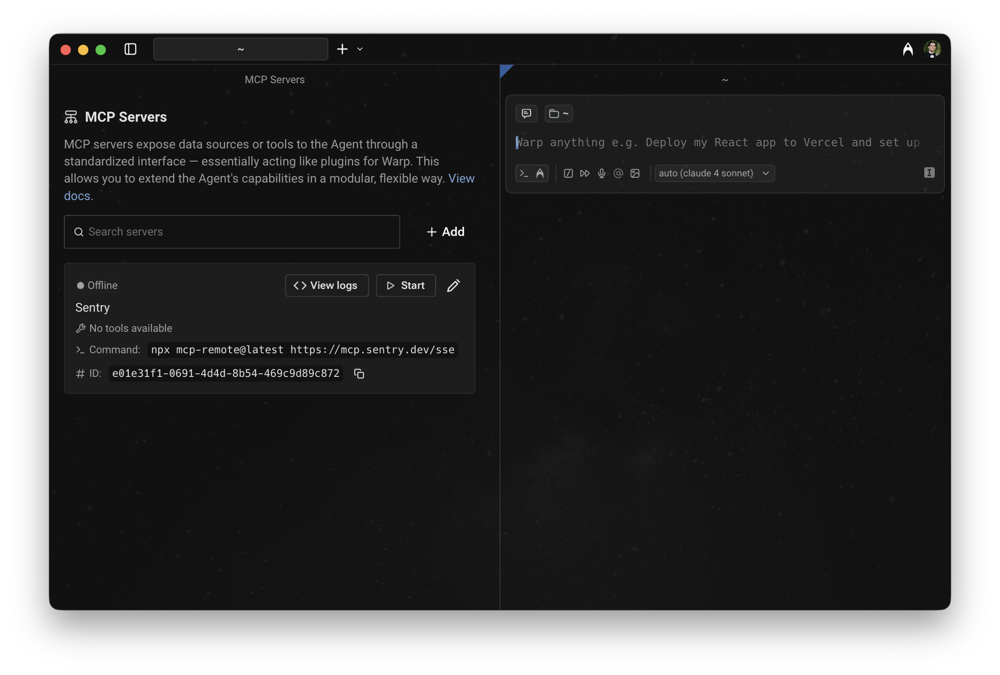

# Oz CLI


The Oz CLI is under development and only supports some operations.
\
We welcome [feedback](https://docs.warp.dev/support-and-community/troubleshooting-and-support/sending-us-feedback#sending-warp-feedback) on how you're building with the CLI and on any missing functionality!


## What is the Oz CLI?

The Oz CLI is the command-line tool that lets you run [Cloud Agents](https://docs.warp.dev/agent-platform/cloud-agents/cloud-agents-overview) from anywhere, including terminals, scripts, automated systems, or services.

It's the standard runtime entry point that turns a **prompt** plus **configuration** into an **executable agent task** that runs on either a **Warp-hosted or self-hosted runner**.&#x20;

With the Oz CLI, you can:

* Run agents locally for development and debugging
* Run agents on remote machines
* Connect agents to MCP servers like GitHub and Linear
* Configure integrations that connect agents to Slack, Linear, and other trigger surfaces

## Quickstart Guide

Set up and run your first cloud agent in less than 5 minutes.

### 1. Installing the CLI

If you already have the [Warp desktop app installed](https://docs.warp.dev/getting-started/quickstart-guide/installation-and-setup), the **CLI is included** and available in the Warp terminal.&#x20;

If not, see [Installing the CLI](#installing-the-cli) for installation options for all platforms.

### 2. Authenticate

For local development and first-time setup, authenticate interactively using the `oz login` command. Use the appropriate command name based on your installation method. For command names, refer to the table in [Running the CLI](#running-the-cli).

**For example, on macOS:**

```sh
oz login
```

This command prints a sign-in URL in your terminal. Open the URL in your browser to login to Warp. Your credentials will be stored securely for future CLI use.

Interactive login works on both **local** and **remote** machines, and does not require API keys.

### 3. Run an agent

From any directory, run:

```sh
oz agent run --prompt "summarize this directory"
```

This uses the default agent profile, loads any available MCP servers, and executes the run locally. The output appears directly in your terminal.

What happens:

* Warp starts a new cloud agent session.
* The agent is given access to your current working directory.
* The agent autonomously executes commands and streams output to your terminal.

### 4. Add GitHub context (optional)

If the directory is a Git repository, the Oz CLI can use GitHub as an MCP server:

```sh
oz mcp add github
oz agent run --prompt "Open a pull request that fixes TODOs in this repo"
```

You'll be prompted to authorize the Warp GitHub App if you haven't already.

### 5. Next steps

Once you've successfully set up and ran your agent, explore other configurations and workflows with the Oz CLI:

* Customize behavior with [agent profiles.](./#using-agent-profiles)
* [Reuse prompts](./#using-saved-prompts) with `--saved-prompt`.
* Connect agents to external systems [using MCP servers](./#using-mcp-servers).
* Authenticate with [API keys](api-keys.md) for automated environments or workflows.
* Get up-to-date information about the Oz CLI using the [`help` command.](./#getting-help)

Continue reading to learn how to install the CLI on different platforms, authenticate in different environments, and configure agents for real-world workflows.

***

## Installing the CLI

You can install the Oz CLI as part of the Warp desktop app, or as a standalone package.&#x20;

### Bundled with Warp

The Oz CLI is automatically distributed with the Warp desktop app and can be used right away with the Warp terminal. To make the CLI globally available, add it your `PATH`.



To add the Oz CLI to your `PATH`,:

1. Open the [Command Palette](https://docs.warp.dev/terminal/command-palette) (`CMD+P` )&#x20;
2. In the search field, find and select the `Install Oz CLI Command` action.


**Note:** Administrator permissions are required to install the CLI into `/usr/local/bin` .




In the Warp installer, select `Add Warp to PATH`. If you are installing for all users, this will put the CLI on the system path. Otherwise, the CLI is only added to the path for your account.



To run the Oz CLI on Linux, use the same command that you'd use to start Warp normally. If you installed Warp via a package manager, it should already be on the system `PATH`.



### Standalone package

Warp provides standalone packages for the CLI on macOS and Linux, without the Warp app.



On macOS, we recommend that you install and update the standalone CLI with [Homebrew](https://brew.sh/), using the [`warpdotdev/warp` tap](https://github.com/warpdotdev/homebrew-warp):

```sh
$ brew tap warpdotdev/warp
$ brew update
$ brew install --cask oz
```

If you're using Warp Preview, install the preview version of the CLI instead:

```sh
brew install --cask oz@preview
```

***

You can also download the CLI directly from these URLs:

* [Apple Silicon](https://app.warp.dev/download/cli?os=macos\&package=tar\&arch=aarch64)
* [Intel](https://app.warp.dev/download/cli?os=macos\&package=tar\&arch=x86_64)
* [Apple Silicon, Warp Preview](https://app.warp.dev/download/cli?os=macos\&channel=preview\&package=tar\&arch=aarch64)
* [Intel, Warp Preview](https://app.warp.dev/download/cli?os=macos\&channel=preview\&package=tar\&arch=x86_64)


**Note:** These builds do not auto-update.




On Linux, we recommend that you install and update the standalone CLI through your distribution's package manager. We support `apt`, `yum`, and `pacman`.

1. Add the Warp package repository for your distribution (see the [installation instructions](https://docs.warp.dev/getting-started/quickstart-guide/installation-and-setup)).&#x20;
2. Install either the stable or Preview package (replace `apt` with `yum` or `pacman` as needed):

```sh
# Stable
sudo apt install oz-stable

# Preview (beta/early-access)
sudo apt install oz-preview

```


**Note:** The package name (`oz-stable`) differs from the CLI command executable (`oz`). After installation, use the CLI via `oz` commands.


***

You can also install the CLI by downloading a package directly. These installers automatically add the Warp repository, so future updates come through your package manager:

* x86-64: [`.deb`](https://app.warp.dev/download/cli?os=linux\&package=deb\&arch=x86_64), [`.rpm`](https://app.warp.dev/download/cli?os=linux\&package=rpm\&arch=x86_64), [pacman](https://app.warp.dev/download/cli?os=linux\&package=pacman\&arch=x86_64)
* aarch64: [`.deb`](https://app.warp.dev/download/cli?os=linux\&package=deb\&arch=aarch64), [`.rpm`](https://app.warp.dev/download/cli?os=linux\&package=rpm\&arch=aarch64), [pacman](https://app.warp.dev/download/cli?os=linux\&package=pacman\&arch=aarch64)



A standalone CLI package is not currently available on Windows. To use the Oz CLI on Windows, install the Warp app, which bundles the CLI.

You can install Warp using [WinGet](https://learn.microsoft.com/en-us/windows/package-manager/winget/):

```powershell
winget install Warp.Warp
```

After installation, see [Bundled with Warp](#bundled-with-warp) for instructions on adding the CLI to your `PATH`.



## Running the CLI

The command to run the Oz CLI depends on your OS, whether you installed the CLI as part of Warp or as a standalone package, and whether you're using the stable build or [Warp Preview](https://docs.warp.dev/support-and-community/community/warp-preview-and-alpha-program).

| OS      | Installation Method | CLI Command | CLI Command (Preview) |
| ------- | ------------------- | ----------- | --------------------- |
| macOS   | Standalone          | `oz`        | `oz-preview`          |
| macOS   | Bundled             | `oz`        | `oz-preview`          |
| Linux   | Standalone          | `oz`        | `oz-preview`          |
| Linux   | Bundled             | `oz`        | `oz-preview`          |
| Windows | Bundled             | `oz`        | `oz-preview`          |

## Logging in

The Oz CLI supports two authentication methods, depending on where and how you're running agents.

* **Interactive login —** best for local machines where you have Warp installed and can authenticate through a browser.
* **API keys** — best for automated or remote environments that need to authenticate without human interaction.

### Interactive login (local machines)

Use interactive login when you’re working on a machine where you already use the Warp app, or when you can open a browser to complete authentication.

If you use the CLI on a host where you're already signed in to Warp, it automatically reuses your existing credentials.

To authenticate interactively:

```bash
oz login
```

Replace `oz` with the appropriate command name for your installation method according to the table in [Running the CLI](./#running-the-cli).

The CLI prints out a URL that you can open in any browser to login to Warp.

### API key authentication

Use an API key when the environment must authenticate on its own, such as CI pipelines, headless servers, VMs, Codespaces, or containers. API keys let the CLI authenticate non-interactively.

For detailed instructions on creating, managing, and using API keys, see [API Keys](api-keys.md).

**Quick start:**

```sh
$ export WARP_API_KEY="wk-xxx..."
$ oz agent run --prompt "analyze this codebase"
```

***

## Running agents

The Oz CLI offers two ways to run agents, depending on where you want the work to happen:

**Use `oz agent run` when:**

* You're developing locally and want immediate feedback
* You need the agent to work with files in your current directory
* You want to inspect and modify the agent's work in real time
* You're debugging or iterating on prompts

**Use `oz agent run-cloud` when:**

* You want the agent to run on a remote machine or standardized environment
* You're triggering agent work from CI/CD or automated systems
* You need the agent to run independently of your local session
* You're delegating work that doesn't require your immediate attention

### Running locally: \`oz agent run\`

To start a Warp agent, use the `oz agent run` subcommand. You'll need to specify a prompt and, optionally, the [MCP servers](https://docs.warp.dev/agent-platform/capabilities/mcp) and [agent profile](https://docs.warp.dev/agent-platform/capabilities/agent-profiles-permissions) to use.

```sh
oz agent run --prompt "set up a new Rust crate named warp-cli"
I'll run a few terminal commands to:
- Check if this is a Git repo and Cargo workspace
- Create a new binary crate named warp-cli
```

**Key flags:**

* `--cwd <PATH>` — run from a different directory.
* `--share` — share the session with teammates (see [Collaboration](./#collaboration)).
* `--profile <ID>` — use a specific agent profile (see [Using Agent Profiles](./#using-agent-profiles)).
* `--model <MODEL_ID>` — override the default model (see [Model Choice](https://docs.warp.dev/agent-platform/capabilities/model-choice)).
* `--skill <SPEC>` — use a skill as the base prompt (see [Using Skills](./#using-skills)).

The agent will automatically carry out the task you gave it, printing out tool calls and responses as it works.&#x20;

By default, the agent runs in your current working directory. To run from a different directory, use the `-C/--cwd` flag.&#x20;

### Running agents remotely: \`oz agent run-cloud\`

Cloud runs dispatch tasks to remote environments. Use cloud runs for:

* Background processing
* Standardized team configurations
* Remote execution on servers you don't directly access

```sh
oz agent run-cloud \
  --environment SVhg783GBFQHk1OfdPfFU9 \
  --name "Repo summary" \
  --prompt "Summarize this repo and list the top 5 risky areas" \
  --open
```

**Key flags**

* `--environment <ENVIRONMENT_ID> (-e)` — select the environment to run in (this is the main knob that makes the run execute in the cloud).
* `--open` — view the agent's session in Warp once it's available.
* `--name <NAME>` — label the run for grouping and traceability (see [Naming runs](./#naming-runs) below).
* `--profile <PROFILE_ID>` — select an execution profile (defaults if omitted).
* `--mcp <SPEC>` — start one or more MCP servers before execution (UUID, JSON file path, or inline JSON).
* `--model <MODEL_ID>` — override the default model.
* `--skill <SPEC>` — use a skill from the environment's repository as the base prompt (see [Using Skills](./#using-skills)).

**Key differences from `run`**

* No `--cwd` — the environment determines the working directory.
* No `--share` — sharing options are on `run`, not `run-cloud`.

#### Naming runs <a href="#naming-runs" id="naming-runs"></a>

The `--name` flag assigns a config name to the run. Use it to group related runs under a shared label so you can filter, search, and track them later.

**How names work:**

* **Skill-based runs** — When you run an agent from a [skill](https://docs.warp.dev/agent-platform/capabilities/skills), the name is automatically set to the skill name. You don't need to pass `--name` explicitly.
* **Custom runs** — When you build your own automation (via the CLI, API, or SDK), set `--name` to a consistent value that describes the workflow's intent.

**Why naming matters:**

When your team runs many agents across schedules, integrations, and ad-hoc triggers, `name` lets you answer questions like "how many distinct workflows are we running?" and "how often does this particular workflow run?" You can filter runs by name using the `name` query parameter on `GET /agent/runs` in the [Oz Agent API](https://docs.warp.dev/reference/api-and-sdk).

**Examples:**

```sh
# Name a recurring workflow for easy tracking
oz agent run-cloud \
  --environment SVhg783GBFQHk1OfdPfFU9 \
  --name "nightly-dependency-check" \
  --prompt "Check for outdated dependencies and open a PR with updates"

# Skill-based runs are named automatically
oz agent run-cloud \
  --environment SVhg783GBFQHk1OfdPfFU9 \
  --skill "myorg/backend:code-review" \
  --prompt "review the latest PR"
```

**When cloud runs fail**

* Verify your environment has the correct repository and context.
* Check that your profile allows the commands and MCP servers needed.
* Ensure environment variables are set in the environment, not your local shell.

#### Reusing saved prompts <a href="#reusing-saved-prompts" id="reusing-saved-prompts"></a>

When you find prompts that work well, save them in [Warp Drive](https://docs.warp.dev/knowledge-and-collaboration/warp-drive) to reuse across sessions, share with teammates, and integrate into automated workflows. For more information, see [Prompts](https://docs.warp.dev/knowledge-and-collaboration/warp-drive/prompts).

To reuse a prompt, first find its ID. The ID of a saved prompt will be the last part of its Warp Drive [Sharing a drive object using links](https://docs.warp.dev/knowledge-and-collaboration/warp-drive#sharing-a-drive-object-using-links).

For example, in the URL:

```
https://staging.warp.dev/drive/prompt/Fix-compiler-error-sgNpbUgDkmp2IImUVDc8kR
```

... the ID is `sgNpbUgDkmp2IImUVDc8kR`.

You can reference [saved prompts](https://docs.warp.dev) using the `--saved-prompt` flag:

```bash
$ oz agent run --saved-prompt sgNpbUgDkmp2IImUVDc8kR
...
```

#### Referencing Warp Drive objects <a href="#referencing-warp-drive-objects" id="referencing-warp-drive-objects"></a>

Use `<workflow:id>`, `<notebook:id>`, or `<rule:id>` in prompts to reference [Warp Drive objects](https://docs.warp.dev/knowledge-and-collaboration/warp-drive) and [rules](https://docs.warp.dev/knowledge-and-collaboration/rules) as attached context. To quickly create these references, use the [@ context menu](https://docs.warp.dev/agent-platform/local-agents/agent-context/using-to-add-context) in Warp to construct a prompt, and then copy it into your CLI command.

```
$ oz agent run --prompt "Follow the instructions in <notebook:gq1CMAUWLtaL1CpEoTDQ3y>"
...
```

## Using agent profiles

Agent profiles control three things:

* **What the agent can do** — file access, command execution, and MCP server usage.
* **How the agent works** — Model selection, autonomy level, and response style.
* **Where the agent can act** — Directory allowlists/denylists.

You can create and configure agent profiles in the Warp app. For detailed instructions, see [Agent Profiles & Permissions](https://docs.warp.dev/agent-platform/capabilities/agent-profiles-permissions).

Agent profiles are automatically synced to each host that you have Warp installed on, so you can still use them remotely.


**Tip**: For CLI usage, create a dedicated profile. The CLI will fail if it tries to execute a prohibited action, so make sure your profile allows the directories, commands, and MCP servers that you'd like the agent to use.



The default profile for CLI usage is broadly permissive and gives the agent the ability to read/write files, apply code diffs, and execute commands (with a default denylist). The agent does not have the ability to use MCP servers by default.


To use an agent profile with the CLI, first find the profile ID using the `oz agent profile list` command:

```sh
$ oz agent profile list
+--------------+------------------------+
| Name         | ID                     |
+=======================================+
| Default      | AnTb02PZfrkVC9l4V15eH1 |
|--------------+------------------------|
| Coding       | CWhozDJPdPCsjJ1pSG0HCN |
|--------------+------------------------|
| Command Line | hV6n5dNm7ThQVlOiPF8DLS |
+--------------+------------------------+
```

Then, select that profile using the `--profile` flag:

```sh
$ oz agent run --profile CWhozDJPdPCsjJ1pSG0HCN --prompt "update my CI pipeline to use nextest"
...
```

## Using MCP servers

MCP servers connect cloud agents to interact with external systems like GitHub, Linear, or Sentry. To use a [Model Context Protocol (MCP)](https://docs.warp.dev/agent-platform/capabilities/mcp) server from the CLI, you need:

* An MCP server configured in Warp
* An agent profile that allows for the MCP server you want to use
* Environment variables for authentication (if required)

There are two ways to start MCP servers with the agent:

1. If the selected agent profile allows _specific_ MCP servers, they will start automatically.
2. If the selected agent profile allows _any_ MCP server, you must specify the ones to start using the `--mcp-server` flag.

To start specific MCP servers, first get the MCP server ID using  `oz mcp list`:

```sh
$ oz mcp list
+--------------------------------------+--------+
| UUID                                 | Name   |
+===============================================+
| 1deb1b14-b6e5-4996-ae99-233b7555d2d0 | github |
|--------------------------------------+--------|
| 65450c32-9eb1-4c57-8804-0861737acbc4 | linear |
|--------------------------------------+--------|
| d94ade64-0e73-47a6-b3ee-14e5afec3d90 | Sentry |
+--------------------------------------+--------+
```

Alternatively, you can copy the server ID from the MCP servers page in Warp:

1. Click your profile photo in the top-right corner, then click **Settings.**&#x20;
2. In the sidebar, click **MCP Servers**.

<figure><figcaption><p>MCP servers page, showing a server with its UUID</p></figcaption></figure>

Next, use `--mcp-server` to start the server:

```sh
$ oz agent run --mcp-server "1deb1b14-b6e5-4996-ae99-233b7555d2d0" --prompt "who last updated the README?"
...
```

### Environment variables and remote execution

While Warp syncs MCP server configuration between hosts, it **does not** sync environment variables. When running on remote machines, you must set any required auth tokens:

```sh
export MY_MCP_SERVER_ACCESS_TOKEN="..."
$ oz agent run --mcp-server "904a8936-fa82-4571-b1d6-166c26197981" --prompt "use my MCP server to check for errors"
...
```


Tip: consider using a password or secret manager CLI, such as [`op`](https://developer.1password.com/docs/cli/get-started/), [`pass`](https://www.passwordstore.org/), or [`gcloud secrets versions access`](https://cloud.google.com/secret-manager/docs/create-secret-quickstart#secretmanager-quickstart-gcloud) to fetch MCP secrets on remote hosts.


## Using Skills

[Skills](https://docs.warp.dev/agent-platform/capabilities/skills) are reusable instruction sets that teach agents how to perform specific tasks. You can use skills from repositories in your environment with the `--skill` flag.

### Skill spec format

The `--skill` flag accepts a skill specification that identifies which skill to use:

```sh
# Fully qualified format (recommended)
oz agent run-cloud -e <ENV_ID> --skill "owner/repo:skill-name" --prompt "deploy to staging"

# With full path
oz agent run-cloud -e <ENV_ID> --skill "warpdotdev/warp-server:.warp/skills/deploy/SKILL.md" --prompt "deploy to staging"
```

Supported formats:

* `owner/repo:skill-name` — skill by name in a specific repository (recommended)
* `owner/repo:path/to/SKILL.md` — skill by full path in a repository
* `repo:skill-name` — skill by name (only works when the repo is configured in your environment)

### Using Skills with cloud agents

Skills are particularly useful with cloud agents (`oz agent run-cloud`) because they let you define reusable workflows that run consistently across environments:

```sh
# Run a deploy skill from a specific repo
oz agent run-cloud \
  --environment SVhg783GBFQHk1OfdPfFU9 \
  --skill "myorg/backend:.warp/skills/deploy/SKILL.md" \
  --prompt "deploy to staging"

# Run a code review skill
oz agent run-cloud \
  --environment SVhg783GBFQHk1OfdPfFU9 \
  --skill "myorg/backend:code-review" \
  --prompt "review the latest PR"
```


When you specify a skill, it provides the base instructions for the agent. The `--prompt` adds additional context or parameters for that specific run.


### Using Skills with local agents

For local agent runs, skills from your current repository are automatically discovered. You can also explicitly specify a skill:

```sh
# Use a skill from a public or accessible repo
oz agent run --skill "owner/repo:skill-name" --prompt "additional context"
```

For more information about creating and managing skills, see [Skills](https://docs.warp.dev/agent-platform/capabilities/skills).

## Collaboration

In addition to text-based output, the CLI can share the agent's session for you to access on other devices or in a browser. To enable [Agent Session Sharing](https://docs.warp.dev/knowledge-and-collaboration/session-sharing/agent-session-sharing), use the `--share` flag.&#x20;

By default, the session is only accessible to the user running the CLI, but you can also share with [Teams](https://docs.warp.dev/knowledge-and-collaboration/teams) or other Warp users:

```sh
# Share the agent's session with yourself:
$ oz agent run --share --prompt "fix the compiler error"

# Give specific users view-only access to a session:
$ oz agent run --share firstuser@example.com --share otheruser@example.com --prompt "fix the compiler error"

# Let any user on your team edit the session:
$ oz agent run --share team:edit --prompt "fix the compiler error"
```

The `--share` flag can be repeated, and uses the following syntax:

* `--share user@email.com` or `--share user@email.com:view` — gives specified user read-only access to the session.&#x20;
* `--share user@email.com:edit` — gives specified user `user@email.com` read/write access to the session.
* `--share team` or `--share team:view` — gives all members of your team read-only access to the session.
* `--share team:edit` — gives all members of your team read/write access to the session.

## Troubleshooting and help

The CLI includes built-in documentation for all commands:

```bash
# See all available commands
oz help

# Get details on a specific command
oz help agent run

# Explore MCP-related commands
oz help mcp
```

### Common errors

**Command not found / CLI not installed correctly**\
Verify your installation path and confirm the CLI version:

```bash
oz --version
```

**Authentication issues**

* Interactive login: ensure you’ve completed the browser-based flow with `oz login`.
* API keys: confirm the key is valid, not expired, and exported correctly (`echo $WARP_API_KEY`).

**Agent or MCP errors**\
Ensure your agent profile and [MCP servers](https://docs.warp.dev/agent-platform/capabilities/mcp) are configured properly, with correct permissions.
