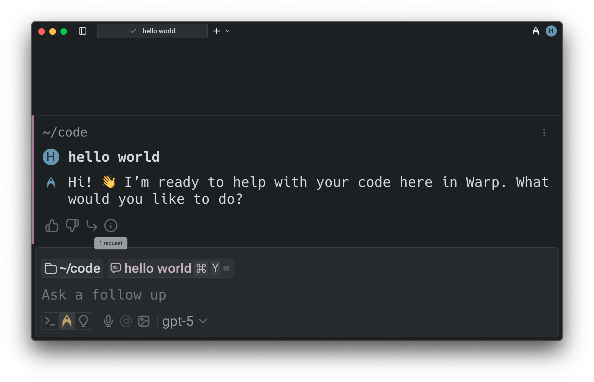

# AI Requests

### What are Warp AI requests?

Each time you submit a prompt in Warp, whether to generate code, suggest a command, or accomplish a task, you initiate an interaction with the Agent.&#x20;

This interaction consumes **at least one AI request**, though more complex interactions may use **multiple requests**. The number of requests consumed can vary based on factors such as your codebase and environment, the model used, number of tool calls the agent makes, amount of context gathered, steps required to accomplish the given task, and other factors.&#x20;

Because of these factors and the nature of LLMs, AI request usage is **non-deterministic** -- two similar prompts can still use a different number of requests.


For a general breakdown of what factors contribute to how many AI requests are consumed, please refer to: [#how-are-warp-ai-requests-calculated](ai-requests.md#how-are-warp-ai-requests-calculated "mention")


Since there's no exact formula for predicting usage, we recommend building an intuitive understanding by experimenting with different prompts, models, and tracking how many requests they consume.

**Tracking your AI request usage**

In an Agent conversation, a **turn** represents a single exchange (a response from the LLM). To see how many requests a turn consumed, hover over the **request count chip** at the bottom of the Agent's response:

<figure><figcaption>
A simple "hello world" Agent conversation turn consuming 1 request, as indicated by the chip.
</figcaption></figure>


You can view your total AI request usage, along with other billing details, in `Settings > Billing` and usage.


#### **Request limits and billing**

* **Seat-level allocation**: on team plans, request limits apply per seat — each team member has their own allowance.
* **Hitting the request limits**: Once you hit your monthly request limit, your access will depend on your plan. On the Free plan, AI access stops until your next billing cycle. On paid plans with overages enabled, you can continue using AI with [**usage-based billing**](usage-overages.md), charged per extra request.

#### **Other features that use AI requests**

In addition to direct Agent conversations, the following features also consume AI requests:

* [Generate](../../agents/generate.md) helps you look up commands and suggestions as you type. As you refine your input, multiple requests may be used before you select a final suggestion.
* [AI Autofill in Workflows](../../knowledge-and-collaboration/warp-drive/workflows.md#ai-autofill) count as a request each time it is run.


Regular shell commands in Warp do not consume or count towards AI requests.


### How are Warp AI requests calculated?

An **AI request** in Warp is a unit of work representing the total processing required to complete an interaction with an AI Agent. It is **not** the same as “one user message” — instead, it scales with the number of tokens processed during the interaction.

In short: **the more tokens used, the more AI requests consumed**.

Several factors influence how many requests are counted for a single interaction:

#### **1. The LLM model used**

Generally, smaller, faster models typically consume fewer requests than larger, reasoning-based models. For example, **Claude 4 Opus** tends to consume the most tokens and requests in Warp, followed by **Claude 4 Sonnet, GPT-5, Gemini 2.5 Pro**, and others in roughly that order. This generally correlates with model pricing as well.


**Tip**: If your task doesn't require deep reasoning, planning, or multi-step problem solving, choose a more lightweight model to reduce request usage.


#### 2. Tool calls triggered by the Agent

Warp's Agents make a variety of tool calls, including:

* Searching for files (grep)
* Retrieving and reading files
* Making and applying code diffs
* Gathering web or documentation context
* Running other utilities

Some prompts require only a couple of tool calls, while others may trigger many — especially if the Agent needs to explore your development environment, navigate a large codebase, or apply complex changes. **More tool calls = more requests**.

#### 3. Task complexity and number of steps

Some tasks are straightforward and may require only a single quick response, without much thinking or reasoning. Others can involve multiple stages—such as planning, generating intermediate outputs, verifying results, applying changes, and self-correcting—each of which can add to the request count.


**Tip**: Keep tasks that you give to the Agent well-scoped, work incrementally, and break large changes into smaller, contained steps.


#### 4. Amount of context passed to the model

Prompts that include large amounts of context (such as [attached blocks](../../agents/using-agents/agent-context.md#attaching-blocks-as-context), long user query messages, etc.) or file attachments like [images](../../agents/using-agents/agent-context.md#attaching-images-as-context) may also increase the number of requests used due to increased token consumption.


**Tip**: When sharing logs, code, or other large pieces of content, attach only the most relevant portions instead of full outputs.


#### 5. Prompt caching (hits and misses)

Many model prompts include repeated content, like system instructions:

* **Cache hits**: if the model provider can match a prefix or a part of the prompt from a past request, it can reuse results from the cache, reducing both tokens consumed and latency.
* **Cache misses**: if no match is found, the full prompt may be processed again, which can increase request usage.

Because cache results depend on model provider behavior and timing, two similar prompts may still have different request counts, depending on when you run the commands.&#x20;


**Tip**: Work in a continuous session when possible to improve cache hit rates.


These are the most common factors affecting request usage, though there are others. Understanding them can help you manage your requests more efficiently and get the most from your plan.
