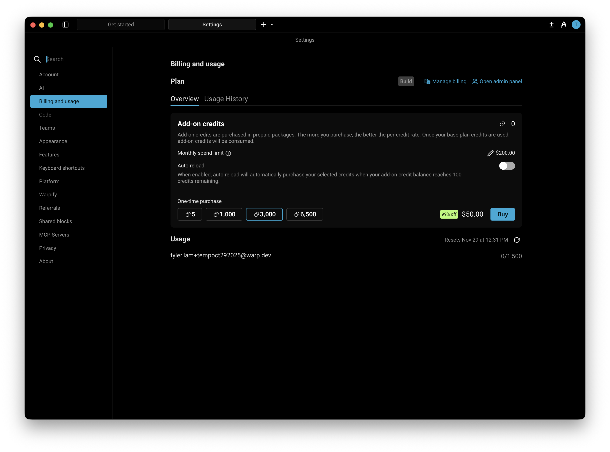

# Reload Credits (Add-on Credits)

Reload credits replace Warp’s old [pay-as-you-go overages model](usage-overages.md). They let you continue using premium AI models even after you’ve reached your monthly credit limit — at lower rates and with more control over spending.

You can manage and purchase Reload credits directly in `Settings > Billing and usage`.

<figure><figcaption></figcaption></figure>

### How do Reload credits work?

Reload credits act as **add-on credits** that extend your AI usage beyond the included monthly quota in your plan. Once your plan’s AI credits are used up, Warp will automatically begin drawing from your available Reload credits.

If you’ve enabled **Auto-Reload**, new credits will be added automatically and billed based on your selected configuration.

Reload credits are available for Build, Business, and Enterprise plans (with custom pricing for Enterprise). These credits **roll over across billing cycles** and remain valid for **12 months from the purchase date**.

### Purchasing Reload credits

You have two options for purchasing more credits:

#### 1. Buy On-Demand&#x20;

You can purchase additional Reload credits at any time directly within the app under `Settings > Billing and usage`. Buying more credits upfront provides a larger discount.

The table below shows the available credit denominations, their prices, and corresponding discounts:

<table><thead><tr><th width="115.21023559570312">Credits</th><th width="194.0745849609375">Price (USD)</th><th>Price per Credit</th><th>Discount</th></tr></thead><tbody><tr><td>400</td><td>$10</td><td>$0.025</td><td>Base rate</td></tr><tr><td>1,000</td><td>$20</td><td>$0.020</td><td>20% off</td></tr><tr><td>3,000</td><td>$50</td><td>$0.016</td><td>~35% off</td></tr><tr><td>6,500</td><td>$100</td><td>$0.0153</td><td>~40% off</td></tr></tbody></table>

#### 2. Enable Auto-Reload

Auto-Reload automatically purchases more credits whenever your balance reaches **100 credits**, ensuring uninterrupted access to premium AI features.

By default, **Auto-Reload is disabled**. When you turn it on, it starts with a **$200 monthly spend limit**, which you can adjust anytime in `Settings > Billing and usage`.

Auto-Reload uses the same denominations and discounts as manual purchases. The denomination you select (e.g., 400, 1,000, 3,000, or 6,500 credits) will repeat each time your balance is depleted, up to your monthly spending limit. Larger denominations offer up to \~40% off per credit.


You can opt in and choose your reload amount when subscribing to a paid plan at [app.warp.dev/upgrade](https://app.warp.dev/upgrade), or change your configuration anytime in settings.


#### **Configuring a Monthly Spend Limit**

Your monthly spend limit sets the maximum amount you can spend on Reload credits in a single calendar month. This ensures you have full control over your AI usage costs while still allowing flexibility for automatic top-ups when needed.

* The default limit is $200, but you can increase or decrease it anytime in `Settings > Billing and usage`.
* **If a credit purchase would exceed your limit, it won’t process** — you’ll need to either raise your limit or choose a smaller reload amount.
* Once your limit is reached, no additional Reload Credit purchases (manual or automatic) will occur until:
  * The next calendar month begins, or
  * You update your limit in settings.


Your monthly spend limit is separate from your billing cycle (which determines when your subscription renews). \
\
The limit resets automatically at the start of each calendar month, so you can manage recurring AI usage with predictable spending and clear visibility into your costs.


This gives you full control over how much you spend on AI usage each month while keeping your workflow uninterrupted.

### Billing and Credit Usage

When your monthly credit balance renews:

1. Warp first consumes your included monthly plan credits (e.g., Build plan credits).
2. After those are used, Warp continues to draw from any available Reload Credits.
3. If your Reload Credits run out and auto-reload is enabled, Warp will automatically purchase more up to your monthly limit.

You can track your remaining credits and spending in the credits transparency footer and in `Settings > Billing and usage`.

#### Teams on Reload Plans

For teams on Build or Business plans, **Reload Credits are shared across all members.** All team credit settings can be managed in `Settings → Billing and usage` by the admin of the team.

Team admins can manage:

* Enabling or disabling Auto-Reload
* Adjusting monthly spend limits
* Choosing reload increments
* Viewing usage and spending breakdowns

Each user on the team has their own monthly credit limit, **but any usage beyond that personal quota draws from the shared team credits**. These shared credits are tracked and billed collectively at the team level.

For example, if your plan includes 1,500 AI credits per team member:

* If **User A** reaches their 1,500 limit, any further usage will draw from shared Reload Credits.
* If **User B** has only used 200 credits, their remaining quota is unaffected, but User A will consume the team's shared credits.

### Plan Changes and Cancellations

If you upgrade, downgrade, or switch plans, any purchased Reload Credits remain in your account and can continue to be used.

If you move to the Free plan, you’ll retain access to any previously purchased Reload Credits but can’t buy additional ones until you upgrade again.


All unused Reload Credits remain valid for 12 months from purchase.

