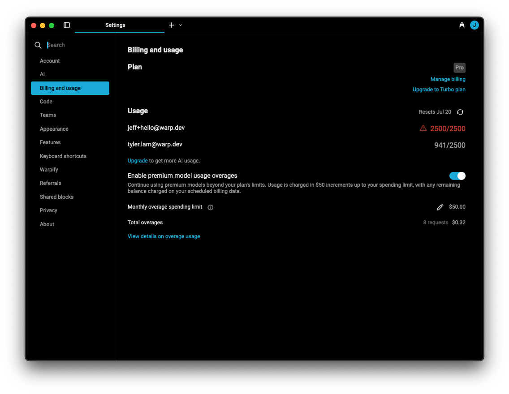

# Usage Overages

Warp offers usage-based pricing for **Pro** and **Turbo** users, allowing continued access to premium AI models even after reaching the monthly request limit included in the plan.

You can manage usage-based pricing directly in Warp under `Settings > Billing and usage`.

<figure><figcaption>
Billing and usage tab in settings, where admins can manage premium model usage overages
</figcaption></figure>

### Enabling overages

**Only Pro and Turbo team admins** can enable or disable "premium model overages" and set a monthly spending limit from the settings dashboard. Individual Pro and Turbo users can manage their own overage settings directly in the settings dashboard.


Usage-based pricing only applies after you’ve reached the AI request limit on your plan — you won’t be charged for any overages until that point, even if overages are enabled.


If you’re using [Warp Lite](../plans-and-pricing.md#what-is-lite) and have usage-based pricing turned on, overages will automatically take precedence once your included usage is exhausted.

### How overages work

Overages are managed **at the team level**, even if your team only has one member (i.e. individual users). Once overages are enabled, any team member who reaches their monthly AI request quota can continue to have access to premium models — with additional usage billed at cost.

Each user on the team has their **own request limit**, but only **requests made beyond that personal quota** are considered overages. These charges are tracked and billed **collectively** at the team level.

For example, if your plan includes 10,000 AI requests per team member:

* If **User A** reaches their 10,000 limit, any further usage by them counts towards overages.
* If **User B** has only used 2,000 requests, they still have 8,000 included requests left.
* User A's overages **do not** consume User B's remaining quota.

Overages are **billed monthly**, or when your team accumulates **$20 worth of charges**, whichever comes first.&#x20;

### Plan upgrades and cancellations

If you upgrade from Pro to Turbo, your monthly request limit will update immediately to match the Turbo plan. (For exact limits, see our [pricing page](https://www.warp.dev/pricing).) However, **any overages incurred while on the Pro plan will still be billed** — upgrading does not retroactively remove or reduce existing overage charges.

If you cancel your Pro or Turbo subscription, you’ll retain access to premium features until the end of your current billing period. Any usage-based overages accrued during that period will be charged at the time your plan ends.\
