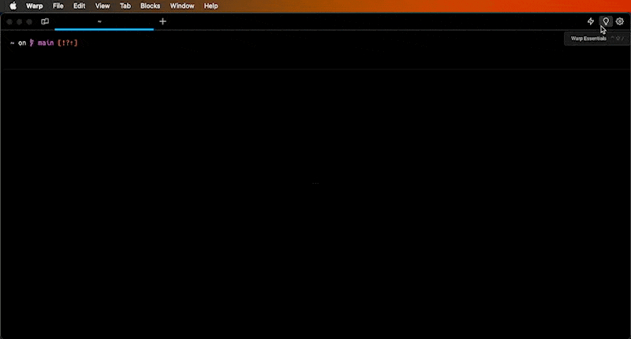

# Sending Feedback & Logs

### Sending Warp feedback

* Open a new bugs or feature request in our [GitHub repository](https://github.com/warpdotdev/warp/issues/new/choose).
* Join our [Warp Community Slack](https://go.warp.dev/join-preview) and share feedback in **#feedback-general**, or **#feedback-preview** if it is specific to [Warp Preview](../community/warp-preview-and-alpha-program.md).
* Join our [Discord](https://discord.com/invite/warpdotdev) server, and ask questions or share feedback in [`#questions-and-feedback`](https://discord.com/channels/851854972600451112/1154432424873296012).
* For security issues or questions, email [security@warp.dev](mailto:security@warp.dev).
* For questions about privacy, email [privacy@warp.dev](mailto:privacy@warp.dev).

#### Subscriber and Enterprise

* For subscriber technical issues or questions (bugs, credits, etc.), email [support@warp.dev](mailto:support@warp.dev).
* For subscriber billing issues or questions (refunds, cancellation, etc.), email [billing@warp.dev](mailto:billing@warp.dev).
* For enterprise, please direct all feedback and issues to your designated Slack Channel.

<figure><figcaption><p>Send Feedback</p></figcaption></figure>

## Gathering Warp Logs

You can retrieve Warp's logs by following the instructions for your platform below. Locate the log file and attach it to your GitHub issue or email.


Warp's logs and crash reports _**do not**_ contain any console input or output. See more on how we handle [Crash Reports and Telemetry](../privacy/privacy.md#what-telemetry-data-are-you-collecting-and-why).




The Warp log files are located at `~/Library/Logs/`.

#### Warp logs on macOS

Close Warp and run the following from another terminal to zip the logs to your Desktop:

```bash
zip -j ~/Desktop/warp-logs.zip ~/Library/Logs/warp.log*
```

#### Warp Preview logs on macOS

Close Warp Preview and run the following from another terminal to zip the logs to your Desktop:

```bash
zip -j ~/Desktop/warp_preview-logs.zip ~/Library/Logs/warp_preview.log*
```


If your issue is graphical (e.g. no display of windows) or a crash, please run Warp with the following command to capture more log information:

```bash
# Run if Warp on macOS is installed
RUST_LOG=wgpu_core=info,wgpu_hal=info /Applications/Warp.app/Contents/MacOS/stable

# Run if Warp Preview on macOS is installed
RUST_LOG=wgpu_core=info,wgpu_hal=info /Applications/WarpPreview.app/Contents/MacOS/preview
```




The Warp log files are located at `$env:LOCALAPPDATA\warp\Warp\data\logs\`.

#### Warp logs on Windows

Close Warp and run the following from another terminal to zip the logs to your Desktop:

```powershell
Compress-Archive -Path "$env:LOCALAPPDATA\warp\Warp\data\logs\warp.log*" -DestinationPath "$([Environment]::GetFolderPath('Desktop'))\warp-logs.zip"
```

#### Warp Preview logs on Windows

Close Warp Preview and run the following from another terminal to zip the logs to your Desktop:

```powershell
Compress-Archive -Path "$env:LOCALAPPDATA\warp\WarpPreview\data\logs\warp_preview.log*" -DestinationPath "$([Environment]::GetFolderPath('Desktop'))\warp_preview-logs.zip"
```


If your issue is graphical (e.g. no display of windows) or a crash, please run Warp with the following command to capture more log information:

```powershell
# Run if Warp on Windows is installed for a single user
$env:RUST_LOG="wgpu_core=info,wgpu_hal=info"; & "$env:LOCALAPPDATA\Programs\Warp\warp.exe"

# Run if Warp on Windows is installed for all users
$env:RUST_LOG="wgpu_core=info,wgpu_hal=info"; & "$env:PROGRAMFILES\Warp\warp.exe"

# Run if Warp Preview on Windows is installed for a single user
$env:RUST_LOG="wgpu_core=info,wgpu_hal=info"; & "$env:LOCALAPPDATA\Programs\WarpPreview\preview.exe"

# Run if Warp Preview on Windows is installed for all users
$env:RUST_LOG="wgpu_core=info,wgpu_hal=info"; & "$env:PROGRAMFILES\WarpPreview\preview.exe"
```




The Warp log files are located at `~/.local/state/warp-terminal/`.

#### Warp logs on Linux

Close Warp and run the following from another terminal to zip the logs to your home directory:

```bash
tar -czf ~/warp-logs.tar.gz -C ~/.local/state/warp-terminal warp.log*
```

#### Warp Preview logs on Linux

Close Warp and run the following from another terminal to zip the logs to your home directory:

```bash
tar -czf ~/warp_preview-logs.tar.gz -C ~/.local/state/warp-terminal-preview warp_preview.log*
```


If your issue is graphical (e.g. no display of windows) or a crash, please run Warp with the following command to capture more log information:

<pre class="language-bash"><code class="lang-bash"># Run if Warp on macOS is installed
<strong>RUST_LOG=wgpu_core=info,wgpu_hal=info MESA_DEBUG=1 EGL_LOG_LEVEL=debug warp-terminal
</strong><strong>
</strong># Run if Warp Preview on Linux is installed
RUST_LOG=wgpu_core=info,wgpu_hal=info MESA_DEBUG=1 EGL_LOG_LEVEL=debug warp-terminal-preview
</code></pre>




## Gathering AI debugging ID <a href="#gathering-ai-debugging-id" id="gathering-ai-debugging-id"></a>

To gather the debugging ID, `RIGHT-CLICK` on the AI conversation block in question and select "Copy debugging ID", then paste that into the [bug report](sending-us-feedback.md#sending-warp-feedback) that you submit so that our team can investigate the issue.

Whenever there is an error in the Agent Conversation, there will also be an option to directly copy the debugging ID for the bug report.

<figure><figcaption></figcaption></figure>
