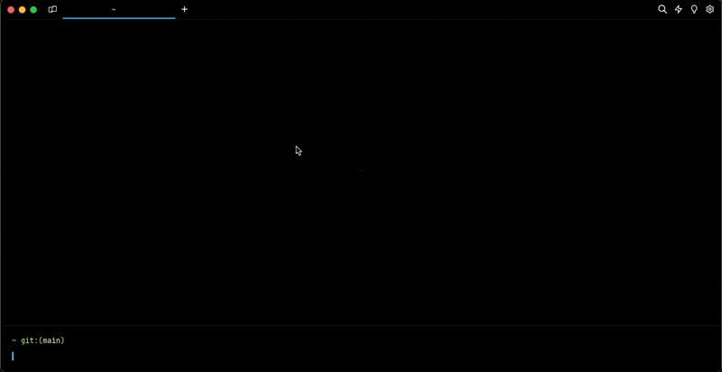

# Updating Warp

Warp automatically checks for updates on startup. A notification will appear in the top right corner of the Warp window when a new update is available.

To check for updates, search for "update" in the [Command Palette](../terminal/command-palette.md) or go to `Settings > Accounts` and click "Check for Update".

If nothing happens, it means you already have the latest stable build.

## Auto-Update Issues

Warp cannot auto-update if it does not have the correct permissions to replace the running version of Warp If this is the case, a banner will prompt you to manually update Warp.

There are 2 main causes of this:

1. You opened Warp directly from the mounted volume instead of dragging it into your Applications directory. If this is the case, the easiest fix is to quit Warp, drag the application into /Applications, and restart Warp.
2. You are a non-Admin user. This can happen if you use a computer with multiple profiles. If you have admin access on the computer, opening the app with the admin user should fix the auto-update issues.


(Oct 2022): There is a known issue with [auto-update on MacOS Ventura](known-issues.md#auto-update-on-macos-ventura).

