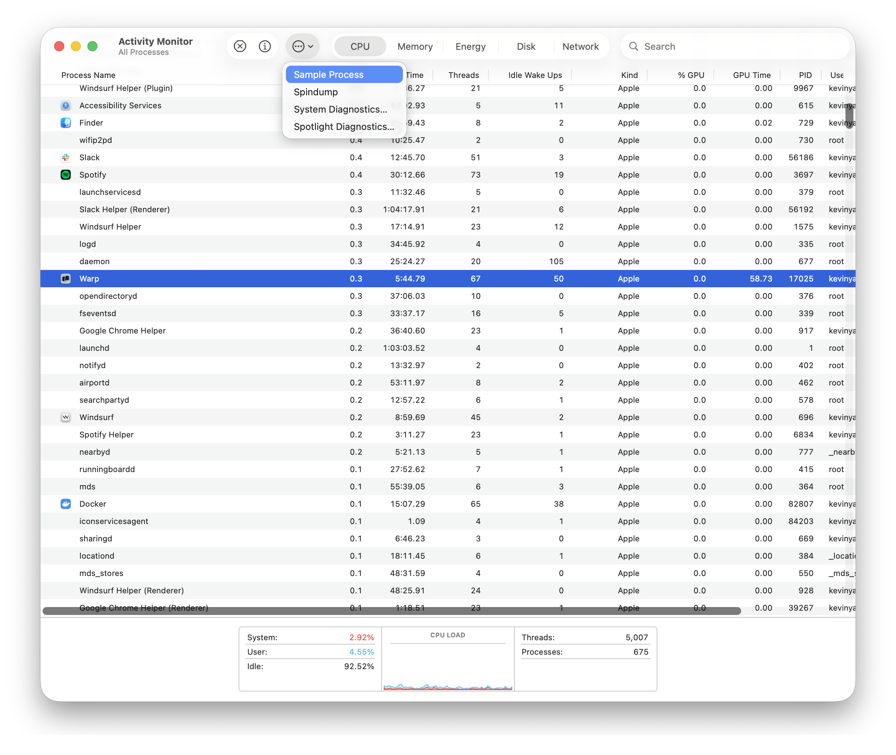
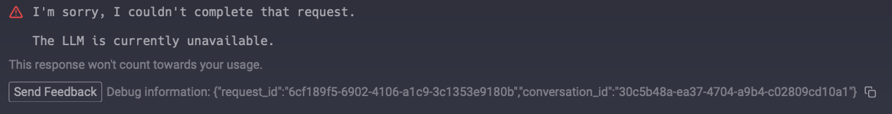

# Sending Feedback & Logs

### Sending Warp feedback

* Open a new bugs or feature request in our [GitHub repository](https://github.com/warpdotdev/warp/issues/new/choose).
* Join our [Warp Community Slack](https://go.warp.dev/join-preview) and share feedback in **#feedback-general**, or **#feedback-preview** if it is specific to [Warp Preview](../community/warp-preview-and-alpha-program.md).
* For security issues or questions, email [security@warp.dev](mailto:security@warp.dev).
* For questions about privacy, email [privacy@warp.dev](mailto:privacy@warp.dev).

#### Subscriber and Enterprise

* For subscriber technical issues or questions (bugs, credits, etc.), email [support@warp.dev](mailto:support@warp.dev).
* For subscriber billing issues or questions (refunds, cancellation, etc.), email [billing@warp.dev](mailto:billing@warp.dev).
* For enterprise, please direct all feedback and issues to your designated Slack Channel.

<figure><figcaption><p>Send Feedback</p></figcaption></figure>

## Gathering Warp Logs

You can view Warp's logs directly from inside the app by opening the **Command Palette** (`CMD + P` on macOS / `CTRL + SHIFT + P` on Windows/Linux) and searching for "View Warp Logs", or by selecting it from the profile menu in the top-right corner.

Alternatively, you can retrieve Warp's logs manually by following the instructions for your platform below. Locate the log file and attach it to your GitHub issue or email.


Warp's logs and crash reports _**do not**_ contain any console input or output. See more on how we handle [Crash Reports and Telemetry](../privacy-and-security/privacy.md#what-telemetry-data-are-you-collecting-and-why).




The Warp log files are located at `~/Library/Logs/`.

**Warp logs on macOS**

Run the following to zip the Warp logs to your Desktop:

```bash
zip -j ~/Desktop/warp-logs.zip ~/Library/Logs/warp.log* ~/Library/Logs/oz/warp.log*
```

**Warp Preview logs on macOS**

Run the following to zip the Warp Preview logs to your Desktop:

```bash
zip -j ~/Desktop/warp_preview-logs.zip ~/Library/Logs/warp_preview.log* ~/Library/Logs/oz/warp_preview.log*
```


If your issue is graphical (e.g. no display of windows) or a crash, please run Warp with the following command to capture more log information:

```bash
# Run if Warp on macOS is installed
RUST_LOG=wgpu_core=info,wgpu_hal=info /Applications/Warp.app/Contents/MacOS/stable

# Run if Warp Preview on macOS is installed
RUST_LOG=wgpu_core=info,wgpu_hal=info /Applications/WarpPreview.app/Contents/MacOS/preview
```




The Warp log files are located at `$env:LOCALAPPDATA\warp\Warp\data\logs\`.

**Warp logs on Windows**

Close Warp and run the following from another terminal to zip the logs to your Desktop:

```powershell
$logs="$env:LOCALAPPDATA\warp\Warp\data\logs"; $paths=@("$logs\warp.log*","$logs\oz\warp.log*") | Where-Object { Test-Path $_ }; Compress-Archive -Path $paths -DestinationPath "$([Environment]::GetFolderPath('Desktop'))\warp-logs.zip" -Force
```

**Warp Preview logs on Windows**

Close Warp Preview and run the following from another terminal to zip the logs to your Desktop:

```powershell
$logs="$env:LOCALAPPDATA\warp\WarpPreview\data\logs"; $paths=@("$logs\warp_preview.log*","$logs\oz\warp_preview.log*") | Where-Object { Test-Path $_ }; Compress-Archive -Path $paths -DestinationPath "$([Environment]::GetFolderPath('Desktop'))\warp_preview-logs.zip" -Force
```


If your issue is graphical (e.g. no display of windows) or a crash, please run Warp with the following command to capture more log information:

```powershell
# Run if Warp on Windows is installed for a single user
$env:RUST_LOG="wgpu_core=info,wgpu_hal=info"; & "$env:LOCALAPPDATA\Programs\Warp\warp.exe"

# Run if Warp on Windows is installed for all users
$env:RUST_LOG="wgpu_core=info,wgpu_hal=info"; & "$env:PROGRAMFILES\Warp\warp.exe"

# Run if Warp Preview on Windows is installed for a single user
$env:RUST_LOG="wgpu_core=info,wgpu_hal=info"; & "$env:LOCALAPPDATA\Programs\WarpPreview\preview.exe"

# Run if Warp Preview on Windows is installed for all users
$env:RUST_LOG="wgpu_core=info,wgpu_hal=info"; & "$env:PROGRAMFILES\WarpPreview\preview.exe"
```




The Warp log files are located at `~/.local/state/warp-terminal/`.

**Warp logs on Linux**

Run the following to zip the Warp logs to your home directory:

```bash
tar -czf ~/warp-logs.tar.gz -C ~/.local/state/warp-terminal $(ls warp.log* oz/warp.log* 2>/dev/null | tr '\n' ' ')
```

**Warp Preview logs on Linux**

Run the following to zip the Warp Preview logs to your home directory:

```bash
tar -czf ~/warp_preview-logs.tar.gz -C ~/.local/state/warp-terminal-preview $(ls warp_preview.log* oz/warp_preview.log* 2>/dev/null | tr '\n' ' ')
```


If your issue is graphical (e.g. no display of windows) or a crash, please run Warp with the following command to capture more log information:

```bash
# Run if Warp on Linux is installed
RUST_LOG=wgpu_core=info,wgpu_hal=info MESA_DEBUG=1 EGL_LOG_LEVEL=debug warp-terminal

# Run if Warp Preview on Linux is installed
RUST_LOG=wgpu_core=info,wgpu_hal=info MESA_DEBUG=1 EGL_LOG_LEVEL=debug warp-terminal-preview
```




## Collecting crash reports on macOS

If Warp crashes, macOS may generate `.ips` crash report files in `~/Library/Logs/DiagnosticReports/`. Run the following to collect all Warp crash reports into a zip on your Desktop:

```bash
files=$(find ~/Library/Logs/DiagnosticReports -name "*.ips" -exec grep -l "dev\.warp" {} + 2>/dev/null) && [ -n "$files" ] && echo "$files" | xargs zip -j ~/Desktop/warp-crash-logs.zip || echo "No Warp crash reports found."
```

Attach the resulting `warp-crash-logs.zip` to your [bug report](sending-us-feedback.md#sending-warp-feedback).


This command searches crash report files for Warp's bundle identifier, so it works across all Warp channels (Stable, Preview).


## Collecting debug info on Windows

Occasionally, the Warp team may ask you to provide debugging information on Windows OS in particular with one of the following:

```powershell
# If Warp is in your PATH, Run:
warp --dump-debug-info

# Otherwise you may need to use an absolute path and ...
# Warp on Windows is installed for a single user, Run:
& $env:LOCALAPPDATA\programs\Warp\warp.exe --dump-debug-info

# Warp on Windows is installed for all users, Run:
& $env:PROGRAMFILES\Warp\warp.exe --dump-debug-info
```

## Collecting CPU samples

Certain conditions can cause Warp to use more CPU than expected or become unresponsive. Collecting a CPU sample while the issue is happening is the best way to report it. The sample provides the information the Warp team needs to identify and fix the root cause.

Collect a sample using the steps for your platform and attach it to a new [GitHub issue](https://github.com/warpdotdev/warp/issues/new/choose).



1. Reproduce the high CPU usage or unresponsiveness in Warp.
2. While the issue is occurring, open **Activity Monitor**, select the **Warp** process, and click **Sample Process**.

<figure><figcaption><p>Sample Process in Activity Monitor</p></figcaption></figure>

3. Save the resulting sample and attach it to your GitHub issue.



Install [`samply`](https://github.com/mstange/samply) to record a CPU trace:

```powershell
powershell -ExecutionPolicy Bypass -c "irm https://github.com/mstange/samply/releases/download/samply-v0.13.1/samply-installer.ps1 | iex"
```

1. Find the Warp process ID:

   ```powershell
   Get-Process *warp*
   ```

2. Start recording, replacing `<PID>` with the process ID from the previous step:

   ```powershell
   samply record -p <PID>
   ```

3. Reproduce the issue that causes high CPU usage or unresponsiveness.
4. Press `Ctrl+C` to stop recording. `samply` opens the profile in the Firefox Profiler in your browser. Click the upload icon in the top-right corner to generate a shareable link, then paste it into your GitHub issue.



Install [`samply`](https://github.com/mstange/samply) to record a CPU trace:

```bash
curl --proto '=https' --tlsv1.2 -LsSf https://github.com/mstange/samply/releases/download/samply-v0.13.1/samply-installer.sh | sh
```


`samply` requires access to Linux perf events. If you get a permission error, run:

```bash
echo '-1' | sudo tee /proc/sys/kernel/perf_event_paranoid
```


1. Start recording the Warp process:

   ```bash
   samply record -p $(pgrep -f warp-terminal)
   ```

2. Reproduce the issue that causes high CPU usage or unresponsiveness.
3. Press `Ctrl+C` to stop recording. `samply` opens the profile in the Firefox Profiler in your browser. Click the upload icon in the top-right corner to generate a shareable link, then paste it into your GitHub issue.


If you prefer not to install `samply`, you can use the built-in `perf` tool instead:

```bash
perf record -g -p $(pgrep -f warp-terminal) -- sleep 30
```

Attach the resulting `perf.data` file from your current directory to your GitHub issue.




## Gathering AI debugging ID <a href="#gathering-ai-debugging-id" id="gathering-ai-debugging-id"></a>

To gather the debugging ID, `RIGHT-CLICK` on the AI conversation block in question and select "Copy debugging ID", then paste that into the [bug report](sending-us-feedback.md#sending-warp-feedback) that you submit so that our team can investigate the issue.

Whenever there is an error in the Agent Conversation, there will also be an option to directly copy the debugging ID for the bug report.

<figure><figcaption></figcaption></figure>
