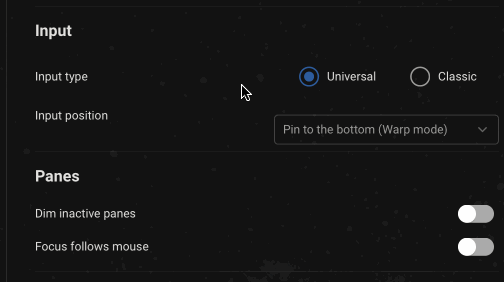
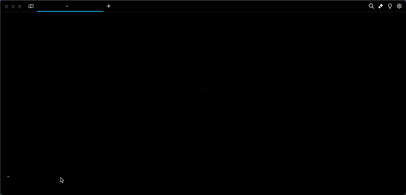
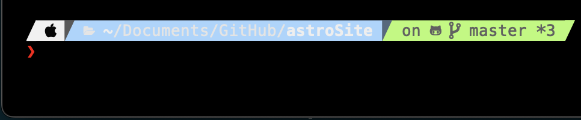

# Prompt

### Warp prompt

Warp has a native prompt that is customizable and can show a variety of information including cwd, git, svn, kubernetes, pyenv, date, time, an so on. You can visit `Settings > Appearance > Input > Classic > Current prompt > Warp Prompt` to drag and drop context chips into your Warp prompt until it displays the pieces of information you'd like to include.

#### Git and Subversion

Git and Subversion context chips show which branch you are on locally, as well as the number of uncommitted changed files. This includes any new files, modified files, and deleted files that are staged or unstaged.

#### Kubernetes

Kubernetes context chip shows relevant information when you're using one of the following commands:

`kubectl|helm|kubens|kubectx|oc|istioctl|kogito|k9s|helmfile|flux|fluxctl|stern|kubeseal|skaffold|kubent|kubecolor|cmctl|sparkctl|etcd|fubectl`


Warp respects the `KUBECONFIG` environmental variable, make sure you set it to your preferred configuration file location, if it's not the default path of `~/.kube/config`


### Same line prompt

By default, Warp's prompt displays on two lines where the command line input is one line below the prompt.

If you'd like to set your prompt such that the command line input and the prompt display together inline, you can configure this under `Settings > Appearance > Input > Classic > Current prompt > Warp Prompt` and check the box for "Same line prompt."

If you're using a [Shell prompt (PS1)](prompt.md#custom-prompt), Warp will use the same line prompt settings to respect any styles or theme configurations. You may optionally configure a new line prompt with PS1 but you will need to write your configuration, according to your theme of choice.


If you want to add back the new line on your Shell prompt, please run the following based on your shell or prompt:

```sh
# Bash
echo -e '\nPS1="${PS1}"$'\''\\n'\''' >> ~/.bashrc

# Zsh
echo -e '\nPROMPT="${PROMPT}"$'\''\\n'\''' >> ~/.zshrc

# Fish
echo -e '\nfunctions --copy fish_prompt fish_prompt_orig; function fish_prompt; fish_prompt_orig; echo; end' >> ~/.config/fish/config.fish

# Powershell
$rawString = @'
$originalPrompt = Get-Item Function:\prompt
Set-Item -Path Function:\prompt_original -Value $originalPrompt
function prompt {
    "$(& prompt_original)`n"
}
'@
Add-Content -Path $PROFILE -Value "`n$rawString`n"

# Powerlevel10k
p10k configure

# Starship Prompt
echo '[line_break]\ndisabled = false' >> ~/.config/starship.toml
```


### Shell prompt (PS1)

You can also set up a Shell prompt by configuring the **PS1** variable or installing a supported shell prompt plugin, see [Shell Prompt Compatibility Table](prompt.md#shell-prompt-compatibility-table). Visit `Settings > Appearance > Input > Classic > Current prompt > Shell Prompt (PS1)` to enabled it.


The PS1 is a variable used by the shell to generate the prompt, it represents the primary prompt string (hence the “PS”) - which the terminal typically displays before typing new commands.


#### Multi-Line and Right-Sided Prompts

The Shell prompt supports multi-line or right-sided prompts in zsh and fish, not bash. However, you can't have a multiline right-side prompt, only a multiline left prompt.

## How to access it

* Toggle the prompt by right-clicking on the prompt area above the input and selecting `Settings > Appearance > Input > Classic > Current prompt`. There you will be able to select and customize the Warp prompt or select the Shell prompt (PS1).
  * When using Warp prompt, you can right-click the prompt to copy the entire prompt, working directory, current git branch, git uncommitted file count, etc.
  * When using a Shell prompt, you can right-click the prompt to copy the entire prompt or select any part of the custom prompt in previously run blocks in your session.

## How it works

<figure><figcaption><p>Classic input</p></figcaption></figure>

<figure><figcaption><p>Warp Prompt |  Shell Prompt Demo</p></figcaption></figure>

<figure><figcaption><p>Prompt edit modal</p></figcaption></figure>

### Shell Prompt Compatibility Table

| Shell                       | Tool                                                                      | Does it work?                                                   |
| --------------------------- | ------------------------------------------------------------------------- | --------------------------------------------------------------- |
| bash \| zsh                 | [PS1](https://www.warp.dev/blog/whats-so-special-about-ps1)               | Working                                                         |
| bash \| zsh \| fish \| pwsh | [Starship](https://github.com/starship/starship)                          | [Working\*](prompt.md#starship)                                 |
| bash \| zsh \| fish \| pwsh | [oh-my-posh](https://github.com/JanDeDobbeleer/oh-my-posh)                | Working                                                         |
| zsh                         | [Powerlevel10k](https://github.com/romkatv/powerlevel10k)                 | [Working\*](prompt.md#powerlevel10k)                            |
| zsh                         | [Spaceship](https://github.com/spaceship-prompt/spaceship-prompt)         | [Working\*](prompt.md#spaceship)                                |
| zsh                         | [oh-my-zsh](https://github.com/ohmyzsh/ohmyzsh)                           | Working                                                         |
| zsh                         | [prezto](https://github.com/sorin-ionescu/prezto)                         | [Working\*](prompt.md#prezto)                                   |
| ssh                         |                                                                           | Working                                                         |
| bash                        | [oh-my-bash](https://github.com/ohmybash/oh-my-bash)                      | Not supported                                                   |
| bash                        | [bash-it](https://github.com/Bash-it/bash-it)                             | Not supported                                                   |
| bash                        | [SBP](https://github.com/brujoand/sbp)                                    | Not supported                                                   |
| bash                        | [synth-shell-prompt](https://github.com/andresgongora/synth-shell-prompt) | Not supported                                                   |
| bash \| zsh                 | [Powerline-shell](https://github.com/b-ryan/powerline-shell)              | Not supported                                                   |
| zsh                         | [zplug](https://github.com/zplug/zplug)                                   | Not supported                                                   |
| fish                        | [tide](https://github.com/IlanCosman/tide)                                | [Not supported](https://github.com/warpdotdev/Warp/issues/3358) |
| fish                        | [oh-my-fish](https://github.com/oh-my-fish/oh-my-fish)                    | [Not supported](https://github.com/warpdotdev/Warp/issues/3796) |

## Known incompatibilities

If you’re having issues with prompts, please see below or our [Known Issues](../../support-and-billing/known-issues.md#configuring-and-debugging-your-rc-files) for more troubleshooting steps. Also, although some prompts are not officially supported, they may still work in Warp.

### Starship

#### Starship Settings

Some `~/.config/starship.toml` settings are known to cause errors in Warp. `#` or `DEL` the following lines to resolve known errors:

```
# Get editor completions based on the config schema
'' = 'https://starship.rs/config-schema.json'

# Disables the custom module
[custom]
disabled = false
```

For `fish` shell, optional for `bash|zsh`, disable the multi-line prompt in Starship by putting the following in your `~/.config/starship.toml`:

```
[line_break]
disabled = true
```

You may also see an error relating to timeout. You can set the `command_timeout` variable in your `~/.config/starship.toml` to fix this. See more in the [starship docs](https://starship.rs/config/#prompt).

#### Starship + bash

Starship prompt may not render properly if your [default shell](../../getting-started/supported-shells.md#changing-default-shell) is `/bin/bash`. To [workaround](https://github.com/warpdotdev/Warp/issues/3066#issuecomment-1548643121) the issue, we recommend you upgrade bash, find the path with `echo $(which bash)`, then put the path in your `Settings > Features > Session > "Startup shell for new sessions" > Custom`.

#### Starship + zsh

If you want to restore the additional line after the Starship prompt on `zsh`, add the following to the bottom of your `~/.zshrc` file: `PROMPT="${PROMPT}"$'\n'`

### Powerlevel10k

When installing the Powerlevel10k (P10k) prompt, we recommend you use the [Meslo Nerd Font](https://github.com/romkatv/powerlevel10k/blob/master/font.md).\
\
P10K may display the arrow dividers as grey instead of color. The color for those chars is rendered grey due to Warp's minimum contrast setting. To [workaround](https://github.com/warpdotdev/Warp/issues/2851#issuecomment-1605005256) this issue, go to `Settings > Appearance > Text > Enforce minimum contrast` and set it to "Never".

<figure><figcaption><p>Example of the grey dividers in p10k</p></figcaption></figure>

Warp does support [p10k](https://github.com/romkatv/powerlevel10k#installation) version 1.19.0 and above. Ensure you have the latest version installed and restart Warp after the installation/update of p10k. Then enable the custom prompt as stated [above](prompt.md#how-to-access-it) and it should work.


Warp still doesn't fully support some p10k features like transient prompt and visual features like gradients.



Installing Powerlevel10k



Please note the Installing Powerlevel10k video mentions enabling a custom prompt in `Settings > Features > Honor users custom prompt (PS1)`, but it's now in `Settings > Appearance > Input > Classic > Current prompt > Shell Prompt (PS1)` .


### Spaceship

This prompt can cause an issue with typeahead in Warp's input editor. To [workaround](https://github.com/warpdotdev/Warp/issues/1973#issuecomment-1340150521) the issue, run `echo "SPACESHIP_PROMPT_ASYNC=FALSE" >>! ~/.zshrc`.

### Prezto

Although Warp does have support for prezto's prompt, enabling the [prezto utility module](https://github.com/sorin-ionescu/prezto/blob/master/modules/utility/README.md) in the `.zpreztorc` is not supported as with many other autocompletion [plugins that are incompatible](../../support-and-billing/known-issues.md#list-of-incompatible-tools).

### Disabling unsupported prompts for Warp

We advise using Warp's default prompt or installing one of the supported tools, see [Compatibility Table](prompt.md#custom-prompt-compatibility-table). You can disable unsupported prompts for Warp as such:

```
if [[ $TERM_PROGRAM != "WarpTerminal" ]]; then
##### WHAT YOU WANT TO DISABLE FOR WARP - BELOW

    # Unsupported Custom Prompt Code

##### WHAT YOU WANT TO DISABLE FOR WARP - ABOVE
fi
```

#### iTerm2

The iTerm2 shell integration breaks Warp and your custom prompt will not be able to be visible with this on. If you're coming from iTerm2 please check your dotfiles for it. We advise disabling the integration for Warp like so:

```
if [[ $TERM_PROGRAM != "WarpTerminal" ]]; then
##### WHAT YOU WANT TO DISABLE FOR WARP - BELOW

test -e "${HOME}/.iterm2_shell_integration.zsh" && source "${HOME}/.iterm2_shell_integration.zsh"

##### WHAT YOU WANT TO DISABLE FOR WARP - ABOVE
fi
```
