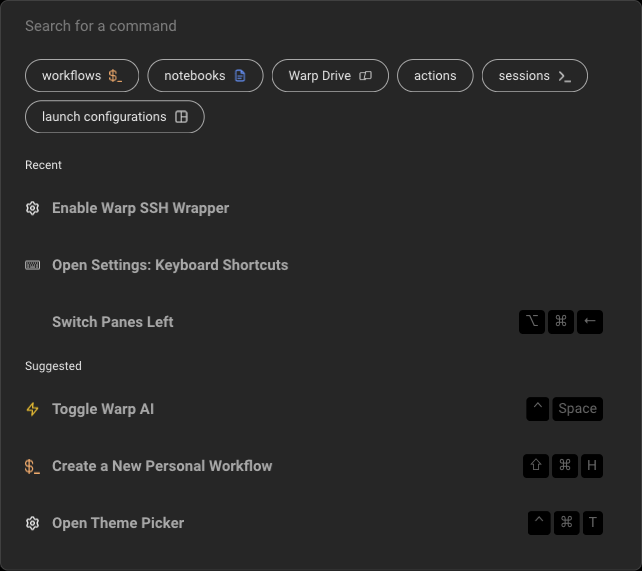

# Command Palette

<figure><figcaption>
Command Palette Panel
</figcaption></figure>

## How to access it



You can access the Command Palette with the keyboard shortcut `CMD-P`.



You can access the Command Palette with the keyboard shortcut `CTRL-SHIFT-P`.



You can access the Command Palette with the keyboard shortcut `CTRL-SHIFT-P`.



## How it works

* Start typing to search for workflows, notebooks, keyboard shortcuts, actions, toggles, etc.
* Activate a specific filter, by clicking on the filter buttons or prepending your search with the following:
  * `workflows:` or `w:` will filter for [Workflows](../knowledge-and-collaboration/warp-drive/workflows.md).
  * `prompts:` or `p:` will filter for [Prompts](../knowledge-and-collaboration/warp-drive/prompts.md).
  * `notebook:` or `n:` will filter for [Notebooks](../knowledge-and-collaboration/warp-drive/notebooks.md).
  * `env_vars:` will filter for [Environment Variables](../knowledge-and-collaboration/warp-drive/environment-variables.md).
  * `files:` will filter for local files.
  * `drive:` will filter for [Warp Drive](../knowledge-and-collaboration/warp-drive/).
  * `actions:` will filter for Warp-specific actions like settings and features.
  * `sessions:` will filter for active sessions with [Session Navigation](sessions/session-navigation.md).
  * `launch_configs:` will filter for [Launch Configurations](sessions/launch-configurations.md).


Command Palette Demo

