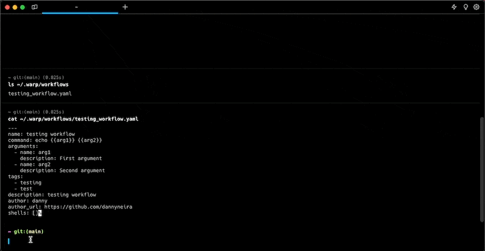

# Command Entry

1. [Command Corrections](command-corrections.md) provides auto-correct suggestions on previously run commands to catch typos, and forgotten flags, and fix general console errors.
2. [Command Search](broken-reference) is a 3-in-1 panel that allows you to search across Command History, Workflows, Notebooks, and A.I. Command Search all at once.
3. [Command History](command-history.md) allows Warp to isolate the history of each shell session to make previously run commands easily accessible.
4. [Synchronized Inputs](synchronized-inputs.md) allow you to easily run the same command in multiple sessions at the same time.
5. [YAML Workflows](broken-reference) are easier to execute and share parameterized and searchable commands within Warp.

## Command Corrections


Command Corrections Demo


## Command Search


Command Search Demo


## Command History


Command History Demo


## YAML Workflows

<figure><figcaption>
YAML Workflows Demo
</figcaption></figure>
