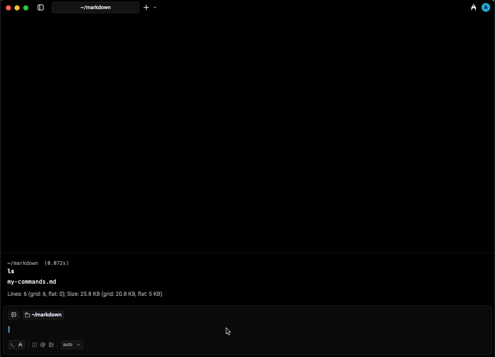
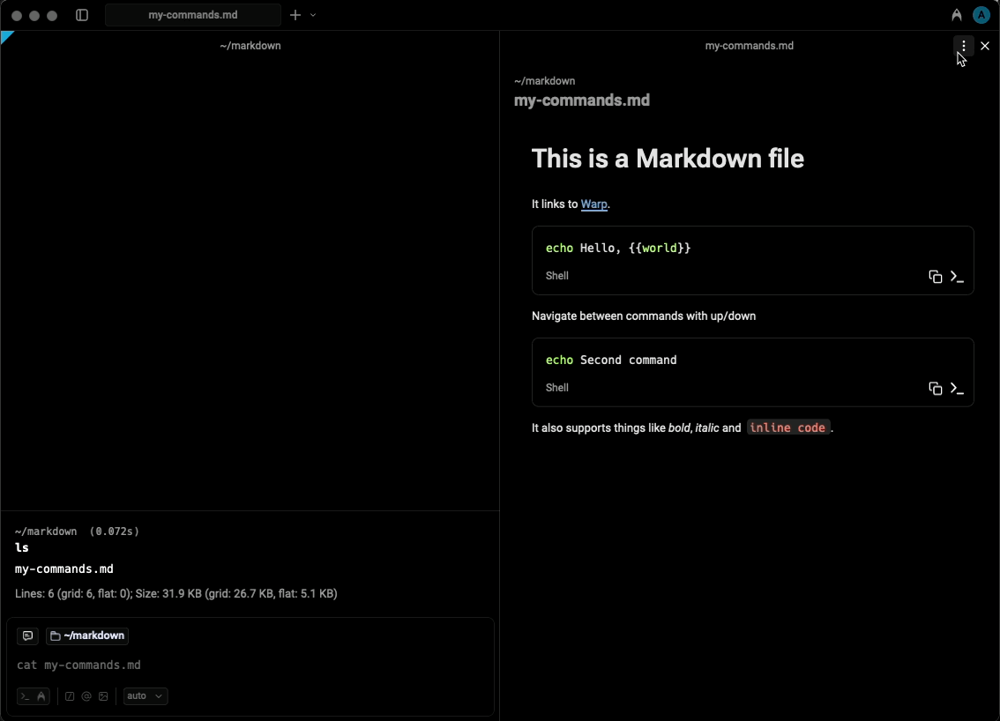
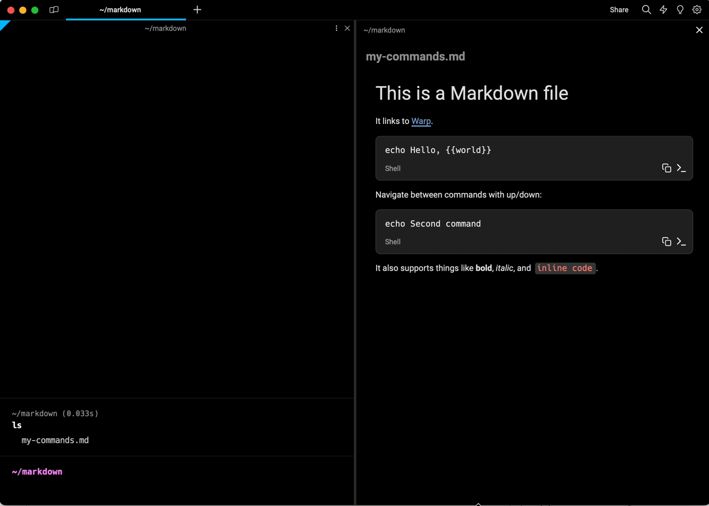

# Markdown Viewer

Warp can be used for both editing and viewing rendered Markdown files in a [split pane](../windows/split-panes.md). Any local file with the `.md` or `.markdown` extension is treated as a Markdown file. Remote files are currently not supported. Turning on `Settings > Features > General > Open Markdown files in Warp's Markdown viewer by default` will make the Markdown viewer default, otherwise Markdown files will open in Warp's editor.

### Opening a file link within a block



For any link to a Markdown file within a block, you can open the file in Warp by `CMD`-clicking on the link, from the link tooltip, or the right-click context menu on the link.



For any link to a Markdown file within a block, you can open the file in Warp by `CTRL`-clicking on the link, from the link tooltip, or the right-click context menu on the link.



For any link to a Markdown file within a block, you can open the file in Warp by `CTRL`-clicking on the link, from the link tooltip, or the right-click context menu on the link.



<figure><figcaption><p>Opening a Markdown file in Warp using the link tooltip</p></figcaption></figure>

### Markdown-viewing commands

If you run a Markdown-viewing command like `cat myfile.md`, Warp will show a banner with a button to open the Markdown file.

The following commands are considered Markdown viewers:

* `cat`
* `glow`
* `less`

### Opening a Markdown file from Finder

From Finder, you can open a Markdown file in Warp from the “Open With” menu that appears when right-clicking on the file.

### Toggling between editor and viewer

You can toggle between the Markdown editor and viewer via the pane overflow menu.

<figure><figcaption><p>Toggling between editor and viewer</p></figcaption></figure>

## Shell commands in Markdown files

Warp can run shell commands from Markdown code blocks in your active terminal session. Click the run icon `>_` to insert a command into the terminal input.


The shell command must be in a code block with three backticks ` ``` ` and not inline code for Warp to treat the code like a runnable command.


Markdown shell blocks also support keyboard navigation. There are two ways to enter the keyboard navigation mode:



* Clicking on a shell block.
* Pressing `CMD-UP` or `CMD-DOWN`.

Once a shell block is selected, press `CMD-ENTER` to insert it into the terminal input. You can also use `UP`, `DOWN`, `CMD-UP`, and `CMD-DOWN` to navigate between shell blocks. While the Markdown file is focused, press `CMD-L` to switch focus back to the terminal without inserting a command.



* Clicking on a shell block.
* Pressing `CTRL-UP` or `CTRL-DOWN`.

Once a shell block is selected, press `CTRL-ENTER` to insert it into the terminal input. You can also use `UP`, `DOWN`, `CTRL-UP`, and `CTRL-DOWN` to navigate between shell blocks. While the Markdown file is focused, press `CTRL-SHIFT-L` to switch focus back to the terminal without inserting a command.



* Clicking on a shell block.
* Pressing `CTRL-UP` or `CTRL-DOWN`.

Once a shell block is selected, press `CTRL-ENTER` to insert it into the terminal input. You can also use `UP`, `DOWN`, `CTRL-UP`, and `CTRL-DOWN` to navigate between shell blocks. While the Markdown file is focused, press `CTRL-SHIFT-L` to switch focus back to the terminal without inserting a command.



If the command contains any arguments using the curly brace `{{param}}` syntax, they will be treated as Workflow arguments. Learn more about [Workflows](../../knowledge-and-collaboration/warp-drive/workflows.md).

<figure><figcaption><p>Navigating between and running commands in a Markdown file</p></figcaption></figure>

In addition, all shell and code blocks have a copy button to quickly copy the block’s text to the clipboard.

Code blocks without a set language, or one of the following languages, are treated as shell commands: `sh`, `shell`, `bash`, `fish`, `zsh`, `warp-runnable-command`.
