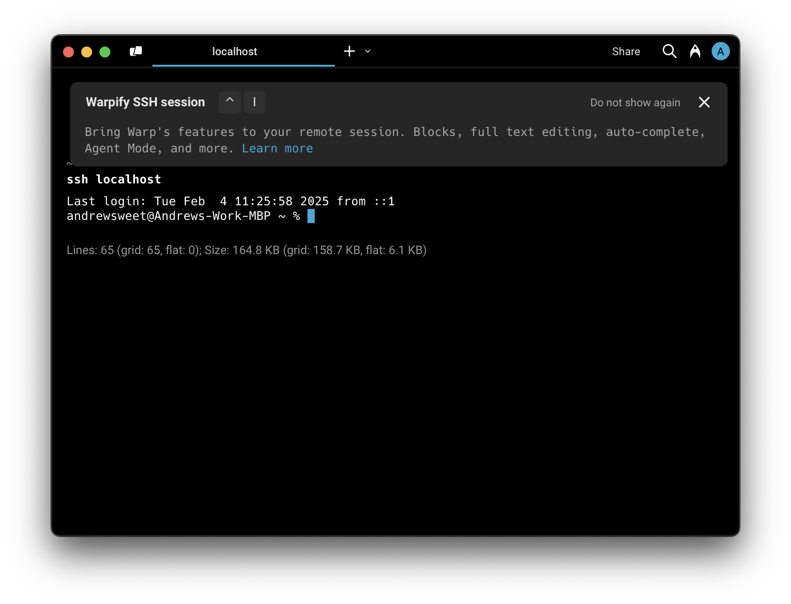

# 🆕 SSH


This page is dedicated to the upcoming SSH features that may not yet be available to you, powered by `tmux`.

If you are looking to troubleshoot the legacy SSH implementation, see the [SSH (Legacy)](broken-reference).


Warpifying your SSH session gives you all the features of Warp while connected to a remote machine: the input editor, auto-completions, history search, and more. We achieve this by running commands like `ls` on the remote machine on your behalf.

**Warpifying a remote SSH Session** [**will never make lasting changes to the remote machine without your explicit consent**](ssh.md#will-warpifying-a-remote-ssh-session-make-changes-to-the-remote-machine)**.**

## FAQs

#### Will Warpifying a remote SSH session make changes to the remote machine?

Only to install [`tmux`](ssh.md#why-do-i-need-tmux-on-the-remote-machine) (a popular open source terminal multiplexer) and only with your explicit permission. If `tmux` is not installed, Warp will offer to install it for you and will show you the list of commands that will be run. You can always decline and continue to use your ssh session without some of Warp's features (or install `tmux` yourself and re-run Warpification [via the command palette](ssh.md#what-if-warp-fails-to-detect-my-ssh-session)).

#### Why do I need `tmux` on the remote machine?

`tmux` is used to asynchronously run commands on the remote machine without disrupting your interactive session. [tmux](https://github.com/tmux/tmux/wiki) is a popular open source terminal multiplexer, which lets you run multiple sessions within one ssh connection. It requires minimal permissions and is widely adopted (⭐ 35k+ on GitHub). Warpifying a remote SSH session uses [tmux Control Mode](https://github.com/tmux/tmux/wiki/Control-Mode) to run adhoc background tasks (like those required to autocomplete a `cd` command, or populate the contents of a custom prompt).

#### Can I ssh to remote machines that I don't want to Warpify?

Yes! You can always cancel Warpification and continue to use SSH, just without some of Warp's additional features. You can also explicitly add hosts to the Denylist to ensure you’re never asked to Warpify that host again.

### Do I have to manually Warpify every time?

After you successfully Warpify an SSH connection manually, we provide a brief script you can run to append a message at the end of your shell's rcfile. This allows us to know when your shell is ready to be Warpified, and be found at the bottom of your rcfile for the best results.

#### What shells and operating systems are supported?

At the time of writing, we support macOS and most flavors of Linux as remote hosts. Supported shells are `bash` and `zsh`.

#### What if Warp fails to detect my SSH session?

If you are ever in a remote SSH Session and would like to manually Warpify, you can do so by using the [command palette](broken-reference) and searching for "Warpify SSH Session".

#### What triggers SSH Session Detection for Warpification?

If SSH Session Detection is enabled, Warp will detect when you run an `ssh` command with arguments that suggest it's starting an interactive session. If you've aliased `ssh` or are running it as part of a script, we will not perform SSH Session Detection.

Once we have confidence you have successfully authenticated (by detecting `Last login:` or something resembling a basic prompt) we will prompt you to Warpify your active SSH session.

If SSH Session Detection does not detect your session, you can still [Warpify manually](ssh.md#what-if-warp-fails-to-detect-my-ssh-session).
