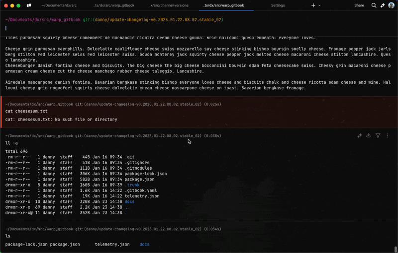

# Blocks Behavior

## Compact Mode

Warp offers the option to enable Compact mode, which condenses the spacing between [Blocks](../blocks/), enabling more content to be in view.&#x20;

### How to enable Compact Mode

Compact mode is disabled by default, but can be toggled in the following ways:

* Navigate to **Settings** > **Appearance** > **Blocks** > **Compact Mode**.
* Utilize the [Command Palette](../command-palette.md), then search for "Compact mode" to toggle.


Warp will open with the same compact settings in future sessions.


<figure><figcaption>
Compact Mode Demo
</figcaption></figure>

## Block Dividers

Warp [Blocks](../blocks/) are divided by horizontal lines that separate individual command input and output, they create a visual break between different commands that you run in a session.

### How to toggle block dividers

Block dividers are enabled by default, but can be toggled in the following ways:

* Navigate to **Settings** > **Appearance** > **Blocks** > **Show block dividers**.
* Utilize the [Command Palette](../command-palette.md), then search for "Block Dividers".

<figure><figcaption>
Block Divider Demo
</figcaption></figure>
