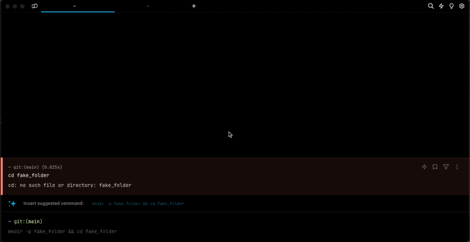
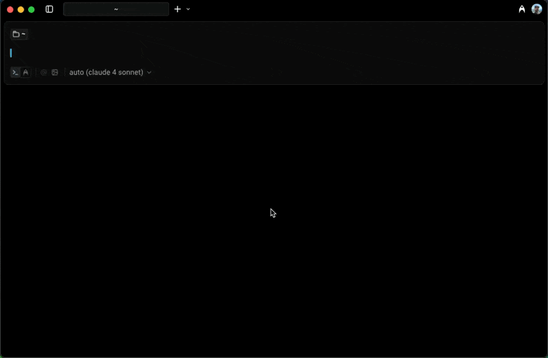

# Tabs Behavior

## Tab indicators

Tab indicators provide visual cues in the tab bar under certain specific conditions: When the current pane is maximized, when panes or tabs are syncronized, and when a command exits with an error. These indicators serve as quick references.

### How to toggle tab Indicators

* Navigate to **Settings** > **Appearance** > **Tabs**, and switch the "Show tab indicators" option.
* Utilize the [Command Palette](../command-palette.md), then search for "Tab indicators" to toggle the tab indicators.

<figure><figcaption>
Tab Indicator Demo
</figcaption></figure>

## Tab bar

The tab bar provides easy navigation between open tabs. By default, the tab bar is visible in windowed mode but hides in fullscreen. To access the tab bar when hidden, hover near the top of the window. You can customize its visibility based on your preferences.

### How to configure the tab bar

* Navigate to **Settings** > **Appearance** > **Tabs** > **Show the tab bar** to toggle the visibility of the tab bar. Choose from the following options:
  * Always – Keeps the tab bar visible at all times.
  * Only on hover – Hides the tab bar in both modes.
  * When windowed – Displays the tab bar only in windowed mode.
* Block dividers


On macOS, traffic lights will not be shown when in windowed mode if the tab bar is set to show only on hover.


<figure><figcaption>
Tab Bar Demo
</figcaption></figure>

## Tab close button

You can configure the position of the tab close button to be either on the left or right side of the tab.

### How to configure the tab close button

Navigate to **Settings** > **Appearance** > **Tabs** > **Tab close button position**, then choose from the following options:

* Left - the close button will be on the left side of the tab (macOS style)
* Right – the close button will be on the right side of the tab (Windows | Linux style)\

<figure><figcaption>
Tab close button demo
</figcaption></figure>