# Themes

### Theme Picker

The Theme Picker can be accessed by:

1. Navigating to **Settings** > **Appearance**.
2. Clicking the Custom Themes (shaded) box.
3. Upon selecting a theme, Warp's appearance will update accordingly.
4. Press the checkmark to save the selection, or the X to revert.


The Theme setting persists, meaning Warp will open with the same settings in the next session.


### Theme Creator

Automatically create new themes based on a background image.

1. Go to **Settings** > **Appearance** > **Themes** or search "Open theme picker" within the [Command Palette](../command-palette.md).
2. Click the `+` button in the theme picker.
3. Upload the image and select the background color.
4. Click "Create Theme" to save and accept the new theme.

### OS Theme Sync

Warp supports synchronizing your theme with the OS’s light and dark themes. To enable this:

1. Open the **Settings** > **Appearance** dialog.
2. Click the toggle "Sync with OS".
3. You will then be able to select a specific theme for when the OS is in light mode and dark mode.

## How it works

<figure>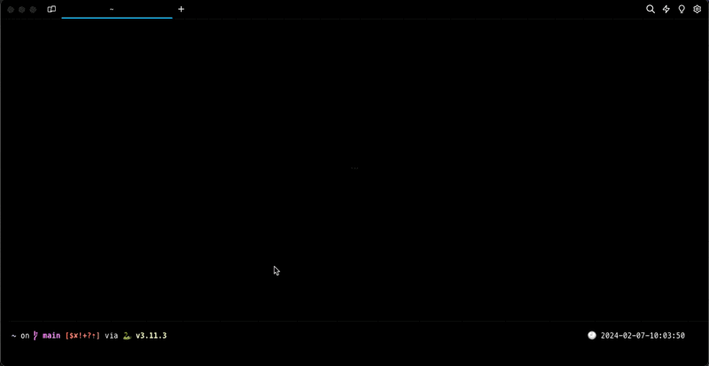<figcaption>
Theme picker demo
</figcaption></figure>

<figure>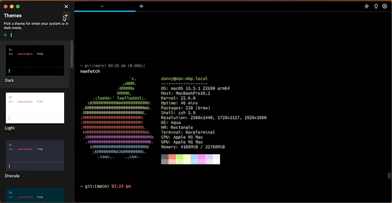<figcaption>
Theme creator demo
</figcaption></figure>

<figure>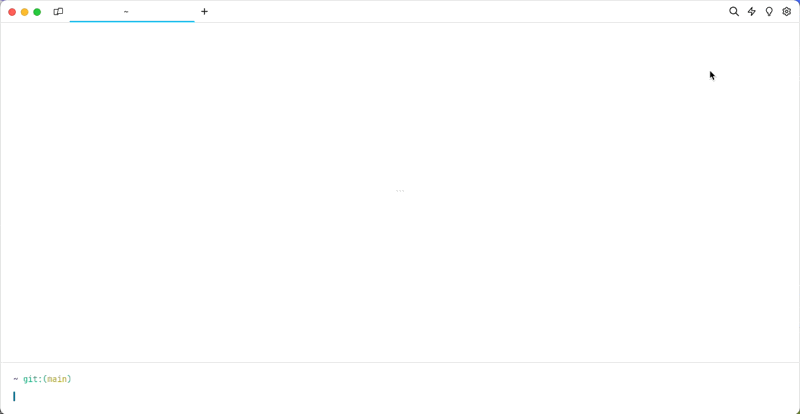<figcaption>
Theme sync demo
</figcaption></figure>

## Default Themes

By default, Warp ships with these themes:

<table data-view="cards"><thead><tr><th align="center"></th><th align="center"></th></tr></thead><tbody><tr><td align="center"></td><td align="center">Warp Dark</td></tr><tr><td align="center">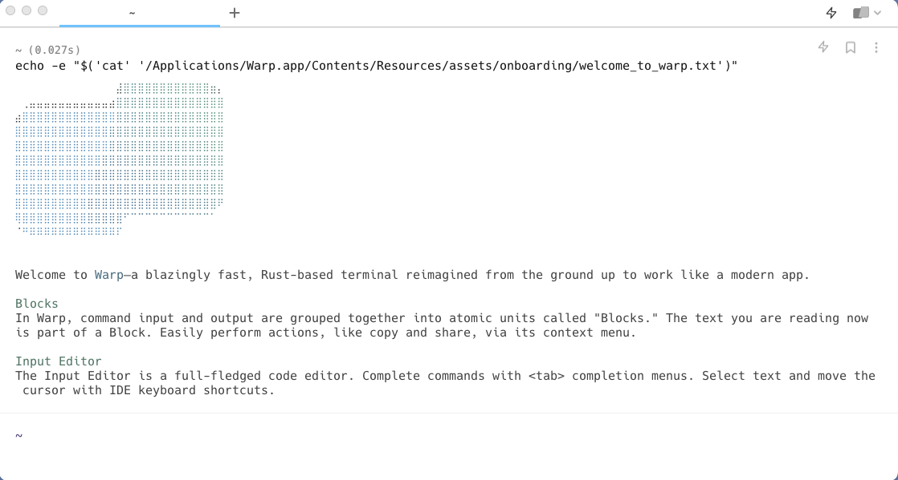</td><td align="center">Warp Light</td></tr><tr><td align="center"></td><td align="center">Dracula</td></tr><tr><td align="center"></td><td align="center">Solarized Dark</td></tr><tr><td align="center"></td><td align="center">Solarized Light</td></tr><tr><td align="center"></td><td align="center">Gruvbox Dark</td></tr><tr><td align="center">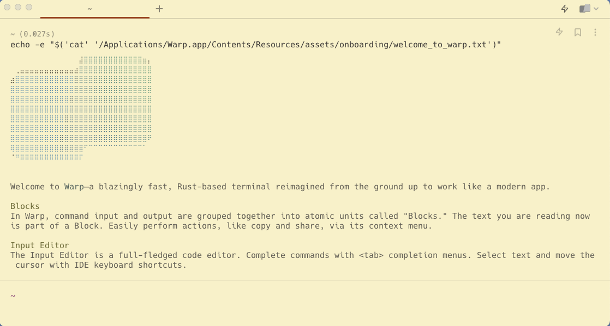</td><td align="center">Gruvbox Light</td></tr><tr><td align="center">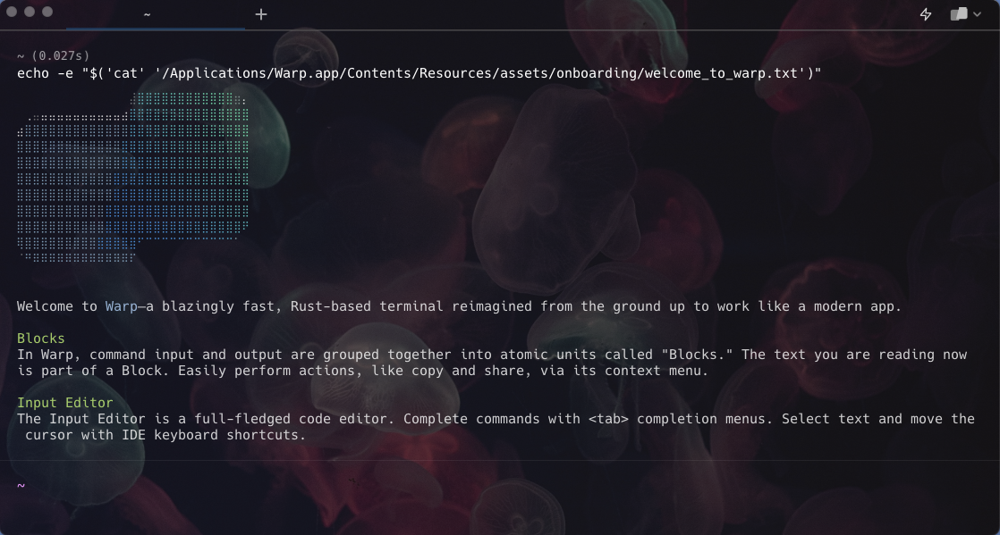</td><td align="center">Jellyfish</td></tr><tr><td align="center">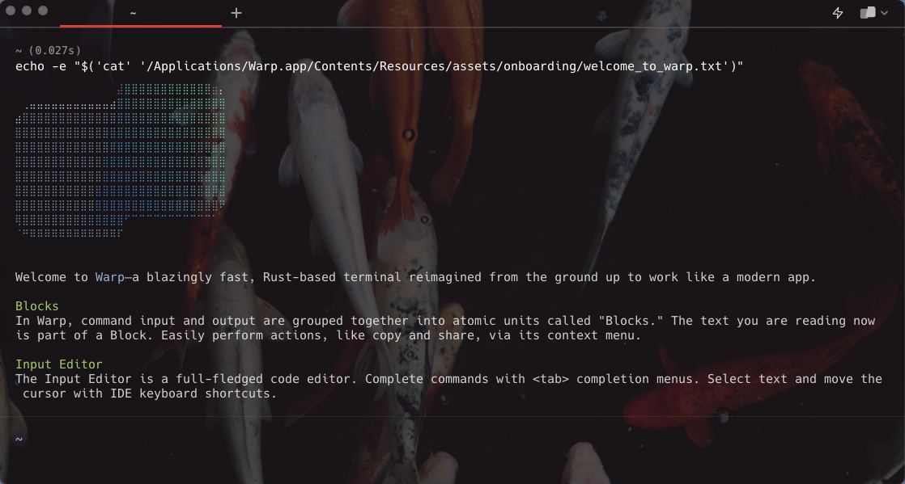</td><td align="center">Koi</td></tr><tr><td align="center"></td><td align="center">Leafy</td></tr><tr><td align="center"></td><td align="center">Marble</td></tr><tr><td align="center"></td><td align="center">Pink City</td></tr><tr><td align="center">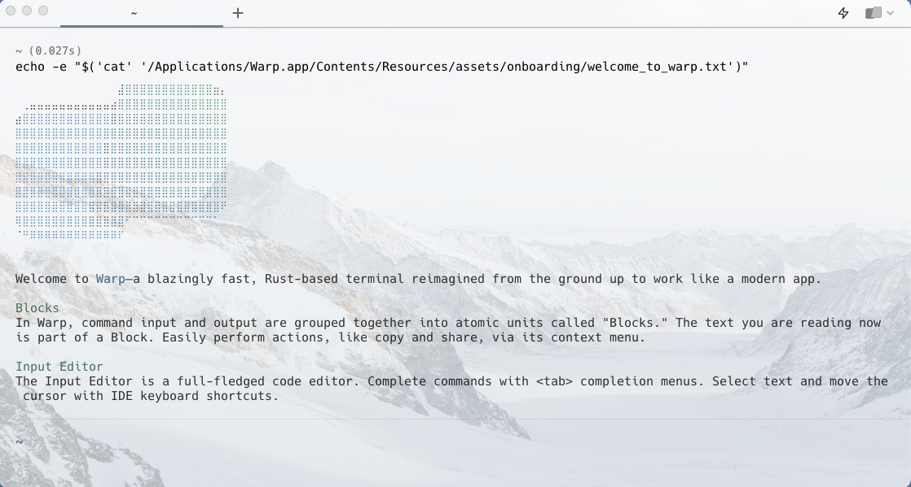</td><td align="center">Snowy</td></tr><tr><td align="center"></td><td align="center">Dark City</td></tr><tr><td align="center"></td><td align="center">Red Rock</td></tr><tr><td align="center">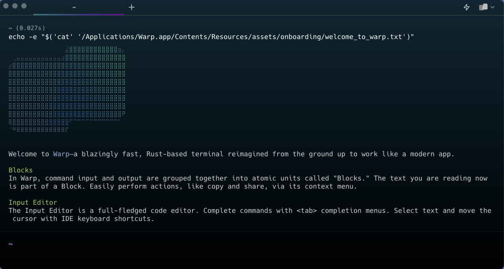</td><td align="center">Cyber Wave</td></tr><tr><td align="center">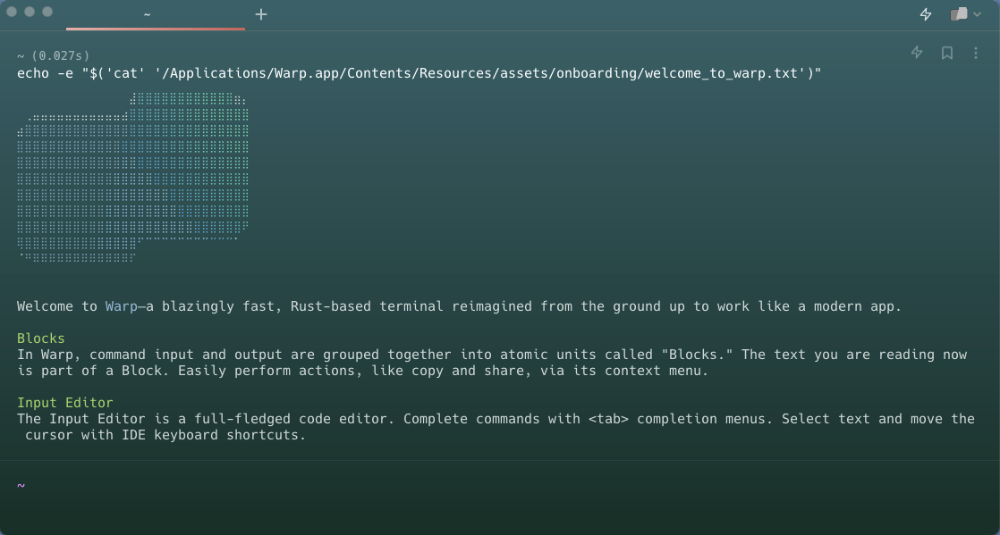</td><td align="center">Willow Dream</td></tr><tr><td align="center"></td><td align="center">Fancy Dracula</td></tr><tr><td align="center">
<figure>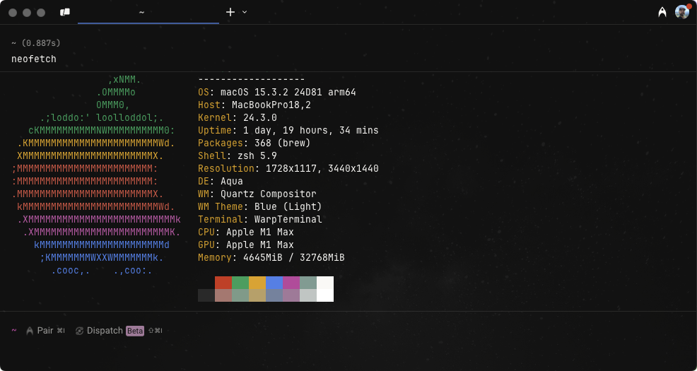<figcaption></figcaption></figure>
</td><td align="center">Phenomenon</td></tr><tr><td align="center">
<figure><figcaption></figcaption></figure>
</td><td align="center">Solar Flare</td></tr><tr><td align="center">
<figure>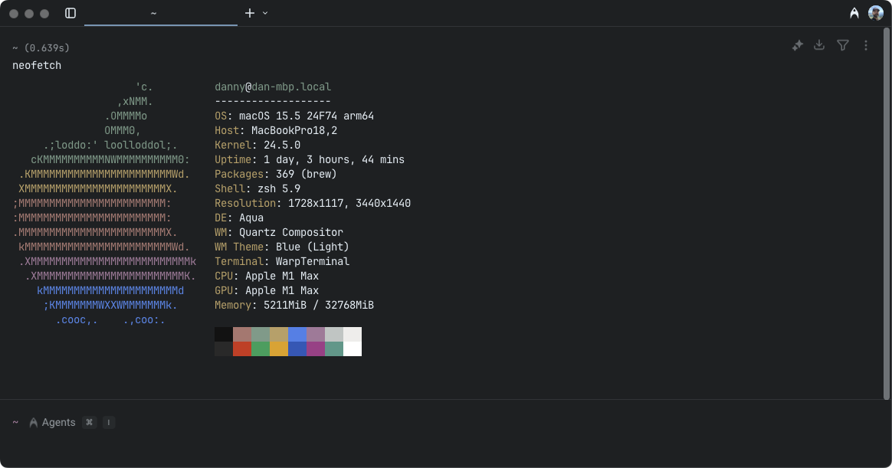<figcaption></figcaption></figure>
</td><td align="center">Adeberry</td></tr></tbody></table>
