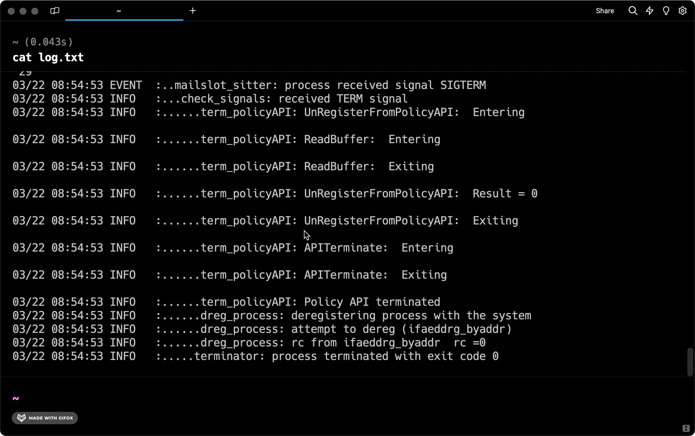

# Block Filtering

Filter the output lines of a block in Warp to quickly focus on a subset of the block. You can filter by plaintext, regex, invert, or make your filter case-sensitive. You can also add context lines to view output around matches. Filtering does not delete any output lines, so you can clear the filter to go back to the original output.

## How to filter a block

To apply a filter to a block:

1. Click on the filter icon in the top right corner of a block. A filter editor will appear with a large input field with two buttons on the left and a smaller input field on the right.
2. Type in the input to filter the block in the left input field. Only lines containing text that matches the filter query will be shown.
3. (Optional) Click on the regex, case sensitive search, or invert filter buttons to enable.
4. (Optional) Type a number in the right input field to add context lines around matched lines.

<figure><figcaption>
Filter a block's output, with the ability to add context lines.
</figcaption></figure>



You can also toggle a filter by:

* Using the keybinding `OPT-SHIFT-F` by default to toggle filtering on the selected or latest block
* Selecting `Toggle Block Filter` in the block context menu



You can also toggle a filter on/off by:

* Using the keybinding `ALT-SHIFT-F` to toggle filtering on the selected or latest block
* Selecting `Toggle Block Filter` in the block context menu



You can also toggle a filter on/off by:

* Using the keybinding `ALT-SHIFT-F` to toggle filtering on the selected or latest block
* Selecting `Toggle Block Filter` in the block context menu




Toggling a filter on a block without a filter applied will open the filter editor. If you toggle a filter off, the same filter will be applied if you toggle filtering on again.


<figure><figcaption>
Toggle a block filter on/off.
</figcaption></figure>
