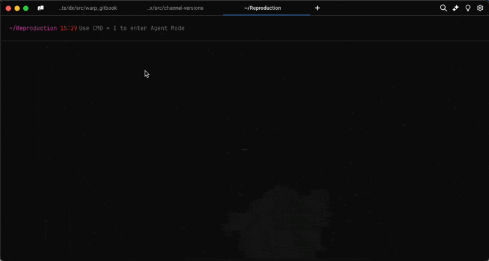
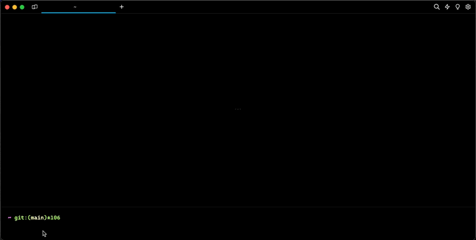

# Warpify overview

1. [Subshells](subshells.md), Warp supports enabling Warp features in subshells for bash, zsh, and fish.
2. [SSH](ssh.md), Warp supports a tmux powered wrapper that enables Warp features in remote (SSH) sessions.
3. [SSH Legacy](ssh-legacy.md), Warp supports a legacy wrapper that enables Warp features in remote (SSH) sessions.

## Subshells

<figure><figcaption>
Warpify Subshells Demo
</figcaption></figure>

## SSH

<figure><figcaption>
Warpify SSH Demo
</figcaption></figure>
