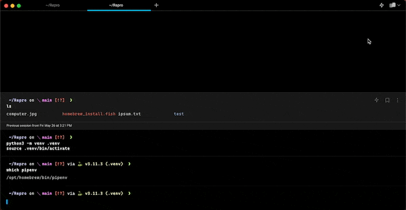
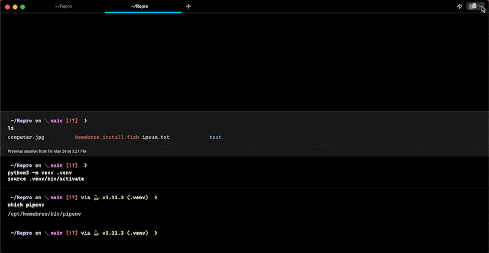

# Window Management

1. [Global Hotkey](global-hotkey.md) is a configurable shortcut that can show/hide a dedicated window or all windows on your chosen desktop regardless of whether the app is focused.
2. [Tabs](tabs.md) allow you to organize a window into multiple terminal sessions.
3. [Vertical tabs](vertical-tabs.md) replace the horizontal tab bar with a sidebar that shows rich metadata and drag-and-drop management for every tab and pane.
4. [Split Panes](split-panes.md) allows you to divide a Tab into multiple rectangular _panes_, each of which is a unique terminal session.

## Global Hotkey

<figure><figcaption>
Global Hotkey - Dedicated Window Demo
</figcaption></figure>

<figure><figcaption>
Global Hotkey - Show/Hide All Windows Demo
</figcaption></figure>

## Tabs


Tabs Demo


## Split Panes


Split Panes Demo

