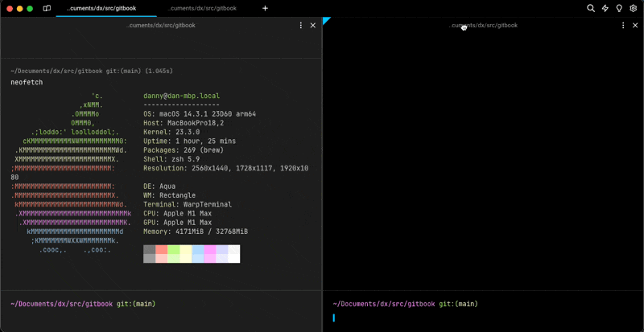

# Split Panes

## How to use Split Panes



* Split Panes to the right / down with `CMD-D` / `SHIFT-CMD-D` or in any direction by right-clicking on any Pane.
* Activate the Previous / Next Pane with `CMD-[` / `CMD-]` or by clicking a pane.
* Navigate among Split Panes with `OPT-CMD-ARROW`, the active pane will be marked with a triangle in the top corner.
* Toggle Maximize Pane with `CMD-SHIFT-ENTER`.
* Close the active Pane with `CMD-W`.
* You can also drag and drop panes. Click and drag a Pane’s header around a given tab, drag the Pane to the tab bar to move it to another Tab, or make it into a Tab.



* Split Panes to the right / down with `CTRL-SHIFT-D` / `CTRL-SHIFT-E` or in any direction by right-clicking on any Pane.
* Activate the Previous / Next Pane with `CTRL-SHIFT-{` / `CTRL-SHIFT-}` or by clicking a pane.
* Navigate among Split Panes with `CTRL-ALT-ARROW`, the active pane will be marked with a triangle in the top corner.
* Toggle Maximize Pane with `CTRL-SHIFT-ENTER`.
* Close the active Pane with `CTRL-SHIFT-W`.
* You can also drag and drop panes. Click and drag a Pane’s header around a given tab, drag the Pane to the tab bar to move it to another Tab, or make it into a Tab.



* Split Panes to the right / down with `CTRL-SHIFT-D` / `CTRL-SHIFT-E` or in any direction by right-clicking on any Pane.
* Activate the Previous / Next Pane with `CTRL-SHIFT-{` / `CTRL-SHIFT-}` or by clicking a pane.
* Navigate among Split Panes with `CTRL-ALT-ARROW`, the active pane will be marked with a triangle in the top corner.
* Toggle Maximize Pane with `CTRL-SHIFT-ENTER`.
* Close the active Pane with `CTRL-SHIFT-W`.
* You can also drag and drop panes. Click and drag a Pane’s header around a given tab, drag the Pane to the tab bar to move it to another Tab, or make it into a Tab.




You can quickly find all the **pane** shortcuts by using the [Command Palette](../command-palette.md). You can also remap the shortcuts to your liking. See [Custom Keyboard Shortcuts](../../getting-started/keyboard-shortcuts.md#custom-keyboard-shortcuts) for more details.


### CTRL-TAB Behaviour

`CTRL-TAB` shortcut defaults to activate the previous / next [Tabs](tabs.md). You can configure the shortcut to cycle the most recent session, including any Split Panes, in **Settings** > **Features** > **Keys** > **Ctrl-Tab behavior**

## How Split Panes work


Split Panes Demo


<figure><figcaption>
Split Panes Drag and Drop Demo
</figcaption></figure>
