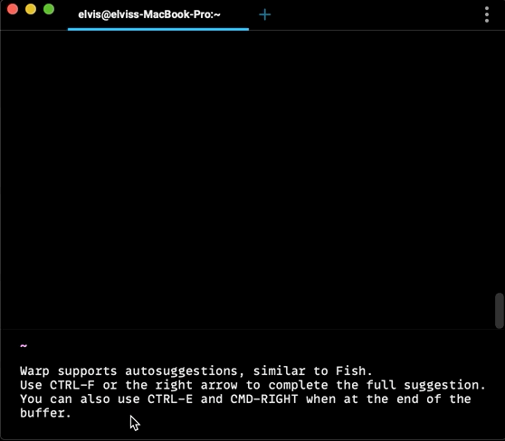

# Autosuggestions

Warp has an autosuggestions feature similar to Fish (shell).  
Autosuggestions are enabled by default, but can be toggled using the Command Palette (`CMD-P`).

Complete an autosuggestion using the `RIGHT` arrow or `CTRL-F`. 
`CTRL-E` and `CMD-RIGHT` also completes the autosuggestion when your cursor is at the end of the buffer (last character in the Input Editor).

