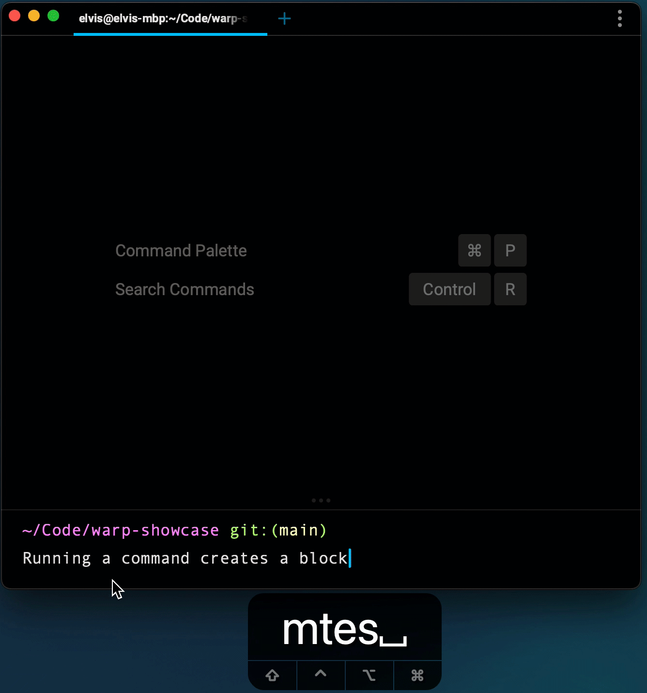
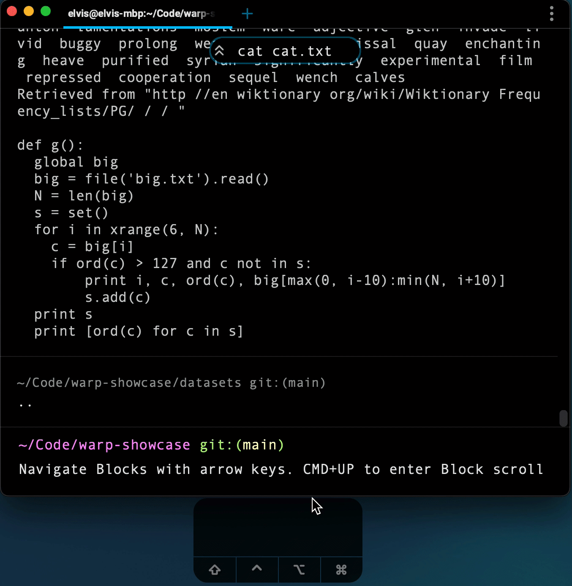
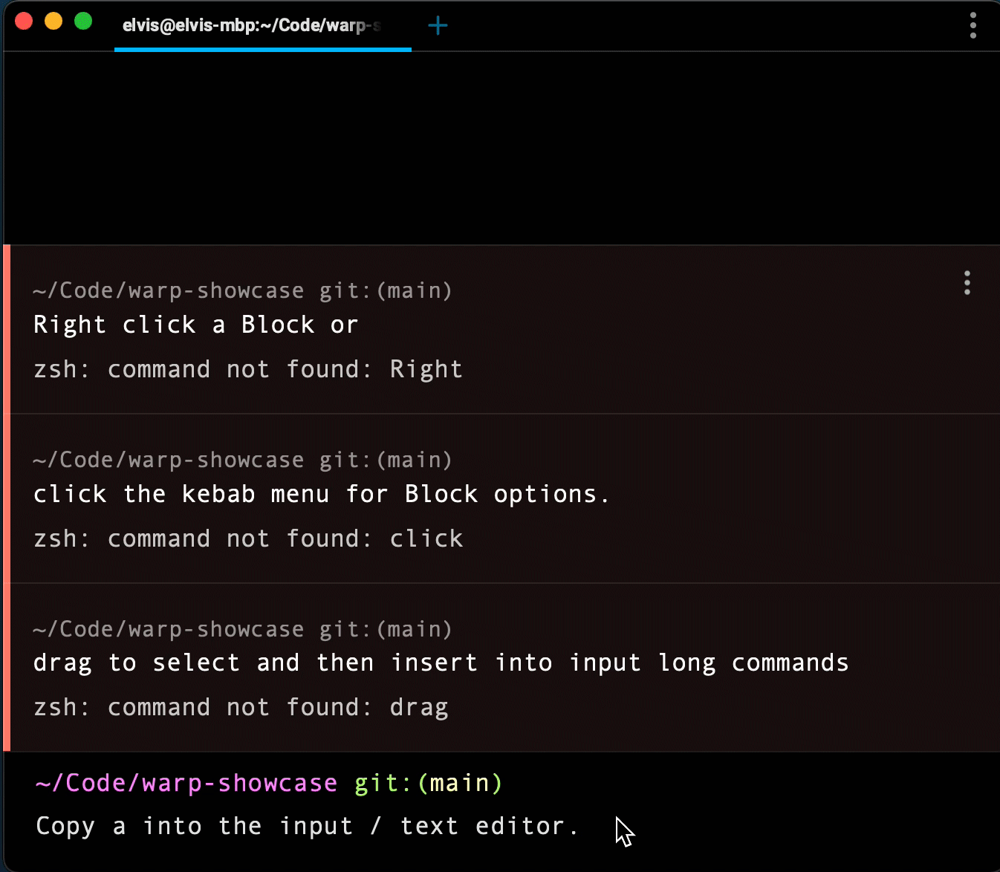

# Blocks

In other terminals, the atomic unit is a character. But most developers think in commands and outputs. We designed Warp to reflect this mental model by grouping commands and outputs into Blocks.

Blocks enable us to easily:

* copy a command
* copy a command’s output
* scroll directly to the start of a command’s output
* re-input commands
* [share](https://app.warp.dev/block/TxBPzaJ56fQyXYI4TI4Ia2) both a command and its output (with formatting!)

Interested in how we differentiate input and output, or how we implement blocks? Check out our blog post: [How Warp Works.](https://blog.warp.dev/how-warp-works/#implementing-blocks)

## Creating your first Block

* Execute a command (type `ls` and hit `ENTER`) in the Input Editor at the bottom of the screen.
* Warp groups your command and output into a Block.
* The Input Editor is fixed to the bottom.
* Blocks grow from bottom to the top.
* Try executing a different command (type `echo hello` and hit enter).
* Warp adds your newly created Block to the bottom (directly above the input editor).

## Color-coded Blocks

We designed visual cues to help with quickly identifying what’s going on in a block.

* Blocks that quit with a non-zero exit code have a red background and red side bar.
* Try it: type `xyz` (or some other command that doesn’t exist) and hit `ENTER`

## Selecting a Block

To select a Block:

* Using your mouse: click on a Block.
* Or using your keyboard: hit `CMD+UP` to select the most recently executed Block and use the `UP ↑` and `DOWN ↓` arrow keys to navigate to the desired Block.

## Navigating between Blocks

To navigate between Blocks, you can either scroll using your mouse or the scrollbar, or you can [select a Block](https://docs.warp.dev/features/blocks#selecting-a-block) and use the `UP ↑` and `DOWN ↓` arrow keys.

When the output of a command is cut-off, Warp creates a “snack bar” that displays the command the Block corresponds to. Clicking the snackbar will scroll the screen to the start of the Block.

## Actions on a Block

To access a Block's dropdown menu, hover over a Block and click the kebab (three dots) button on the right hand side. Right clicking a block will also open up the Block’s dropdown menu.

The dropdown menu supports: (Dec 2021):

* Copying the input and/or output of a Block to the clipboard (`CMD+SHIFT+C`) to copy with the keyboard).
* Sharing a Block (with formatting) by creating a [web permalink](https://app.warp.dev/block/TxBPzaJ56fQyXYI4TI4Ia2).
  * You can always unshare the Block after. To unshare the Block: Go to Settings -> Shared Blocks
  * Currently the link is viewable to anyone who has it, but in the future, you will be able to restrict viewing permissions to specific Warp users or email domains.
  * This is the only action in the app that sends command information to our server. It is explicitly opt-in. Our privacy principle is that any data sharing is opt-in and under the control of the user, and you should be able to remove or export that data from our servers at any time. Read our privacy policy here for [more information](https://www.warp.dev/privacy).

