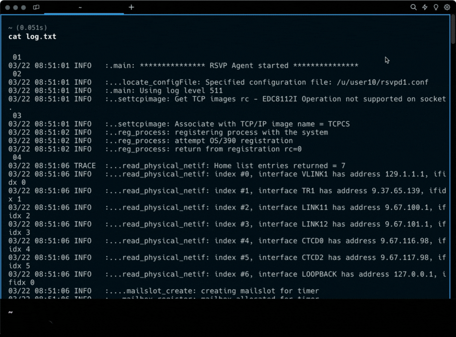
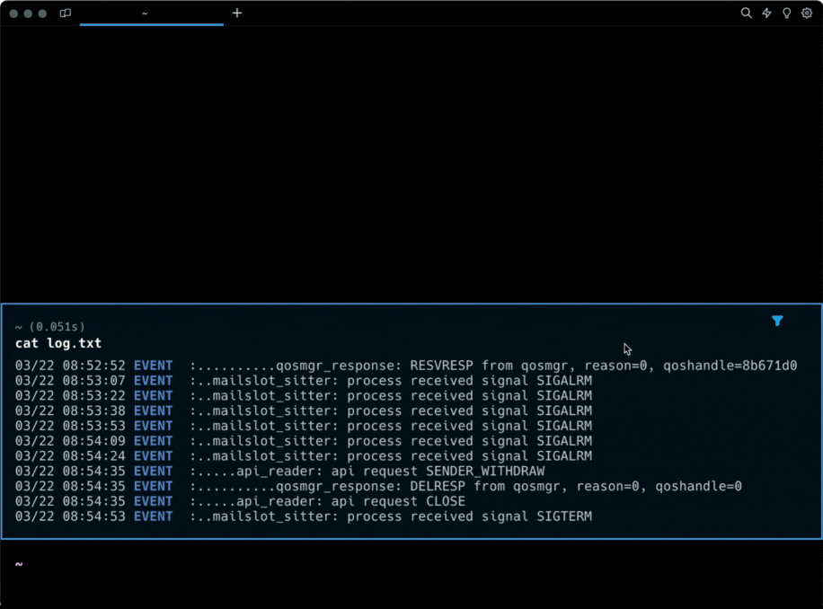

# Block Filtering

Filter the output lines of a block in Warp to quickly focus on a subset of the block. You can filter by plaintext, regex, or make your filter case-sensitive. Filtering does not delete any output lines, so you can clear the filter to go back to the original output.

## How to filter a block

To apply a filter to a block:

1. Click on the filter icon in the top right corner of a block. A filter editor will appear with an input field and two buttons.
2. Type in the input to filter the block. Only lines containing text that matches the filter query will be shown.
3. (Optional) Click on either the regex or case sensitivity buttons to enable.

<figure>
    
    <figcaption>
        
Filter a block's output.

    </figcaption>
</figure>

You can also toggle a filter on/off by:

1. Using the keybinding (`OPT-SHIFT-F` by default) to toggle filtering on the selected or latest block
2. Selecting `Toggle Block Filter` in the block context menu

Toggling a filter on a block without a filter applied will open the filter editor. If you toggle a filter off, the same filter will be applied if you toggle filtering on again.

<figure>
    
    <figcaption>
        
Toggle a block filter on/off.

    </figcaption>
</figure>
