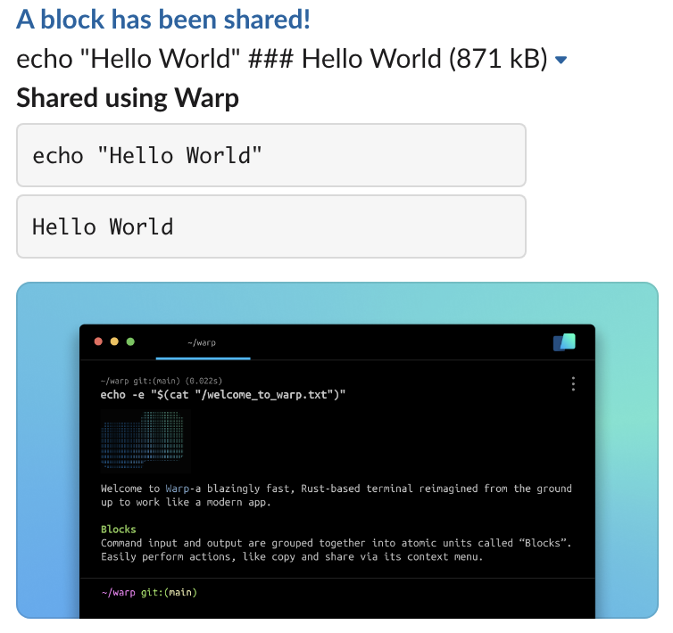
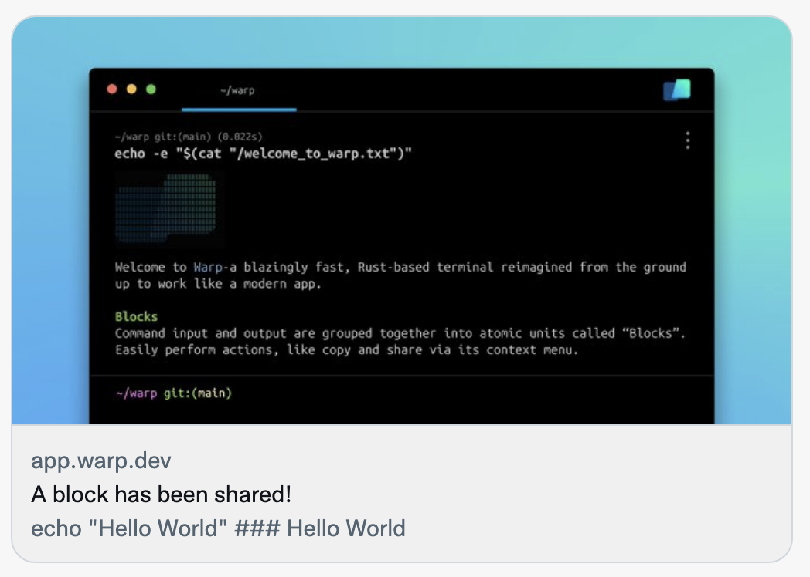

# Block Sharing


This action sends command information to our server and is explicitly opt-in. Our privacy principle is that any data sharing is opt-in and under the control of the user, and you should be able to remove or export that data from our servers at any time. Read our privacy policy here for [more information](https://www.warp.dev/privacy).


## Permalink

Create and share a permalink to your Blocks to collaborate with teammates. Warp also preserves your Block’s output to improve the debugging process.

* Currently, shared Blocks are viewable to anyone with the link, but in the future, you will be able to restrict viewing permissions to specific people or email domains.
* Unshare a Block by navigating to `Settings -> Shared Blocks`


Share and Un-share a Block


Here is the [web permalink](https://app.warp.dev/block/vzFATak939iqGWfNh7wsAP) of the Block shared in the demo above.

## Link Previews

Shared permalinks will also display a preview of your code for quick context on each link.


Compatible with any platform that supports Open Graph or Twitter meta tags.


<figure><figcaption>
Slack Block Preview
</figcaption></figure>

<figure><figcaption>
Twitter Block Preview
</figcaption></figure>
