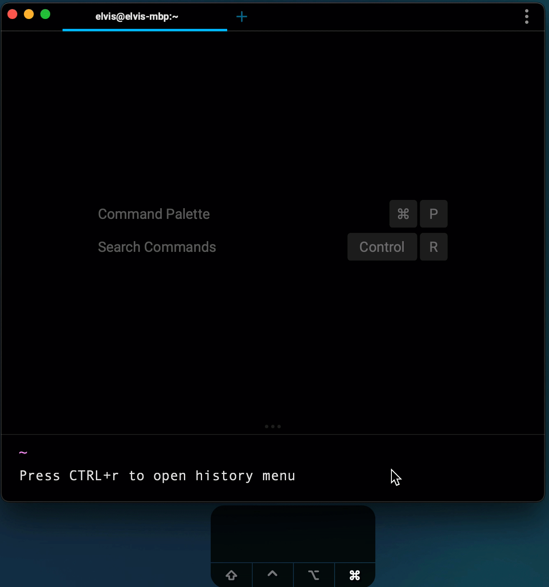

# Command History

Hitting `UP ↑` in the editor brings up your history.
After Warp starts, history is scoped within each shell session e.g. if you have two Split Panes open, commands created in one do not populate the other.
Only until the entire Warp instance is closed do we merge these two branches.

Pressing `CTRL-r` opens a menu and initiates a search of your command history.
Use your `UP` `↑` and `DOWN` `↓` arrow keys, or mouse scroll, to navigate through them.

Warp will (via `CTRL-r`) automatically highlight the matching text.

