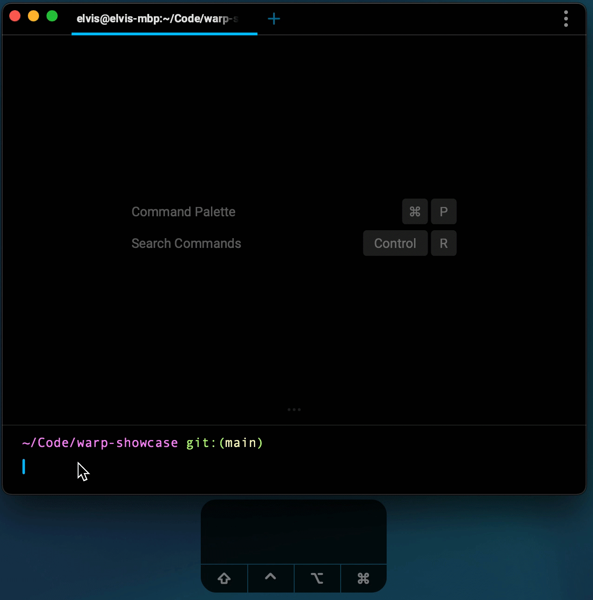

# Command Palette

Finding your way around Warp is as simple as pressing `CMD-p`, which brings up the command palette.
Use this to search for keyboard shortcuts on how to complete various tasks in Warp, like opening up a Split Pane with `CMD-e` or `SHIFT-CMD-E`.

