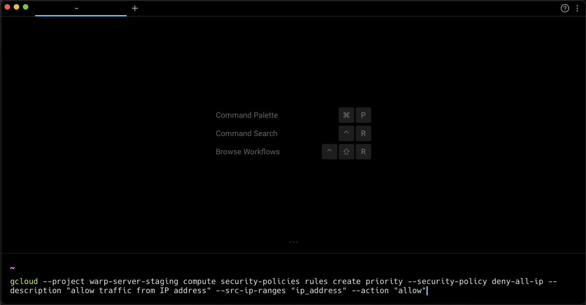

# Modern Text Editing

## What is it

Unlike other terminals, Warp’s input editor operates out-of-the-box like a modern IDE and the text editors we’re used to.


Text Editor Input also works for [SSH sessions](../ssh.md).


### Soft Wrapping

Warp supports soft wrapping in the input editor. If there is an auto suggestion that goes off-screen, the input editor will be horizontally scrollable to make it visible. _Note:"_ Some operations treat soft wrapped lines like a logical line (`TRIPLE-CLICK`, `OPTION-LEFT` / `OPTION-RIGHT`) while other operations treat soft wrapped lines like visible different lines (`UP` / `DOWN`, `SHIFT-UP` / `SHIFT-DOWN`).

### Copy on Select

Warp supports copy on select in the Input editor or with any other selectable text in [Blocks](../blocks/).  Note: This feature has a known issue working within [alt-screens](https://github.com/warpdotdev/Warp/issues/2758) like vim, less, k9s, etc.

* Enable this feature in `Settings > Features > General` or search for "copy on select" in the Command Palette `CMD-P`.

### Input Hints

Warps input will occasionally show hints within the input editor in light grey text that help users learn about features that are available. For example "Type `#`  for AI command suggestions". It's enabled by default.

* Disable "Show Input hint text" in `Settings > Features > Editor` or search for "input hint text" in the Command Palette `CMD-P` or Right-click on the input editor.

## How to use it

| Keyboard binding                                     | Shortcut description                                                                                       |
| ---------------------------------------------------- | ---------------------------------------------------------------------------------------------------------- |
| `escape`                                             | Closes the input suggestions or history menu                                                               |
| `ctrl-l`                                             | Clears the terminal                                                                                        |
| `ctrl-h`                                             | Backspace                                                                                                  |
| `ctrl-c`                                             | Clear the entire editor buffer                                                                             |
| `ctrl-u` `cmd-shift-K`                               | Clear the current line                                                                                     |
| `cmd-c` `ctrl-y`, `cmd-x`, `cmd-v`                   | Copy, cut, paste                                                                                           |
| `ctrl-w` / `option-d`                                | Cut the word to the left / right of the cursor                                                             |
| `option-backspace` / `option-d`                      | Delete the word to the left / right of the cursor                                                          |
| `ctrl-k cmd-delete`                                  | Delete everything to the right of the cursor                                                               |
| `option-left` / `option-right`                       | Move to the beginning of the previous / next word                                                          |
| `ctrl-opt-left` / `ctrl-opt-right`                   | Move backward / forward by one subword                                                                     |
| `cmd-left` `ctrl-a`/ `ctrl-e` `cmd-down` `cmd-right` | Move the cursor to the start / end of the line                                                             |
| `cmd-up`                                             | Move the cursor to the beginning of the editor buffer. If it's already there, select the most recent block |
| `shift-left` / `shift-right`                         | Select the character to the left / right of the cursor                                                     |
| `option-shift-left` / `option-shift-right`           | Select the word to the left / right of the cursor                                                          |
| `cmd-shift-left` / `cmd-shift-right`                 | Select everything to the left / right of the cursor                                                        |
| `shift-up` / `shift-down`                            | Select everything above / below the cursor                                                                 |
| `cmd-a`                                              | Select the entire editor buffer                                                                            |
| `shift-enter` `ctrl-enter` `option-enter`            | Insert newline                                                                                             |
| `ctrl-r`                                             | [Command History](broken-reference)                                                                        |
| `cmd-d`                                              | Split pane                                                                                                 |

## How it Works


Text Editor Input Demo


<figure><figcaption>
Soft Wrapping Demo
</figcaption></figure>
