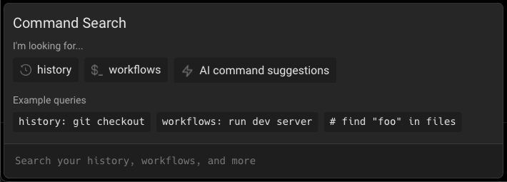

# Command Search

## What is it

Command Search panel allows you to search across Command History, Workflows, Notebooks (**Coming Soon**), and A.I. Command Search all at once. Warp supports fuzzy search and tries to rank more relevant search queries.

## How to access it

1. Press `CTRL-R` to open the Command Search Panel. You’ll be greeted with a landing page, where you can click through different filters to get started.

1. Type into the input box what your search query is. The results will be a mix of command history, saved workflows, and A.I. Command Search.
    *  Curly Brackets icon signifies that the result is a [Workflow](../entry/workflows.md).
    *  Rewind Time Clock icon signifies that the result is a [Command History](../entry/command-history.md).
    *  Earmarked Page icon signifies that the result is a Notebook (**Coming Soon**).
    *  Sparkle icon signifies piping that search query into [A.I. Command Search](../entry/ai-command-search.md)
1. Activate a specific filter, by prepending your search term with:
   * `workflows:` will activate the workflows filter. You can also use the shortcuts `w:` or `W+TAB`.
   * `history:` will activate the history filter. You can also use the shortcuts `h:` or `H+TAB`.
   * `#:` will activate the A.I. Command Search filter. Once the filter is activated, it will be bolded and italicized.
1. Once the result shows up, press ENTER to input the command directly into Warp's Input Editor. For history results, `CMD-ENTER` will directly execute the command.

## How it works

Command Search Demo
