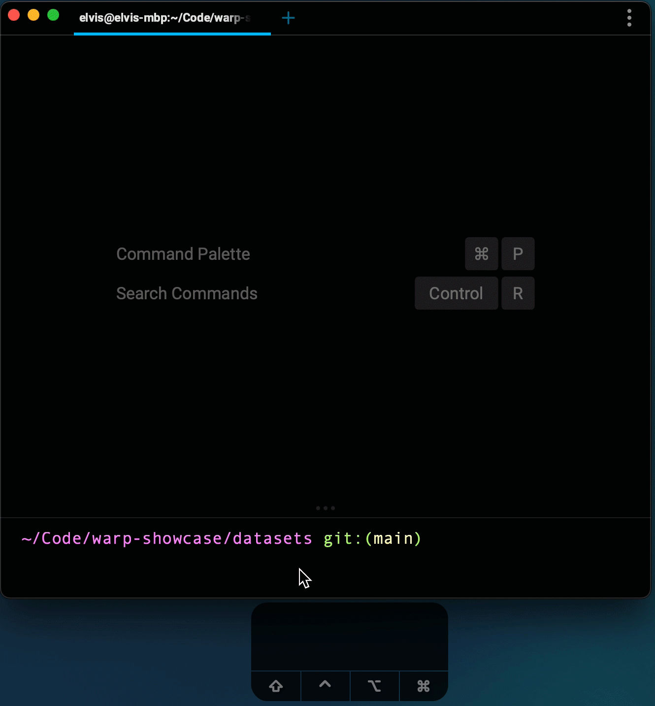

# Find

## What is it

Find works just like what you would expect in a modern text editor. It searches for matches in your Blocks from the bottom-up, with the first match being the most recent one. Since command outputs are contained within Blocks, you can still use the input editor when invoking find.

## How to access it

1. Hitting `CMD-F` opens the find view which searches across the terminal (scoped within the current pane).

Note: Within Find modal, you can also enable the Regex toggle, Find in one or multiple selected Blocks, and or toggle Case sensitive search.

## How it works

