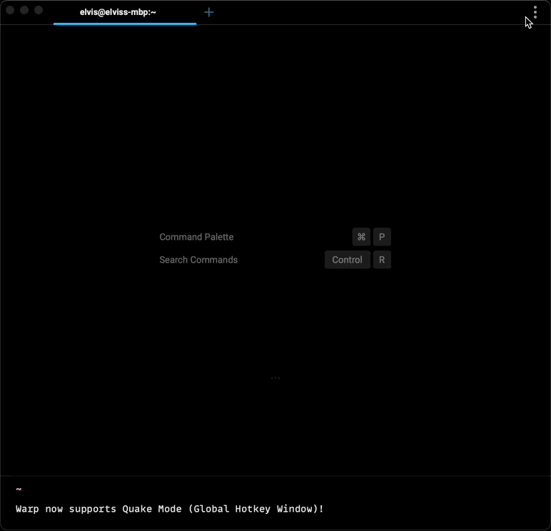

# Global Hotkey Window

## What is it

The Hotkey Window shortcut can show and hide Warp on your focused desktop regardless of whether the app is focused. You could customize the window’s pinned position and its width and height ratio relative to your active screen size. _Note:_ Your new customization will apply the **next** time a hotkey window is created and not the currently opened one.

## How to access it

1. Open `Settings > Features` and tick the `Hotkey Window` and enable the feature.
2. There you can configure the keyboard shortcut and the windows position, screen, and relative size.

_Note:_ If the window does not open after pressing the registered hotkey, check under `System Preferences > Security & Privacy > Accessibility` and tick the checkbox to grant Warp access. Also,`ESC, BACKTICK, TAB , SHIFT, CAPS` are not supported keyboard shortcuts.

## How it works

