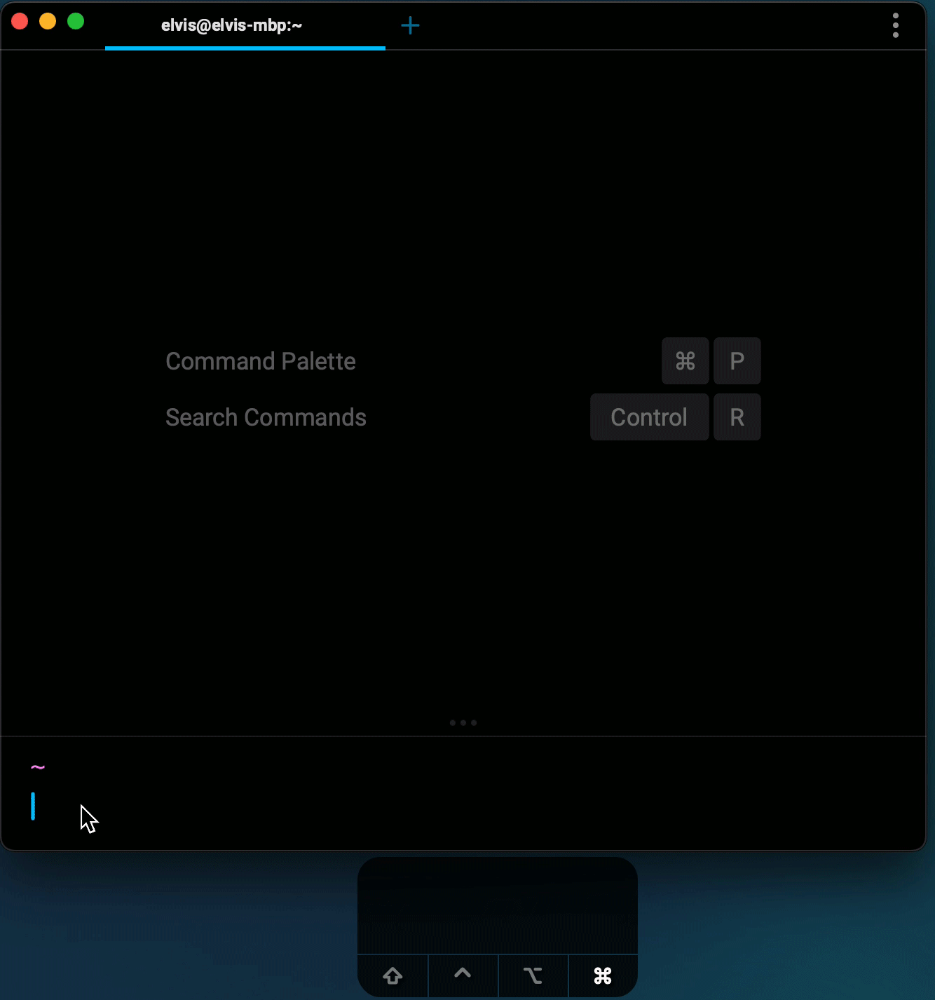

# Input / Text Editor

Unlike other terminals, Warp’s input editor operates out-of-the-box like a modern IDE and the text editors we’re used to, even for [SSH sessions.](https://docs.warp.dev/features/ssh)

Warp supports modern keyboard and mouse bindings like multiple cursors and clicking and dragging text.
Warp is also backwards-compatible to the normal terminal bindings (emacs), e.g. we support `CTRL+a` and `CTRL-e` to move to the start and end of a line respectively.
To see all the editor shortcuts head to [Keyboard Shortcuts](https://docs.warp.dev/features/keyboard-shortcuts) or click `CMD-p` to open the [Command Palette](https://docs.warp.dev/features/command-palette).

* To type in a multi-line command use `SHIFT-ENTER` or `OPT-ENTER` to insert newlines.
* For multi-cursor selection click into a word on the first line and while holding the `CMD` key down, and click into anywhere else in the text.
* You can also select a string and click `CMD-d` to select the next occurrence of the string

