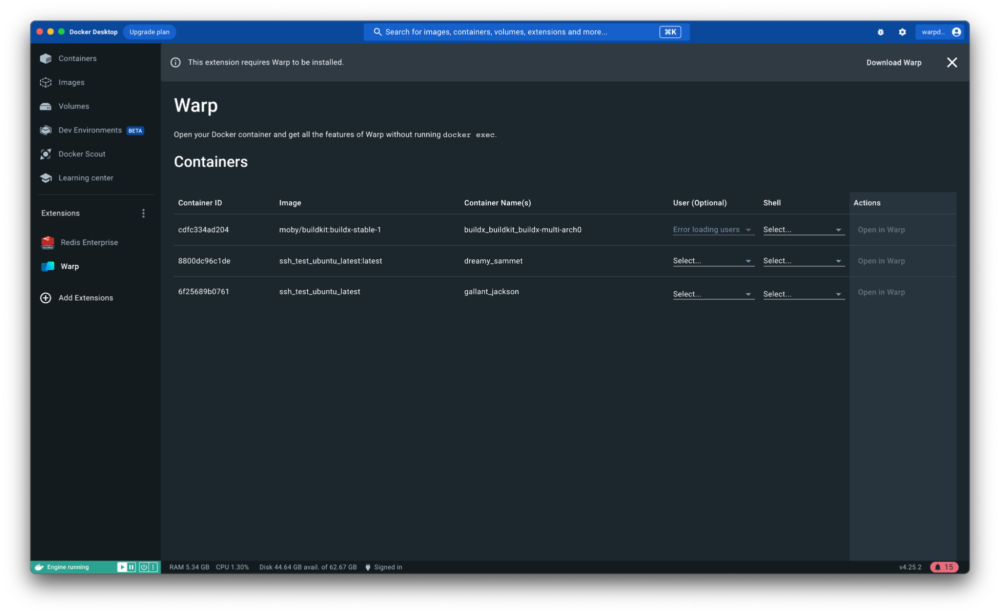
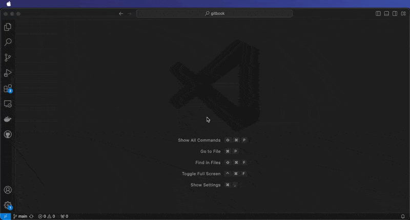

# Integrations

## Docker

[Warp’s Docker extension](https://hub.docker.com/extensions/warpdotdev/warp) makes it more convenient to open Docker containers in Warp. With the extension, you can click to open any Docker container in [a Warpified subshell](https://docs.warp.dev/features/subshells), without manually running `docker exec` or typing out lengthy container IDs.

Select a container from the list and specify a shell type. Select a user (optional). Then click “Open in Warp” to run commands within the Docker container.

<figure><figcaption>
Warp's extension for Docker lists available containers.
</figcaption></figure>

## Raycast

Warp + Raycast extension helps you open new Windows, Tabs, or Launch Configurations with [ease](https://twitter.com/warpdotdev/status/1678432353461637121).


Warp + Raycast Extension Link


## VSCode

Press `SHIFT-CMD-C` while in VSCode to open a new session in Warp.

To configure this, use the Apple Menu. Click on `Code` -> `Settings` -> `Settings`. Type in "terminal" and change _Terminal > External: Osx Exec_ to `Warp.app`.

## JetBrains IDEs

Press a keyboard shortcut of choice while in a JetBrains IDE to open a new session in Warp.

To configure this, use the Apple Menu. Click on `Preferences`, go to `External Tools` and click `Add`. In this menu, put the following information:

* _Name_: Open Warp
* _Program_: `/Applications/Warp.app`
* _Arguments_: `$ProjectFileDir$`
* _Working Directory_: `/Applications`

Then press `Ok`. Now you will be able to `Open Warp` from the Apple Menu under `Tools` -> `External Tools`.

To attach this configuration to a keyboard shortcut, you must go to the Apple Menu -> `Preferences`. Then go to `Keymap` -> `External Tools`. You will find `Open Warp`. Right click on it, and select `Add Keyboard Shortcut`. Type your desired shortcut and click save! You're ready to open Warp with a keyboard shortcut.

