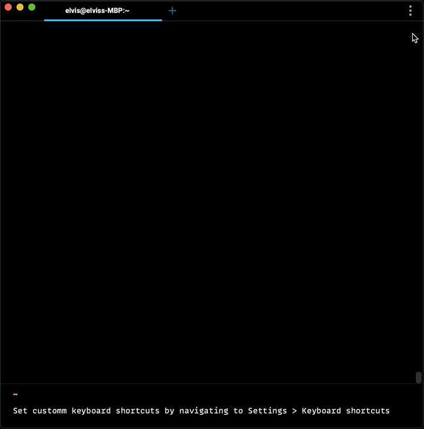

# Keyboard Shortcuts

Warp opens with a shortcut screen showing some of the most commonly used keyboard shortcuts.
Hide the shortcut screen by clicking the menu button below it.

## Custom Keyboard Shortcuts

Set custom or change current keyboard shortcuts by navigating to Settings > Keyboard Shortcuts.
Search through the re-mappable actions using the search bar.

## Input Editor Shortcuts
### Superstar features

| Action | Shortcut | Description |
| ------ | -------- | ----------- |
| `workspace:toggle_launch_config_palette` | `CTRL-CMD-L` | Launch Configuration Palette |
| `workspace:show_theme_chooser` | `CTRL-CMD-T` | Open Theme Picker |
| `workspace:show_command_search` | `CTRL-R` | Command Search |
| `pane_group:add_right` | `CMD-D` | Split Pane Right |
| `input:toggle_workflows` | `CTRL-SHIFT-R` | Workflows |
| `input:toggle_natural_language_command_search` | `CTRL-`` | A.I. Command Search |

### Blocks

| Action | Shortcut | Description |
| ------ | -------- | ----------- |
| `terminal:bookmark_selected_block` | `CMD-B` | Bookmark Selected Block |
| `terminal:select_previous_block` | `CMD-UP` | Select Previous Block |
| `terminal:reinput_commands` | `CMD-I` | Reinput Selected Commands |
| `terminal:expand_block_selection_above` | `SHIFT-UP` | Expand Selected Blocks Above |
| `terminal:open_block_list_context_menu_via_keybinding` | `CTRL-M` | Open Block Context Menu |
| `terminal:select_bookmark_up` | `ALT-UP` | Select the Closest Bookmark Up |
| `terminal:open_share_modal` | `SHIFT-CMD-S` | Share Selected Block |
| `terminal:expand_block_selection_below` | `SHIFT-DOWN` | Expand Selected Blocks Below |
| `terminal:select_bookmark_down` | `ALT-DOWN` | Select the Closest Bookmark Down |
| `terminal:focus_input` | `CMD-L` | Focus Terminal Input |
| `terminal:reinput_commands_with_sudo` | `SHIFT-CMD-I` | Reinput Selected Commands as Root |
| `terminal:select_all_blocks` | `CMD-A` | Select All Blocks |
| `terminal:select_next_block` | `CMD-DOWN` | Select Next Block |
| `terminal:copy_outputs` | `ALT-SHIFT-CMD-C` | Copy Command Output |
| `terminal:copy_commands` | `SHIFT-CMD-C` | Copy Command |

### Input Editor

| Action | Shortcut | Description |
| ------ | -------- | ----------- |
| `editor_view:select_right` | `CTRL-SHIFT-F` | Select One Character to the Right |
| `editor_view:select_left_by_word` | `SHIFT-META-B` | Select One Word to the Left |
| `editor_view:move_forward_one_word` | `META-F` | Move Forward One Word |
| `editor_view:unfold` | `ALT-CMD-]` | Unfold |
| `editor_view:select_left` | `CTRL-SHIFT-B` | Select One Character to the Left |
| `editor_view:move_to_paragraph_start` | `META-A` | Move to the Start of the Paragraph |
| `editor_view:backspace` | `CTRL-H` | Remove the Previous Character |
| `editor:delete_word_right` | `ALT-DELETE` | Delete Word Right |
| `editor_view:cut_word_left` | `CTRL-W` | Cut Word Left |
| `editor_view:clear_and_copy_lines` | `CTRL-U` | Copy and Clear Selected Lines |
| `editor_view:cut_word_right` | `META-D` | Cut Word Right |
| `editor_view:home` | `CMD-LEFT` | Home |
| `editor:select_to_line_start` | `CTRL-SHIFT-A` | Select to Start of Line |
| `editor_view:move_to_line_end` | `CTRL-E` | Move to End of Line |
| `editor_view:clear_lines` | `SHIFT-CMD-K` | Clear Selected Lines |
| `editor:delete_word_left` | `ALT-BACKSPACE` | Delete Word Left |
| `editor_view:add_cursor_below` | `CTRL-SHIFT-DOWN` | Add Cursor Below |
| `editor_view:down` | `CTRL-N` | Move Cursor Down |
| `editor_view:move_to_buffer_start` | `SHIFT-META-<` | Move to the Start of the Buffer |
| `editor_view:select_all` | `CMD-A` | Select All |
| `editor_view:move_backward_one_word` | `META-B` | Move Backward One Word |
| `editor_view:clear_buffer` | `CTRL-C` | Clear Command Editor |
| `editor_view:fold` | `ALT-CMD-[` | Fold |
| `editor_view:delete` | `CTRL-D` | Delete |
| `editor_view:select_up` | `CTRL-SHIFT-P` | Select Up |
| `editor_view:end` | `CMD-RIGHT` | End |
| `editor_view:fold_selected_ranges` | `ALT-CMD-F` | Fold Selected Ranges |
| `editor_view:add_cursor_above` | `CTRL-SHIFT-UP` | Add Cursor Above |
| `editor:select_to_line_end` | `CTRL-SHIFT-E` | Select to End of Line |
| `editor_view:delete_all_left` | `CMD-BACKSPACE` | Delete All Left |
| `editor_view:insert_newline` | `CTRL-J` | Insert Newline |
| `editor_view:up` | `CTRL-P` | Move Cursor Up |
| `input:clear_screen` | `CTRL-L` | Clear Screen |
| `editor_view:right` | `CTRL-F` | Move Cursor Right / Accept Autosuggestion |
| `editor_view:select_down` | `CTRL-SHIFT-N` | Select Down |
| `editor_view:move_to_paragraph_end` | `META-E` | Move to the End of the Paragraph |
| `editor:insert_last_word_previous_command` | `META-.` | Insert Last Word of Previous Command |
| `editor_view:cmd_i` | `CMD-I` | Inspect Command |
| `editor_view:left` | `CTRL-B` | Move Cursor Left |
| `editor_view:cut_all_right` | `CTRL-K` | Cut All Right |
| `editor_view:cmd_down` | `CMD-DOWN` | Move Cursor to the Bottom |
| `editor_view:select_right_by_word` | `SHIFT-META-F` | Select One Word to the Right |
| `editor_view:move_to_line_start` | `CTRL-A` | Move to Start of Line |
| `editor_view:add_next_occurrence` | `CTRL-G` | Add Selection for Next Occurrence |
| `editor_view:delete_all_right` | `CMD-DELETE` | Delete All Right |
| `editor_view:move_to_buffer_end` | `SHIFT-META->` | Move to the End of the Buffer |

### Terminal

| Action | Shortcut | Description |
| ------ | -------- | ----------- |
| `pane_group:toggle_maximize_pane` | `SHIFT-CMD-ENTER` | Toggle Maximize Active Pane |
| `pane_group:resize_right` | `CTRL-CMD-RIGHT` | Resize Pane > Move Divider Right |
| `workspace:toggle_navigation_palette` | `SHIFT-CMD-P` | Toggle Navigation Palette |
| `workspace:set_a11y_verbose_verbosity_level` | `ALT-CMD-V` | [a11y] Set Verbose Accessibility Announcements |
| `find:find_prev_occurrence` | `SHIFT-CMD-G` | Find the Previous Occurrence of Your Search Query |
| `pane_group:add_down` | `SHIFT-CMD-D` | Split Pane Down |
| `workspace:toggle_resource_center` | `CTRL-SHIFT-?` | Open Resource Center |
| `pane_group:navigate_up` | `ALT-CMD-UP` | Switch Panes Up |
| `pane_group:navigate_next` | `CMD-]` | Activate Next Pane |
| `pane_group:navigate_down` | `ALT-CMD-DOWN` | Switch Panes Down |
| `workspace:set_a11y_concise_verbosity_level` | `ALT-CMD-V` | [a11y] Set Concise Accessibility Announcements |
| `pane_group:resize_up` | `CTRL-CMD-UP` | Resize Pane > Move Divider Up |
| `workspace:toggle_command_palette` | `CMD-P` | Toggle Command Palette |
| `pane_group:navigate_right` | `ALT-CMD-RIGHT` | Switch Panes Right |
| `pane_group:navigate_left` | `ALT-CMD-LEFT` | Switch Panes Left |
| `find:find_next_occurrence` | `CMD-G` | Find the Next Occurrence of Your Search Query |
| `workspace:show_settings_account_page` | `CMD-,` | Open Settings: Account |
| `pane_group:resize_down` | `CTRL-CMD-DOWN` | Resize Pane > Move Divider Down |
| `workspace:toggle_mouse_reporting` | `CMD-R` | Toggle Mouse Reporting |
| `pane_group:navigate_prev` | `CMD-[` | Activate Previous Pane |
| `workspace:show_settings_modal` | `CMD-,` | Open Settings |
| `workspace:show_keybinding_settings` | `CTRL-CMD-K` | Open Keybindings Editor |
| `pane_group:resize_left` | `CTRL-CMD-LEFT` | Resize Pane > Move Divider Left |

### Fundamentals

| Action | Shortcut | Description |
| ------ | -------- | ----------- |
| `terminal:paste` | `CMD-V` | Paste |
| `workspace:move_tab_left` | `CTRL-SHIFT-LEFT` | Move Tab Left |
| `terminal:copy` | `CMD-C` | Copy |
| `workspace:activate_fifth_tab` | `CMD-5` | Switch to 5th Tab |
| `workspace:activate_eighth_tab` | `CMD-8` | Switch to 8th Tab |
| `workspace:activate_seventh_tab` | `CMD-7` | Switch to 7th Tab |
| `workspace:decrease_font_size` | `CMD--` | Decrease Font Size |
| `workspace:move_tab_right` | `CTRL-SHIFT-RIGHT` | Move Tab Right |
| `workspace:activate_prev_tab` | `SHIFT-CMD-{` | Activate Previous Tab |
| `workspace:increase_font_size` | `CMD-=` | Increase Font Size |
| `workspace:activate_last_tab` | `CMD-9` | Switch to Last Tab |
| `workspace:activate_fourth_tab` | `CMD-4` | Switch to 4th Tab |
| `workspace:activate_third_tab` | `CMD-3` | Switch to 3rd Tab |
| `workspace:reset_font_size` | `CMD-0` | Reset Font Size to Default |
| `workspace:activate_first_tab` | `CMD-1` | Switch to 1st Tab |
| `terminal:find` | `CMD-F` | Find |
| `workspace:activate_sixth_tab` | `CMD-6` | Switch to 6th Tab |
| `workspace:activate_next_tab` | `SHIFT-CMD-}` | Activate Next Tab |
| `workspace:activate_second_tab` | `CMD-2` | Switch to 2nd Tab |

