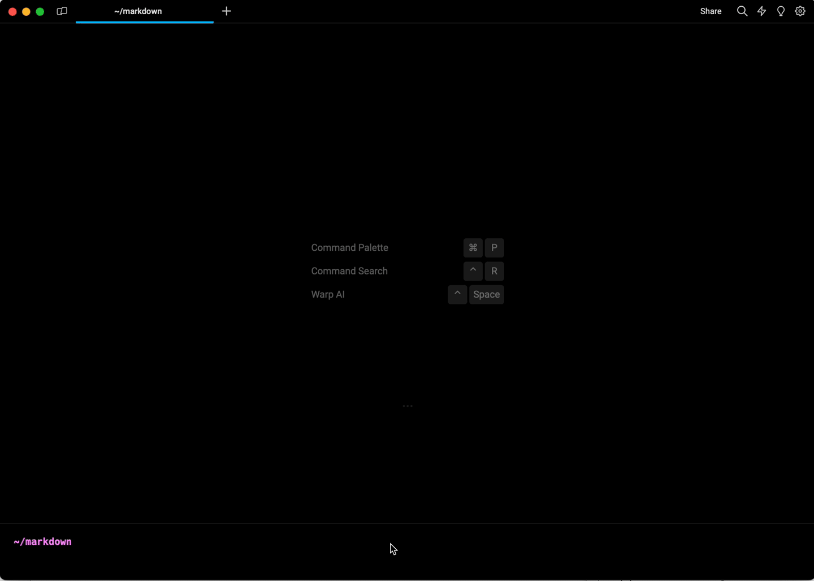

# Markdown Viewer

Warp can display Markdown files directly in a [split pane](windows/split-panes.md), in addition to opening them [in an external editor](files-and-links.md). Any local file with the `.md` or `.markdown` extension is treated as a Markdown file. Remote files are currently not supported.

There are three ways to view a Markdown file in Warp, you can also configure Warp to open markdown files with the default external editor or Warp's built-in markdown viewer in `Settings > Features > General > Open Markdown files in Warp's Markdown viewer by default`.

### Opening a file link within a block

For any link to a Markdown file within a block, you can open the file in Warp by `CMD`-clicking on the link, from the link tooltip, or from the right-click context menu on the link.

<figure><figcaption>
Opening a Markdown file in Warp using the link tooltip
</figcaption></figure>

### Markdown-viewing commands

If you run a Markdown-viewing command like `cat myfile.md`, Warp will show a banner with a button to open the Markdown file.

The following commands are considered Markdown viewers:

* `cat`
* `glow`
* `less`

### Opening a Markdown file from Finder

From Finder, you can open a Markdown file in Warp from the “Open With” menu that appears when right-clicking on the file.

## Shell commands in Markdown files

Warp can run shell commands from Markdown code blocks in your active terminal session. Click the run icon (`>_`) to insert a command into the terminal input.


The shell command must be in a code block with three backticks (\`\`\`) and not inline code in order for Warp to treat the code like a runnable command.


Markdown shell blocks also support keyboard navigation. There are two ways to enter the keyboard navigation mode:

* Clicking on a shell block.
* Pressing `CMD-UP` or `CMD-DOWN`.

Once a shell block is selected, press `CMD_ENTER` to insert it into the terminal input. You can also use `UP`, `DOWN`, `CMD-UP`, and `CMD-DOWN` to navigate between shell blocks. While the Markdown file is focused, press `CMD-L` to switch focus back to the terminal without inserting a command.

If the command contains any arguments using the curly brace `{{param}}` syntax, they will be treated as workflow arguments. Learn more about [workflows](warp-drive/workflows.md).

<figure><figcaption>
Navigating between and running commands in a Markdown file
</figcaption></figure>

In addition, all shell and code blocks have a copy button to quickly copy the block’s text to the clipboard.

Code blocks without a set language, or one of the following languages, are treated as shell commands: `sh`, `shell`, `bash`, `fish`, `zsh`, `warp-runnable-command`.
