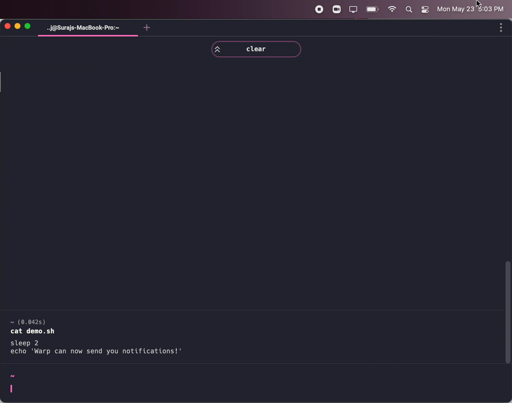

# Notifications

## What is it?

Warp can send you customizable desktop notifications when you are away from the app and quickly re-focus when something meaningful happens in your terminal sessions. Notifications can be sent when a command completes after a configurable number of seconds or when a running command needs you to enter a password to proceed. For either of these triggers, Warp will only send you a desktop notification if you are using a different app at the time the trigger is fired.

## How to access it

* Notifications are enabled by default and require MacOS permissions to appear. You will want to **Allow** or **Accept** the request so that Warp can send you desktop notifications. If you accidentally denied it or would like to re-enable Notifications later, check the [troubleshooting guide below](../features/notifications.md#troubleshooting-warp-notifications).
* If you've turned Notifications off before, toggle it back on by going to `Settings > Features`, or quickly toggle Notifications on or off via the Command Palette `CMD-P`. 
* Customize Notification triggers for long-running commands or password prompts by going to `Settings > Features`.

## How it works

## Troubleshooting Warp Notifications

Warp requires two distinct notification settings to work. Mac system settings found in `Mac > System Preferences > Notifications & Focus` and Warp app settings found in `Settings > Features` must both be enabled for Notifications to show. If you have Notifications enabled in the system and Warp but you still aren't receiving desktop notifications, try the following:
* Make sure that you are navigated away from Warp when you expect to receive the notification.
* Make sure the **Do not Disturb** mode is turned off in `Mac > System Preferences > Notifications > Notifications & Focus > Focus`.
* Go to `Mac > System Preferences > Notifications & Focus > Notifications` and select Warp in the list. Make sure either banner style or alert style notifications are selected, then quit and restart Warp.

Please reach out to us on [Discord](https://warp.dev/discord) or [GitHub](https://github.com/warpdotdev/Warp/issues) if any other issue.
