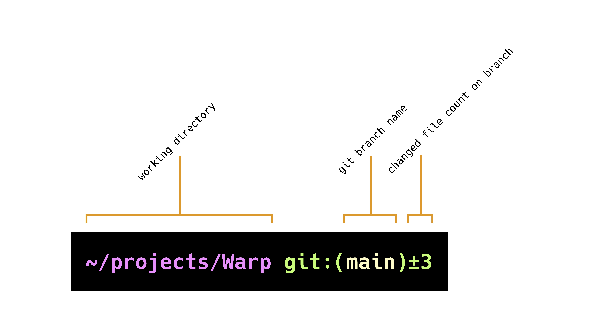

# Prompt

## What is it

Warp has a native Prompt that shows your current working directory (cwd) and also git branch information when in a git directory. It can also be set to a custom prompt using one of the supported tools.

<figure><figcaption><p>Warp Native Prompt</p></figcaption></figure>

### Git Status Indicator

The native Prompt shows the name of the git branch that you are on locally, as well as the number of uncommitted changed files. This includes any new files, modified files, and deleted files that are staged or unstaged.

### Custom Prompt

You can also enable a custom prompt by configuring the **PS1** variable or installing a supported shell prompt plugin, see [Custom Prompt Compatibility Table](prompt.md#custom-prompt-compatibility-table). _Note:_ The PS1 is a variable used by the shell to generate the prompt, it represents the primary prompt string (hence the “PS”) - which is what the terminal typically displays before typing new commands.

## How to access it

* Toggle the default prompt git branch change indicator by right-clicking on the default prompt and selecting "Hide/Show changed file count"
* When right-clicking the default prompt, you can also copy the entire prompt, working directory or the current git branch.
* Toggle custom prompt by right-clicking on the prompt area above the input and select "Use my own prompt" or toggle "Honor user's custom prompt (PS1) from the `Settings > Features` page. ".

## How it works


Git Status Indicator Demo



Custom Prompt Demo


### Custom Prompt Compatibility Table

| Shell    | Tool                                                              | Does it work?                                                                             |
| -------- | ----------------------------------------------------------------- | ----------------------------------------------------------------------------------------- |
| Bash/zsh | [PS1](https://www.warp.dev/blog/whats-so-special-about-ps1)       | Working                                                                                   |
| Bash/zsh | [Starship](https://github.com/starship/starship)                  | [Working\*](prompt.md#starship)                                                           |
| Bash/zsh | [oh-my-posh](https://github.com/JanDeDobbeleer/oh-my-posh)        | [Working\*](prompt.md#multi-line-and-right-sided-prompts)                                 |
| zsh      | [Spaceship](https://github.com/spaceship-prompt/spaceship-prompt) | [Working\*](prompt.md#spaceship)                                                          |
| zsh      | [oh-my-zsh](https://github.com/ohmyzsh/ohmyzsh)                   | Working                                                                                   |
| zsh      | [prezto](https://github.com/sorin-ionescu/prezto)                 | Working                                                                                   |
| zsh      | [Powerlevel10k](https://github.com/romkatv/powerlevel10k)         | [Coming soon\*](prompt.md#disabling-unsupported-prompts-for-warp-e.g.-powerlevel10k-p10k) |
| Bash     | [SBP](https://github.com/brujoand/sbp)                            | Not supported                                                                             |
| zsh      | [zplug](https://github.com/zplug/zplug)                           | Not supported                                                                             |
| Bash/zsh | [Powerline-shell](https://github.com/b-ryan/powerline-shell)      | Not supported                                                                             |
| SSH      |                                                                   | Working                                                                                   |

## Known incompatibilities

If you’re having issues with prompts, please see below or our [Known Issues](../help/known-issues.md#configuring-and-debugging-your-rc-files) for more troubleshooting steps.

### Multi-Line and Right-Sided Prompts

We don’t currently support multi-line or right-sided prompts. The Input Editor is a separate UI element from the Prompt; this is actually what enables a modern text editor experience. Improving the native Prompt is on the [roadmap](prompt.md#context-chips). _Note: The only exception_ to this is the oh-my-posh prompt.

### Starship

Some \~/.config/starship.toml settings are known to cause errors in Warp. `#` or `DEL` the following lines to resolve known errors:

```
# Get editor completions based on the config schema
'' = 'https://starship.rs/config-schema.json'

# Disables the custom module
[custom]
disabled = false
```

There is also a known issue with [starship prompt not rendering](https://github.com/warpdotdev/Warp/issues/2756) if your default shell is `/bin/bash`. To workaround the issue, we recommend installing a newer version of bash with `brew install bash` then include the following in the top of your `~/.bash_profile`:

```
export SHELL="/opt/homebrew/bin/bash"
```

### Spaceship

This prompt can cause an [issue](https://github.com/warpdotdev/Warp/issues/1973) with typeahead in Warp's input editor.\
To workaround the issue, run `echo "SPACESHIP_PROMPT_ASYNC=FALSE" >>! ~/.zshrc`

### Disabling unsupported prompts for Warp e.g. Powerlevel10K (P10K)

We don't currently support P10K, [but we're working on it](https://github.com/warpdotdev/Warp/issues/2851). Because of how we use the prompt\_command in Warp and because P10K can be installed standalone or as an Oh-My-Zsh plugin, each of which results in different problems and requires special handling.

We advise using Warp's default prompt or installing one of the supported tools, see [Compatibility Table](prompt.md#custom-prompt-compatibility-table). You can disable P10K just for Warp as such:

```
if [[ $TERM_PROGRAM != "WarpTerminal" ]]; then
##### WHAT YOU WANT TO DISABLE FOR WARP - BELOW

    # POWERLEVEL10K or Other Unsupported Custom Prompt Code

##### WHAT YOU WANT TO DISABLE FOR WARP - ABOVE
fi
```

### iTerm2

The iTerm2 shell integration breaks Warp and your custom prompt will not be able to be visible with this on. If you're coming from iTerm please check your dotfiles for it. We advise disabling the integration just for Warp like so:

```
if [[ $TERM_PROGRAM != "WarpTerminal" ]]; then
##### WHAT YOU WANT TO DISABLE FOR WARP - BELOW

test -e "${HOME}/.iterm2_shell_integration.zsh" && source "${HOME}/.iterm2_shell_integration.zsh"

##### WHAT YOU WANT TO DISABLE FOR WARP - ABOVE
fi
```

## Context Chips

Context Chips is an idea we have for what the future of terminal prompts could be like, i.e. prompts that support dynamic refreshing, mouse interactions, and can be customized via an open spec that developers can build on. Learn more via our [Twitter thread](https://twitter.com/warpdotdev/status/1496263490491023362?s=20\&t=4PBawdJYHKfywG7eEe2jNA), where we also shared some Figma mocks.
