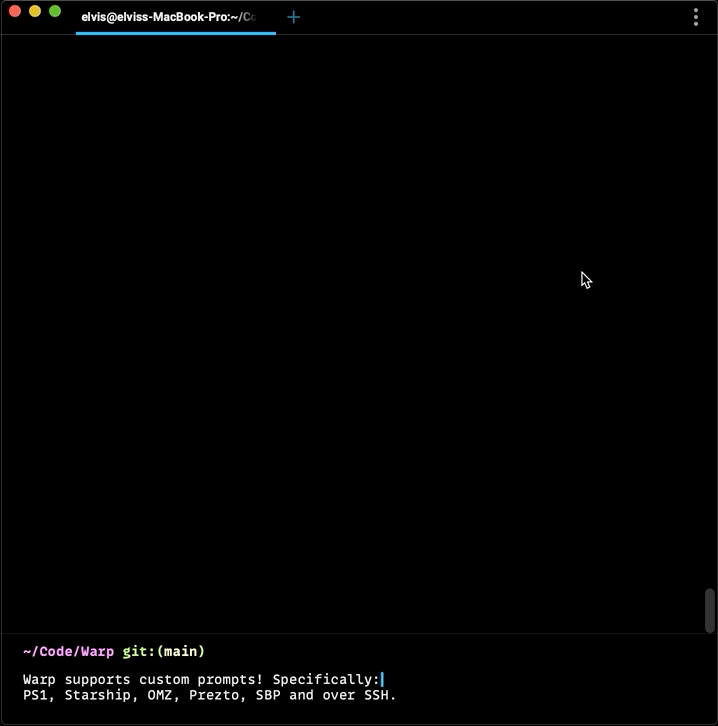

# Prompt

## What is it

Warp has a native Prompt that shows your current working directory (cwd) and also git branch information when in a git directory. You can also enable a custom prompt by configuring the **PS1** or by installing a supported shell prompt plugin, see [Compatibility Table](../features/prompt.md#custom-prompt-compatibility-table). PS1 is a variable used by the shell to generate the prompt, it represents the primary prompt string (hence the “PS”) - which is what you see most of the time before typing a new command in your terminal.

## How to access it

* Enable custom prompt going to `Settings > Features` and toggling on "Honor user's custom prompt (PS1) setting" or you can right-click on the prompt area above the input and select "Use my own prompt".

 If you’re having issues with prompts, please see our [Known Issues](../help/known-issues.md#) for more information on supported tools and troubleshooting steps.

## How it works



## Known Incompatibilities

### Custom Prompt Compatibility Table

| Shell    | Tool            | Does it work?  |
| -------- | --------------  | -------------- |
| Bash/zsh | [PS1](https://www.warp.dev/blog/whats-so-special-about-ps1)             |  Working       |
| Bash     | SBP             |  Coming soon   |
| Bash/zsh | [Starship](https://github.com/starship/starship)        |  Working       |
| zsh      | [oh-my-zsh](https://github.com/ohmyzsh/ohmyzsh)       |  Working       |
| zsh      | [prezto](https://github.com/sorin-ionescu/prezto)          |  Working       |
| zsh      | powerlvel10k    |  Not supported |
| zsh      | zplug           |  Not supported |
| Bash/zsh | powerline-shell |  Coming soon   |
| SSH      |                 |  Working       |

#### Multi-Line and Right-Sided Prompts

We don’t currently support multi-line or right-sided prompts. The Input Editor is a separate UI element from the Prompt; this is actually what enables a modern text editor experience. Improving the native Prompt is on the [roadmap](../features/prompt.md#context-chips).

#### iTerm2

The iTerm2 shell integration breaks Warp and your custom prompt will not be able to be visible with this on. If you're coming from iTerm please check your dotfiles for it. We advise disabling the integration just for Warp like so:

```sh
if [[ $TERM_PROGRAM != "WarpTerminal" ]]; then
##### WHAT YOU WANT TO DISABLE FOR WARP - BELOW

test -e "${HOME}/.iterm2_shell_integration.zsh" && source "${HOME}/.iterm2_shell_integration.zsh"

##### WHAT YOU WANT TO DISABLE FOR WARP - ABOVE
fi
```

#### Powerlevel10K (P10K)

We don't currently support P10K. Because of how we use the prompt_command in Warp and because P10K can be installed standalone or as an Oh-My-Zsh plugin, each of which results in different problems and requires special handling.

We advise using Warp's default prompt or installing one of the supported tools, see [PS1 Compatability Table](../features/prompt.md#ps1-compatibility-table). You can disable P10K just for Warp as such:

```sh
if [[ $TERM_PROGRAM != "WarpTerminal" ]]; then
##### WHAT YOU WANT TO DISABLE FOR WARP - BELOW

    # POWERLEVEL10K

##### WHAT YOU WANT TO DISABLE FOR WARP - ABOVE
fi
```

### Context Chips

Context Chips is an idea we have for how the future of terminal prompts could be like, i.e. prompts that support dynamic refreshing, mouse interactions, and extends customizability via an open spec that developers can build on. Learn more via our [Twitter thread](https://twitter.com/warpdotdev/status/1496263490491023362?s=20&t=4PBawdJYHKfywG7eEe2jNA), where we also shared some Figma mocks.
