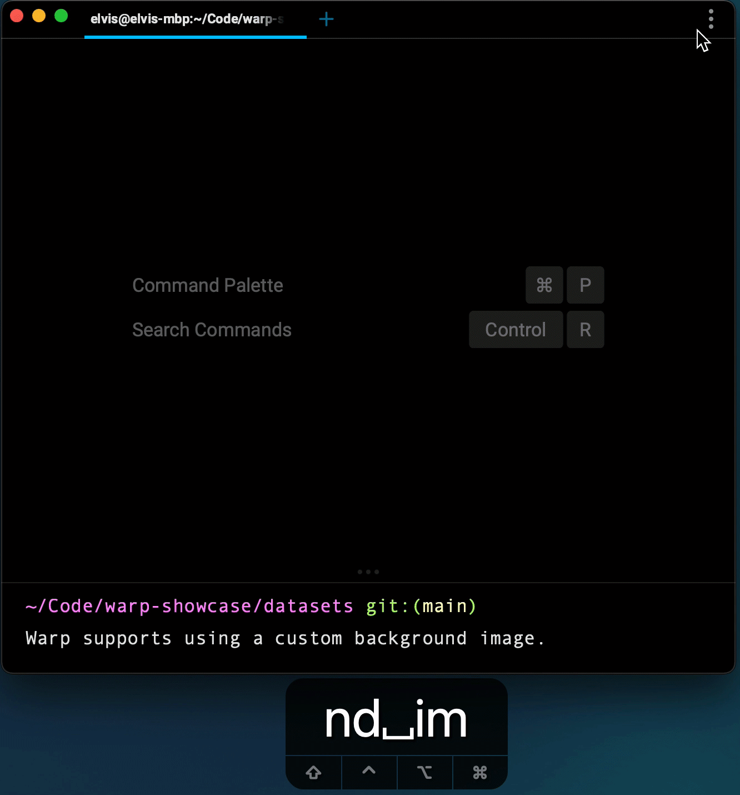

# Themes

## Default themes

By default, Warp ships with seven themes:

* Warp Dark
* Warp Light
* Dracula
* Solarized Dark
* Solarized Light
* Gruvbox Dark
* Gruvbox Light

The Theme Changer can be accessed through the [Command Palette](https://docs.warp.dev/features/command-palettea) or:

1. navigating to the top-right section of the Warp window
2. clicking the kebab-menu to open the drop down menu
3. clicking on “Settings”
4. clicking appearance in the left sidebar of the settings dialog
5. clicking the custom themes (shaded) box

Upon selecting a theme, Warp's appearance will update accordingly.
Press the checkmark to save the selection, or the X to revert.

This setting persists i.e. Warp will open with the same settings in the next session.

## OS theme sync

Warp supports synchronizing your theme with the OS’s light or dark appearance.
To enable this open the settings dialog and click the toggle Sync with OS.
You will then be able to select a specific theme for both, light appearance and dark appearance.

## Custom themes

Custom themes can be added to your Warp config directory: `~/.warp/themes`.
Once the themes are added to the config directory, they're available through the theme picker described above.

A more thorough explanation about the theme format, together with examples and a collection of themes can be found in the [Warp themes repository](https://github.com/warpdotdev/themes).
