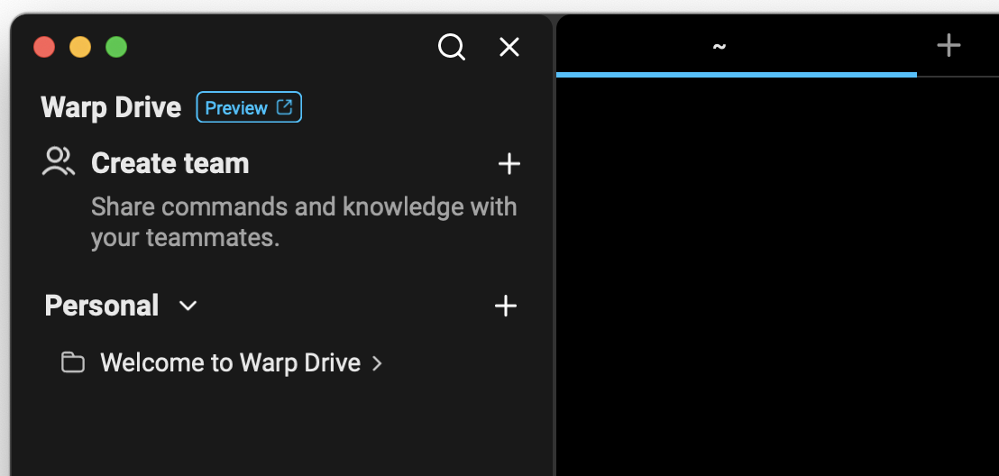
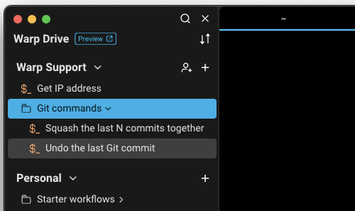
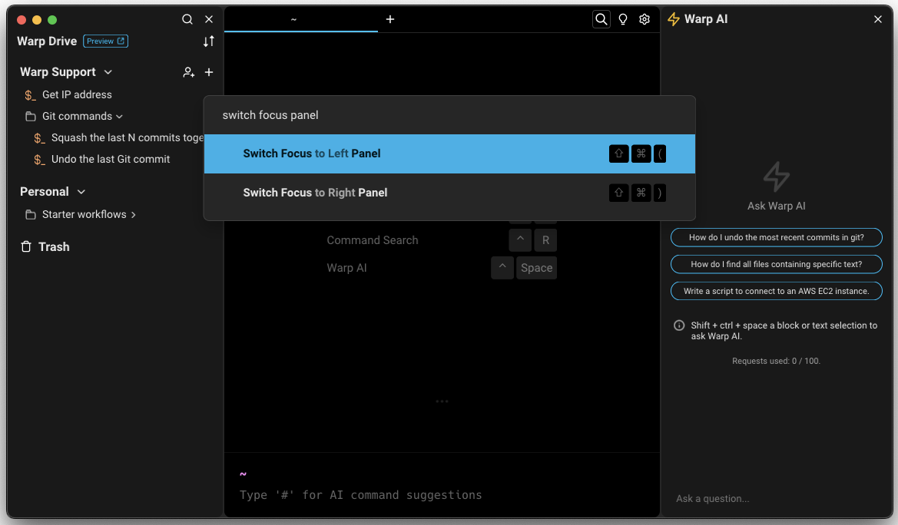

# Warp Drive

## What is Warp Drive?

All objects stored in Warp Drive sync immediately as they’re updated, so you and your team will always have access to the latest versions.


Warp Drive, Teams, and Workflows Demo


## How to access it



Warp Drive is accessible from the status bar in the Warp terminal or you can toggle the Warp Drive side panel with `CMD-\`.



Warp Drive is accessible from the status bar in the Warp terminal or you can toggle the Warp Drive side panel with `CTRL-SHIFT-\`.



<figure><figcaption>
Warp Drive Icon
</figcaption></figure>

## Workspaces in Warp Drive

When you open the Warp Drive panel, you will find a personal workspace where you can store your workflows and organize them into folders.

<figure><figcaption></figcaption></figure>

If you are a member of a team using Warp Drive, your team’s workspace will also be available in the side panel.

<figure><figcaption></figcaption></figure>

## Organizing workflows in Warp Drive with your team

* Objects (e.g. Workflows) and folders in Warp Drive can be sorted alphabetically and by the last updated
* Any objects moved from your personal workspace into a team’s workspace will be shared with all members of your team
* It is not currently possible to move an item back from a team’s workspace into a personal workspace; if you shared something inadvertently, you should copy the contents of the object to your clipboard, recreate it in your personal workspace, and then delete the object from your team workspace
* It is not currently possible to drag a folder of personal workflows into a team workspace; you will need to move objects one at a time

## Using Warp Drive offline

In offline mode, some files will be read-only. You can still create and edit files while offline in your personal space. They will only be saved locally and will not be synced. They cannot be moved into a team or deleted until you are back online.

<figure><figcaption>
Warp Drive offline mode
</figcaption></figure>

## Navigating Warp Drive with your keyboard

To avoid going back and forth between your mouse and keyboard, you can use your keyboard to navigate through Warp Drive once you have either opened Warp Drive or switched focus to the Warp Drive panel. (You can also click on a blank area within Warp Drive.) The object you are navigating with your keyboard will be highlighted in an accented color.

You can take these keyboard actions within Warp Drive:



* Press `UP` or `DOWN` to navigate to the object you want.
* Press `Enter` to 1) execute an object or 2) open/collapse a workspace or folder.
* Press `CMD-ENTER` to open an object’s context menu.
* Press `CMD-SHIFT-(` and `CMD-SHIFT-)` to switch focus on Warp Drive and [Warp AI](../warp-ai/).
* Press `LEFT-ARROW` to collapse a workspace or folder
* Press `RIGHT-ARROW` to open a workspace or folder



* Press `UP` or `DOWN` to navigate to the object you want.
* Press `Enter` to 1) execute an object or 2) open/collapse a space or folder.
* Press `CTRL-ENTER` to open an object’s context menu.
* Press `CTRL-SHIFT-(` and `CTRL-SHIFT-)` to switch focus on Warp Drive and [Warp AI](../warp-ai/).



<figure><figcaption>
Warp Drive navigation states
</figcaption></figure>

To switch between panels (e.g. jump from command line to Warp Drive to Warp AI) using your keyboard, you can use the “Switch Focus to Left Panel” and “Switch Focus to Right Panel” commands in the [Command Palette](../command-palette.md).

<figure><figcaption></figcaption></figure>

## Import and Export

Every object in Warp Drive can be exported to a local file. To export, right-click on an object in Warp Drive and choose "Export" from the menu. This will prompt you for a directory to export into.

To import a local file or directory, right-click on a folder or workspace and choose "Import." If importing a directory, supported files in the directory and its sub-directories will be imported into a matching folder structure.

When importing or exporting, objects are converted as follows:

* [Workflows](workflows.md) import from and export to [YAML workflows](../entry/yaml-workflows.md)
* [Notebooks](notebooks.md) import from and export to Markdown files

## Sharing Your Drive Objects

Every object in Warp Drive can be shared. Currently, sharing is managed via Team-based links and only team objects can be shared. Personal object sharing and richer sharing modalities including direct sharing are coming soon.

### Sharing a Drive Object With a Teammate via Link

To share a Drive object, navigate to the object's overflow menu, and choose "Copy link". Once the link is successfully copied to your clipboard, you can share it with teammates and reference your object in your codebase, documentation, or communication channels like Slack.  Users will need to make an account on Warp to see the object.&#x20;


To view an object, link-followers must have a Warp account and be a member of the object's Warp Drive Team. Those without accounts will be prompted to sign up. Users not on the relevant team will have the ability to automatically request the team admin to be added.


<figure><figcaption>
Copy link Menu Item
</figcaption></figure>

## Troubleshooting Warp Drive

* If you were previously using Warp on your own and were later invited to join a team, you may need to exit, update, and restart the Warp app to gain access to your team’s shared drive and commands
* Navigating to Settings > Teams in Warp should also force a metadata update for you, which will ensure you have access to the latest versions of workflows in your team's drive
