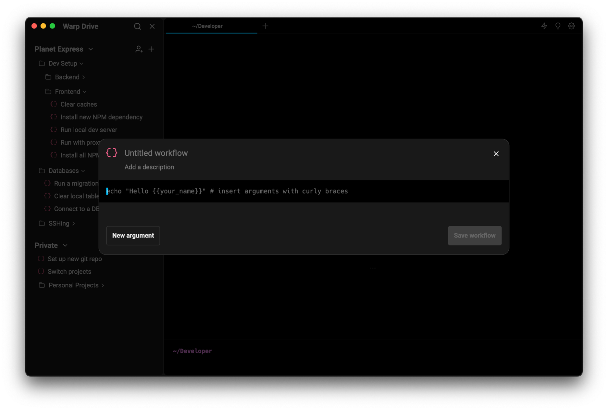
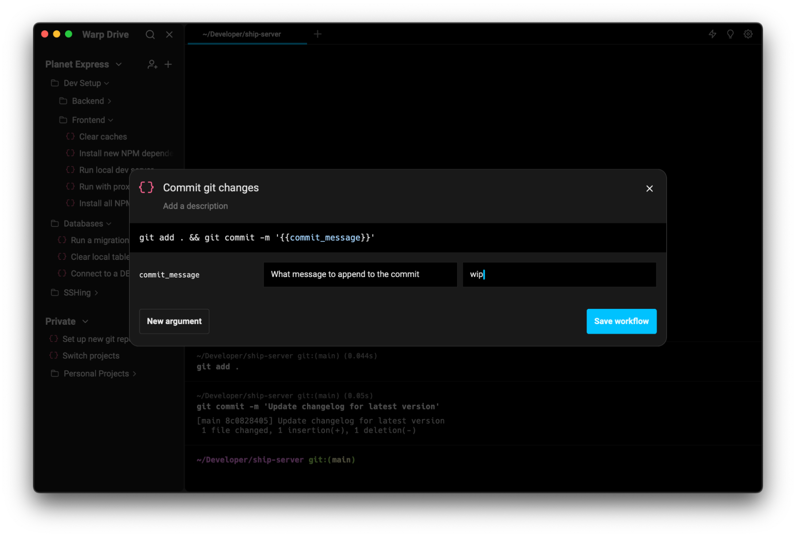

# Workflows in Warp Drive


Warp Drive is currently in a private beta and not yet available for all users.


## What is a workflow?

A workflow is a knowledge object representing one or more terminal commands. Your workflows are stored in Warp Drive, are searchable, and can be shared and edited amongst your whole team.

## Creating a workflow

Workflows are created using the workflow editor. You can open the workflow editor in many ways:

* Click the “plus” icon to the right of the header for the space you’d like the workflow to exist in, and then choose “New workflow”.
* Click the “triple dot” icon that appears when hovering over a folder, and then choose the “New workflow” option from that menu. The workflow you create here will be placed in that folder.
* Search with the command palette (\`cmd+p\`) for “create workflow”
* Use the keyboard shortcut \`cmd-shift-H\` to create a private workflow or \`cmd-alt-shift-H\` to create a team workflow.

There are also other entry points which will prefill the workflow editor with a command or commands:

* Hover over a block and click the “save” icon that appears near the top right corner.
* In Warp AI, click the “save” icon in a code block returned from the language model. You can also use \`cmd+s\` with a code block selected.
* Single- or multi-select any number of blocks and click the “triple dots” icon on the right side of one, or right click on a selected block, and select the “Save as Workflow” option in the menu. You can also use \`cmd+s\` when you have at least one block selected. If you have multiple selected blocks, their commands will be chained together with \`&&\`.

By default, these workflows will be placed in your private space.

## Editing a workflow

Once you have opened the editor via one of the entry points above, you’ll see the workflow editor. Depending on how you accessed the editor, some information may be filled in already. With no content, it looks like this:

<figure><figcaption>
An empty workflow modal with placeholders for title, desription, command, and argument.
</figcaption></figure>

Here’s a brief description of the various fields. When searching for workflows, Warp finds matches across any of these fields:

* Title: Each workflow must have a title. This is how it will appear in Warp Drive.
* Description: Workflow descriptions are optional. They appear when hovering over a workflow in Warp Drive, and can give extra context to a workflow’s purpose.
* Command: Each workflow must have a command. This is what will be entered into your terminal when executing the workflow.

As long as your workflow has a title and command, it can be created by clicking the “Save workflow” button. Once created, the workflow will appear in Warp Drive and be synced to the cloud. If the workflow was created in a team space, it will immediately be visible to other members of the same team.

<figure><figcaption>
A workflow titled "Commit git changes" has a command.
</figcaption></figure>

### Adding arguments

Workflows support the use of named arguments in the command field. Arguments let you and your team decide at execution time what a particular piece of the command should be; for example, you could save a workflow with the command \`ssh \{{username\}}@example.com\`, which denotes that \`username\` is an argument to be modified when someone decides to execute this workflow.

Arguments are denoted by double curly braces (\`\{{\}}\`). You can use the characters \`A-Za-z0-9\`, plus hyphens \`-\` and underscores \`\_\`, to construct argument names, so long as the first character isn’t a number.

Arguments can be added in several ways:

* Add them manually by wrapping text in double curly braces.
* Click the “New argument” button to add a new argument with a default name where your cursor is in the command editor.
* Select some text in the command editor and click the “New argument” button to wrap the selected text in double curly braces.\

Valid arguments will appear in the command editor with blue text; invalid arguments will have a red squiggly line underneath.

When an argument appears in the command editor, an argument editor row will appear underneath. You can add a description for each argument, as well as an optional default value.

<figure><figcaption>
This workflow has a title, command, and an argument.
</figcaption></figure>

## Executing a workflow

You can execute a workflow in several ways:

* In Warp Drive, hover over the workflow you want to execute, and hit the “run” icon.
* Using the command palette (\`cmd+p\`), search for a workflow you want to execute, and hit \`cmd+enter\`.
* Using command search (\`ctrl+r\`), search for a workflow you want to execute, and hit enter.

All of these options will paste the workflow into your active terminal input, and a dialog will appear near the input showing the title, description, command, and any arguments and their associated descriptions and default values. From here, you can make any adjustments to the workflow’s arguments (or the command itself) before hitting \`enter\` to run the workflow.

<figure><figcaption>
Executing a workflow will paste the workflow contents into your terminal input editor.
</figcaption></figure>

\
\
