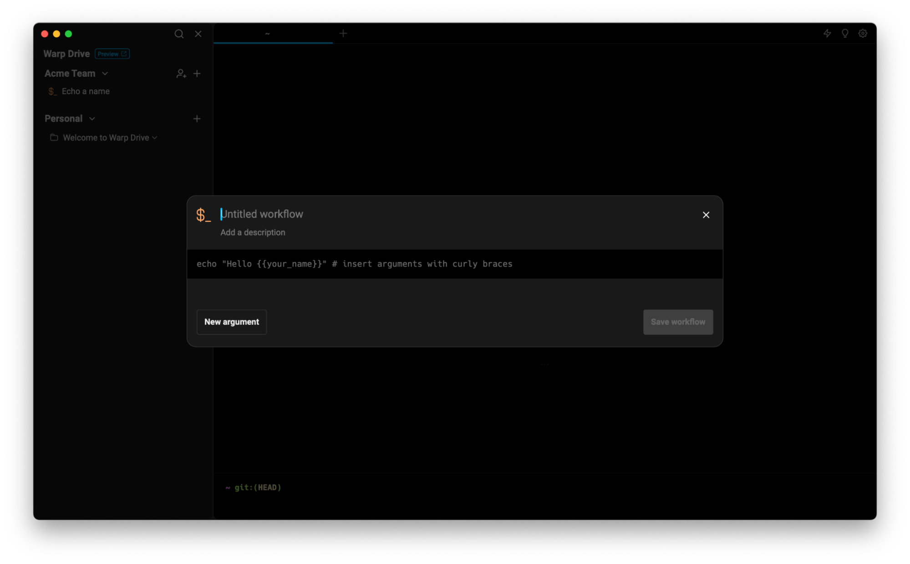
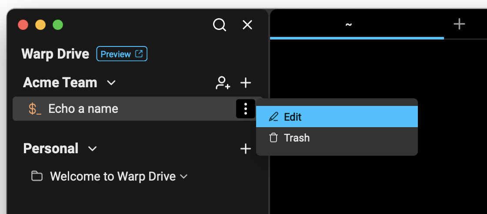
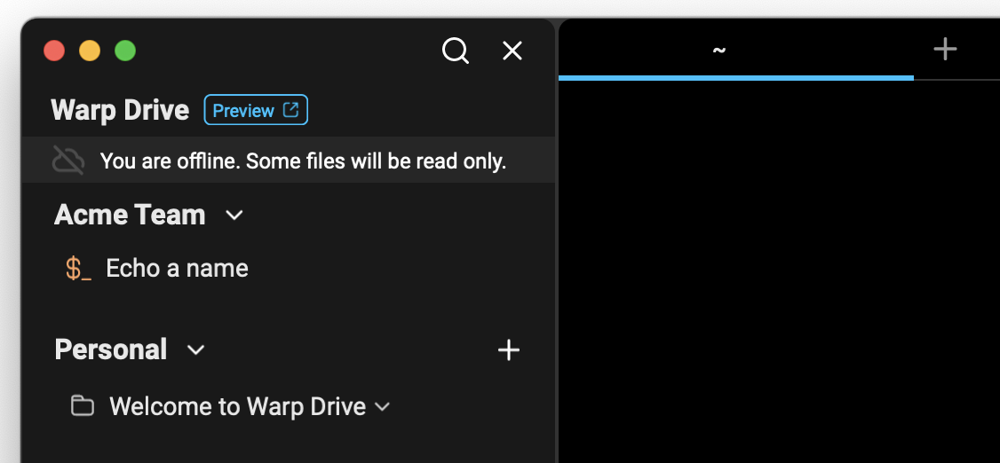

# Workflows

## What is a workflow?

A workflow is a parameterized command you can name and save in Warp with descriptions and arguments. Workflows are searchable and easily accessed from the [Command Palette](../command-palette.md) so you can find and execute them without switching contexts.

## How to save and edit workflows

You can create a new workflow from various entry points in Warp:

* From Warp Drive, + > New workflow
* Using Block Actions, Save as Workflow
* From Warp AI results, Save as Workflow
* From the Command Palette, Create a New Personal Workflow
* With a Keyboard Shortcut, `SHIFT + CMD + H`

Any of these entry points will open the workflow editor where you can:

* Name your workflow
* Edit the command along with any arguments (also known as parameters)
* (optional) Add a meaningful description that will be indexed for search
* (optional) Add arguments, descriptions for arguments, and default values

<figure><figcaption></figcaption></figure>

### Working with arguments

In the workflow editor, you can add arguments manually with "New argument" or by typing in double curly braces within the command field. If you select "New argument" while you have text selected, Warp will wrap that text in curly braces to create an argument. \

There are some rules for creating valid arguments:

* Argument names can only include characters `A-Za-z0-9`, hyphens `-` and underscores `_`
* The first character of an argument cannot be a number.

### Editing workflows

Once a workflow has been created, you can edit it at any time, as long as you have access to an internet connection.

<figure><figcaption></figcaption></figure>

In offline mode, workflows will be read only.

<figure><figcaption></figcaption></figure>

### Editing workflows with a team

If the workflow is shared with a team, all team members will have access to edit the workflow and updates will sync immediately for all members of the team.

If a workflow in the Warp Drive has been edited by another team member or a user on another device while you are attempting to edit the same workflow, you will not be able to save changes; you will need to check out the latest version and try again.

## How to execute workflows

You can execute a workflow several ways:

* From Warp Drive, click the workflow
* From the Command Palette, search for a workflow you’d like to execute, click or select and enter

<figure><figcaption>
Search for any workflow in the Command Palette with <code>CMD + P</code>
</figcaption></figure>

These options will paste the workflow into your active terminal input. Workflow names and any relevant descriptions and arguments will display in a dialog, so you can understand how to use the workflow.&#x20;

<figure><figcaption></figcaption></figure>

You can make any adjustments you need to the arguments (or the command itself) before running the command in your input editor.

## Support for YAML-based workflows

Prior to June 2023, Warp supported [a workflows library](../entry/yaml-workflows.md) which included both personal workflows (created with .yaml files) and community workflows, sourced from an open source repository.

If needed, you can continue to access your .yaml file workflows using the keyboard shortcut `CTRL-SHIFT-R`. However, these legacy workflows will not be available to access, organize, or share in Warp Drive.

Moving forward, we encourage you to create new workflows with the new workflow editor in Warp Drive, which we hope you’ll find is a much easier experience.

\

\

\

