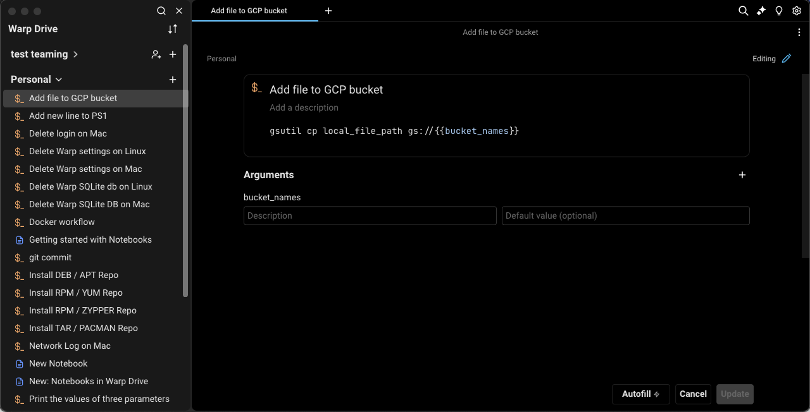
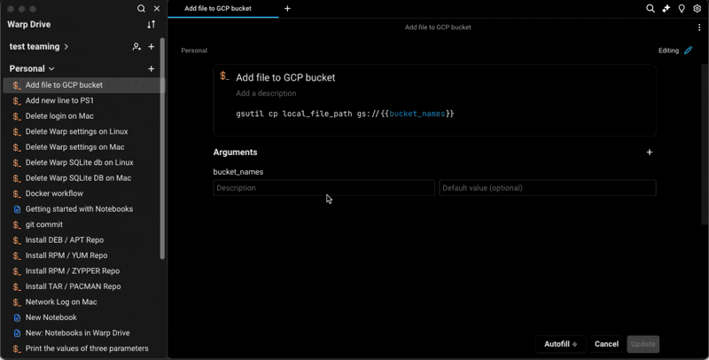

# Workflows

## What is a workflow?

A workflow is a parameterized command you can name and save in Warp with descriptions and arguments. Workflows are searchable and easily accessed from the [Command Palette](../command-palette.md) so you can find and execute them without switching contexts.

## How to save and edit workflows

You can create a new workflow from various entry points in Warp:

* From Warp Drive, + > New workflow
* Using Block Actions, Save as Workflow
* From Warp AI results, Save as Workflow
* From the [Command Palette](../command-palette.md), Create a New Personal Workflow

Any of these entry points will open the workflow editor where you can:

* Name your workflow
* Edit the command along with any arguments (also known as parameters)
* Add a meaningful description that will be indexed for search (optional)
* Add arguments, descriptions for arguments, and default values (optional)

<figure><figcaption>
Workflows save / edit pane
</figcaption></figure>


Save Workflow Demo


### Working with arguments

In the workflow editor, you can add arguments manually with "New argument" or by typing in double curly braces (`{{argument}}`) within the command field. If you select "New argument" while you have text selected, Warp will wrap that text in curly braces to create an argument. Arguments can have defaults values set to text or an [enum](#enums).

There are some rules for creating valid arguments:

* Argument names can only include characters `A-Za-z0-9`, hyphens `-` and underscores `_`
* The first character of an argument cannot be a number

#### Enums

Enums can be set as a default value for arguments in Workflows. Enums are a set of variants defined when editing a workflow and choosen from when running a workflow. You can create or use an enum in the following ways:

* When editing a Workflow, select the default value field for an argument and select Enum.
* Choose new to create a new enum or select an existing enum from the list.
* When creating a new Enum, you can give it a name, add and remove variants, or make it available to other Workflows.
* When running a workflow with an Enum in an argument, you'll have the option to select one of the variants.

### Editing workflows

Once a workflow has been created, you can edit it at any time, as long as you have access to an internet connection.

<figure><figcaption>
Edit workflow menu
</figcaption></figure>

#### AI Autofill

Workflows also have the option to use [Warp AI](../warp-ai/) to automatically generate a title, descriptions, or parameters.

* Create or edit a Workflow, in the edit view you should see the option to AutoFill.
* Warp AI will fill in the fields based on the Workflow you're creating.

<figure><figcaption>
Edit Workflows - Autofill
</figcaption></figure>

### Editing workflows with a team

If the workflow is shared with a team, all team members will have access to edit the workflow and updates will sync immediately for all members of the team.

If a workflow in the Warp Drive has been edited by another team member or a user on another device while you are attempting to edit the same workflow, you will not be able to save changes; you will need to check out the latest version and try again.

## How to execute workflows

You can execute a workflow in several ways:

* From Warp Drive, click the workflow
* From the [Command Palette](../command-palette.md), search for a workflow you’d like to execute, click or select, and enter
* From [Command Search](../entry/command-search.md), search for a workflow you'd like to execute, click or select, and enter.
* When a workflow is selected, you can use `SHIFT-TAB` to cycle through the arguments.


When you create two or more arguments with the same name, Warp automatically selects and puts multiple cursors over the arguments in the input editor so they are synced.\
\
Also, tailor your Command Search experience by toggling off "Show Global Workflows" in `Settings > Features`. When disabled, your search will exclusively encompass YAML and Warp Drive Workflows.


<figure><figcaption>
Search for any workflow in the Command Palette with <code>CMD + P</code>
</figcaption></figure>

These options will paste the workflow into your active terminal input. Workflow names and any relevant descriptions and arguments will be displayed in a dialog, so you can understand how to use the workflow.

<figure><figcaption>
Execute a Workflow
</figcaption></figure>

You make any adjustments you need to the arguments (or the command itself) before running the command in your input editor.


Running Workflow Demo


## Support for YAML Workflows

Warp will indefinitely support the [YAML Workflows](../entry/yaml-workflows.md), which includes personal and community workflows sourced from an open-source repository.

If needed, you can continue to access your `.yaml` file workflows using [Command Search](../entry/command-search.md) or the [Command Palette](../command-palette.md). However, these file-based workflows will not be available to access, organize, or share in Warp Drive.

You can also export Warp Drive workflows as `.yaml` files, by right-clicking on a workflow in Warp Drive and choosing "Export".
