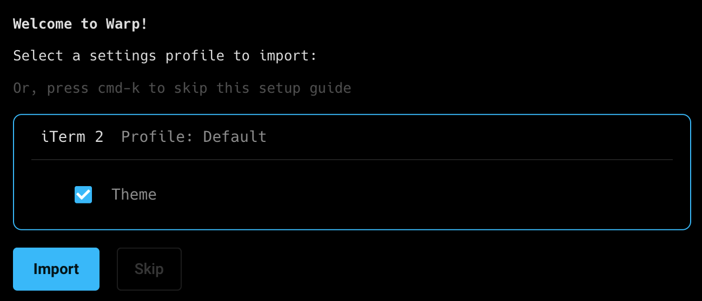

# Migrate to Warp

## From iTerm2

You can easily import your settings from iTerm2 to Warp. This includes custom keybindings and color themes.

When you run Warp for the first time, you will get the option to import your default profile from iTerm2.

Select **iTerm2 Profile: Default** to import your settings.

<figure><figcaption></figcaption></figure>

Warp will only import settings associated with the Default profile.

Next, you can choose your [prompt](../appearance/prompt.md) and decide whether or not to inherit your existing prompt configuration. There are two prompt options:

1. [Warp prompt](../appearance/prompt.md#warp-prompt): This is Warp's native prompt that you can customize to meet your needs. In Settings > Appearance > Prompt, you can drag and drop context chips into your Warp prompt to display specific information, like git branches or timestamps.
2. [Shell prompt (PS1)](../appearance/prompt.md#custom-prompt): This custom prompt inherits your pre-existing prompt configuration. Select this option if you want your Warp prompt to match your settings from iTerm2.

After choosing a prompt, you’re ready to start using Warp.

If you are already running Warp but would like to import your iTerm2 profile, you can use Ctrl+P to open the Command Palette and search for the Setup Guide. This will enter you into the workflow to import your settings.
