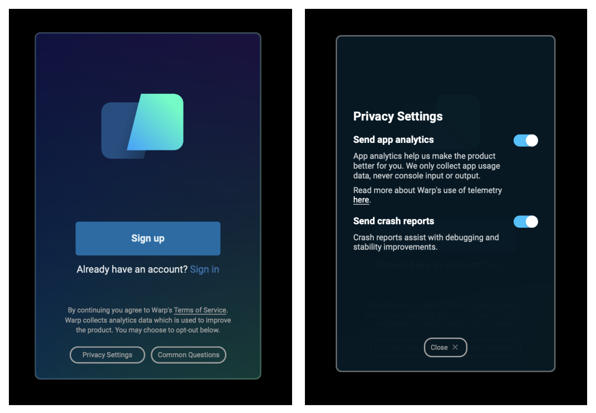
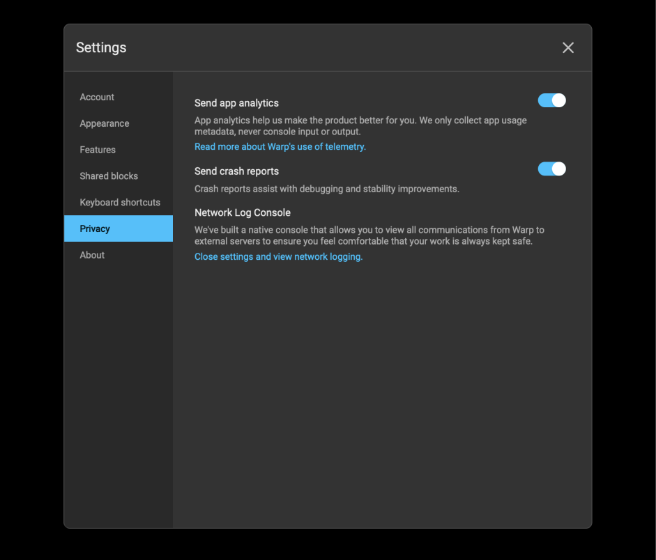

# Privacy

## Our Philosophy


If you have any questions about any of this, please don’t hesitate to reach out at [privacy@warp.dev](mailto:privacy@warp.dev).


Our philosophy is complete transparency and control of any data leaving your machine. This means you can:

* View a list of [all the telemetry events](privacy.md#exhaustive-telemetry-table) that get sent
* Monitor telemetry in real-time with our native [Network Log](../features/network-log.md)
* [Opt-out](privacy.md#how-to-disable-telemetry) of telemetry at any time

Telemetry and crash reporting are used to improve the product and to debug any issues that may arise. Terminal sessions contain sensitive information, and we want the absolute minimum sent to our servers necessary in order to provide you with the best possible experience.

Telemetry data **never includes console input or output** and usage of this data will never be part of our business model.

You can view our [full privacy policy here](https://assets-global.website-files.com/60352b1db5736ada4741b380/60b7f8d410ec2b9fc2a45af9\_privacy-notice.pdf).

## How to disable telemetry and crash reporting

### Opt-out during signup

1. Navigate to Privacy Settings
2.  Toggle off analytics, crash reports, or both (if it's blue, it's "on")

    <figure><figcaption>
Privacy Settings During Signup
</figcaption></figure>

### Opt-out after signup

1. Navigate to Settings > Privacy, or open the command-palette and search for "privacy"
2. Toggle off analytics, crash reports, or both (if it's blue, it's "on")

<figure><figcaption>
Privacy Settings After Signup
</figcaption></figure>

## What telemetry data does Warp collect and why?

Warp collects high-level usage data (**never console input or output**) to discover product quality issues and guide feature prioritization. Selling usage data will never be part of Warp's business model. It is used solely to improve the end-user experience.

We use [Sentry](https://sentry.io/about/) for crash reporting and [Segment](https://segment.com/docs/guides/) for telemetry.

### Exhaustive Telemetry Table

| Event Name                                                 | Description                                                                                                                                                       |
| ---------------------------------------------------------- | ----------------------------------------------------------------------------------------------------------------------------------------------------------------- |
| `Accept Natural Language Search Result`                    | Accepted AI Command Search Result                                                                                                                                 |
| `Add Added Subshell Command`                               | Added a command to be automatically Warpified via Warp's subshell wrapper                                                                                         |
| `Add Denylisted Subshell Command`                          | Explicitly prevent a command from being Warpified via Warp's subshell wrapper                                                                                     |
| `App Startup`                                              | App is launched                                                                                                                                                   |
| `Approve Domains`                                          | Under team management in settings, domain is approved for users with corresponding email domain to join the team                                                  |
| `Auth Common Question Clicked in App`                      | Clicked on "Common Question" when logging in                                                                                                                      |
| `Auth: Hover Common Questions`                             | Hovered over a common question during sign-in                                                                                                                     |
| `Auth: Open Privacy Settings Overlay`                      | Privacy settings modal is open during sign-in                                                                                                                     |
| `Auth: Toggle Common Questions`                            | Toggled FAQ Page when logging in                                                                                                                                  |
| `Autosuggestion Inserted`                                  | Accepted autosuggestion                                                                                                                                           |
| `Background Block Started`                                 | Warp created a background-output Block (whenever a processes has been backgrounded and yields some output)                                                        |
| `BaselineCommand Latency`                                  | Command execution time                                                                                                                                            |
| `Block Creation`                                           | Created Block                                                                                                                                                     |
| `Block Finished to Precmd Delay`                           | Latency between command finished and the precmd hook                                                                                                              |
| `Block Selection`                                          | Selected Block                                                                                                                                                    |
| `Bootstrapping Failed`                                     | Failed bootstrap for the session                                                                                                                                  |
| `Bootstrapping Slow`                                       | Slow bootstrap on session startup                                                                                                                                 |
| `Bootstrapping Succeeded`                                  | Successful bootstrap for session                                                                                                                                  |
| `Changed invite view option`                               | Toggled between link and invite for invite                                                                                                                        |
| `Changed view option`                                      | View is changed between workflows and notebooks in the team page                                                                                                  |
| `Clicked on another way to login`                          | Clicked on "another way to login"                                                                                                                                 |
| `Clicked on have trouble logging in`                       | Clicked on "have trouble logging in"                                                                                                                              |
| `Clicked on send feedback`                                 | Clicked on "send feedback"                                                                                                                                        |
| `Command Correction Event`                                 | Accepted command correction                                                                                                                                       |
| `Command Search Filter Changed`                            | Changed command search filter                                                                                                                                     |
| `Command Search Opened`                                    | Opened command search (universal search panel to search                                                                                                           |
| `Command Search Result Accepted`                           | Accepted command search result                                                                                                                                    |
| `Complete Welcome Tip`                                     | Completed all welcome tips items                                                                                                                                  |
| `Confirm Suggestion`                                       | Accepted tab completion suggestion                                                                                                                                |
| `Context Menu Copy`                                        | Clicked "Copy" in context menu                                                                                                                                    |
| `Context Menu Copy Prompt`                                 | Clicked "Copy Prompt" in context menu                                                                                                                             |
| `Context Menu Copy Selected Text`                          | Clicked "Copy selected text" in context menu                                                                                                                      |
| `Context Menu Insert Selected Text into Input`             | Clicked "insert into input" in context menu                                                                                                                       |
| `Context Menu Toggle Git Prompt Dirty Indicator`           | Toggled indicator of dirty git prompt                                                                                                                             |
| `Context Menu Toggle PS1`                                  | Clicked "user default prompt" in context menu                                                                                                                     |
| `Context Menu: Find Within Blocks`                         | Clicked "find within blocks" in context menu                                                                                                                      |
| `Context Menu: Initiate Block Sharing`                     | Clicked "create permalink..." in context menu                                                                                                                     |
| `Context Menu: Reinput Command`                            | Clicked "reinput command" in context menu                                                                                                                         |
| `Context Menu: Reinput Commands`                           | Clicked "reinput commands" in context menu                                                                                                                        |
| `Copy Block Sharing Link`                                  | Clicked "Copy Link" on Block Sharing Modal                                                                                                                        |
| `Copy Invite Link`                                         | Clicked "Copy Link" on Referral Modal                                                                                                                             |
| `Daily App Focus Duration (seconds)`                       | Cumulative duration of daily focus time on app in seconds                                                                                                         |
| `Database Read Error`                                      | Database read error when trying to get app state for session restoration                                                                                          |
| `Database Startup Error`                                   | Failed to initialize sqlite upon startup                                                                                                                          |
| `Decline Subshell Bootstrap`                               | Developer declined the Warp banner to Warpify the current session                                                                                                 |
| `Deleted Notebook`                                         | Deleted a notebook                                                                                                                                                |
| `Deleted Workflow`                                         | Workflow is deleted on the teams page                                                                                                                             |
| `Disable Input Sync Inputs`                                | Disabled / turn off the Input Synchronization (across editors)                                                                                                    |
| `Dismiss Welcome Tips`                                     | Dismissed Welcome tips                                                                                                                                            |
| `Drag and Drop Tab`                                        | Tab dragged and dropped                                                                                                                                           |
| `Draw Frame Latency`                                       | Recorded time to draw a frame in app (in ms)                                                                                                                      |
| `Draw Frame Latency Histogram Overflow`                    | Could not summarize histogram of draw frame latency                                                                                                               |
| `Edited Input Before Precmd`                               | Input edited before precmd hook completes                                                                                                                         |
| `Expensive Frame`                                          | Frame took long time to draw (past a certain threshold)                                                                                                           |
| `Experiment Triggered`                                     | User assigned to A/B test                                                                                                                                         |
| `Features Page Action`                                     | Changed settings in Features Page                                                                                                                                 |
| `Find Option Toggled`                                      | Changed settings in Find Toggle                                                                                                                                   |
| `Finish Onboarding Survey`                                 | Onboarding survey finished                                                                                                                                        |
| `Focused App`                                              | App is in focus                                                                                                                                                   |
| `Generate Block Sharing Link`                              | Generated Block sharing link                                                                                                                                      |
| `Generate Natural Language Search`                         | Requested AI Command Search generation                                                                                                                            |
| `Get Invite`                                               | Clicked "Get Invite"                                                                                                                                              |
| `Get Referral Status`                                      | Clicked "Get Referral Status"                                                                                                                                     |
| `InitialWorkingDirectoryConfigurationChanged`              | Replaced the default working directory with a different path                                                                                                      |
| `Initiate Natural Language Search`                         | Opened AI Command Search panel                                                                                                                                    |
| `Input Mode Changed`                                       | Changed the Input Editor Mode (Pinned to Bottom, Pinned to Top, Classic / Waterfall Mode)                                                                         |
| `InputBoxAICommandSearch`                                  | Opened AI Command Search via the Input Editor's context menu (right clicking the buffer)                                                                          |
| `InputBoxAskWarpAI`                                        | Clicked "Ask Warp AI" from the Input Editor's context menu                                                                                                        |
| `InputBoxCommandSearch`                                    | Opened Command Search via the Input Editor's context menu (right clicking the buffer)                                                                             |
| `InputBoxCutSelectedText`                                  | Cut the highlighted text via the Input Editor's context menu (right clicking the buffer)                                                                          |
| `InputBoxPaste`                                            | Pasted text into the Input Editor's via its context menu (right clicking the buffer)                                                                              |
| `InputBoxSelectAll`                                        | Selexted all the text in the Input Editor via its context menu (right clicking the buffer)                                                                        |
| `Jumped to Bookmark Block`                                 | Jumped to bookmarked Block                                                                                                                                        |
| `Jumped to Bottom of Block Button Clicked`                 | Used the button to jump to the bottom of a Block                                                                                                                  |
| `Jumped to Previous Command`                               | Jumped to a previous command                                                                                                                                      |
| `Keybinding Changed`                                       | Edited a custom keybinding                                                                                                                                        |
| `Keybinding Removed`                                       | Removed / cleared a keybinding                                                                                                                                    |
| `Keybinding Reset to Default`                              | Reset a custom keybinding to its default                                                                                                                          |
| `Log In Button Clicked in App`                             | Clicked on "Log in" button                                                                                                                                        |
| `Logged in to native app`                                  | Login is successful                                                                                                                                               |
| `Logged-out App Startup`                                   | Started Warp in the logged-out / signed-out state                                                                                                                 |
| `Move Active Tab`                                          | Move active tab left or right                                                                                                                                     |
| `Move Tab`                                                 | Move tab left or right                                                                                                                                            |
| `Natural Language Search Request Failed`                   | Request AI Command Search generation failed                                                                                                                       |
| `New Session From Directory`                               | Dragged a file, folder, etc. into Warp to start a session                                                                                                         |
| `Notebook Created`                                         | Created a new notebook                                                                                                                                            |
| `Notebook Opened`                                          | Opened a notebook                                                                                                                                                 |
| `Notification Clicked`                                     | Clicked desktop notification sent from Warp                                                                                                                       |
| `Notification Failed to Send`                              | Failed to send desktop notification                                                                                                                               |
| `Notification Permissions Requested`                       | Requested permission for desktop notification permissions                                                                                                         |
| `Notification Request Permissions Outcome`                 | Recorded outcome of attempting to request desktop notification permissions                                                                                        |
| `Notification Sent`                                        | Sent desktop notification                                                                                                                                         |
| `Notifications Discovery Banner Action`                    | Showed banner introducing the notifications feature                                                                                                               |
| `Notifications Error Banner Action`                        | Showed error banner for notifications feature                                                                                                                     |
| `Open Command Palette`                                     | Opened command palette                                                                                                                                            |
| `Open Context Menu`                                        | Opened context menu (such as right clicking, clicking on ellipses in the top right of a Block, etc.)                                                              |
| `Open Launch Config`                                       | Opened launch config for a session                                                                                                                                |
| `Open Launch Config File`                                  | Opened the launch config YAML file from modal once saved successfully                                                                                             |
| `Open Palette`                                             | Opened the palette                                                                                                                                                |
| `Open Quake Mode Window`                                   | Toggled quake mode window when previously hidden or closed                                                                                                        |
| `Open Suggestions Menu`                                    | Opened a suggestion menus, such as with up arrow or tab                                                                                                           |
| `Open Team from URI`                                       | Showed settings view of their newly joined team within the app                                                                                                    |
| `Open Theme Chooser`                                       | Opened theme chooser (list of different themes and visualizations of those themes)                                                                                |
| `Open Welcome Tips`                                        | Opened welcome tips in app                                                                                                                                        |
| `Open Workflows Search`                                    | Opened workflows search in command search pane                                                                                                                    |
| `OpenInputBoxContextMenu`                                  | Opened the Input Editor's context menu                                                                                                                            |
| `Opened Link`                                              | Opened a highlighted link within input or output                                                                                                                  |
| `Opened Warp AI`                                           | Activated Warp AI                                                                                                                                                 |
| `Opened alt screen find bar`                               | Opened the Find bar in the Alt Screen                                                                                                                             |
| `Page Viewed`                                              | Page is viewed within the App                                                                                                                                     |
| `Pass Through Onboarding Question: attribution`            | Attribution question in onboarding flow                                                                                                                           |
| `Pass Through Onboarding Question: attribution:friend`     | Tracked "friend" as attribution in onboarding survey flow                                                                                                         |
| `Pass Through Onboarding Question: attribution:internet`   | Tracked "internet" as attritbution in onboarding survey flow                                                                                                      |
| `Pass Through Onboarding Question: attribution:teammate`   | Tracked "teammate" as attribution in onboarding survey flow                                                                                                       |
| `Pass Through Onboarding Question: company`                | Company question in onboarding survey flow                                                                                                                        |
| `Pass Through Onboarding Question: engineering_experience` | Engineering experience question in onboarding survey flow                                                                                                         |
| `Pass Through Onboarding Question: purpose`                | Purpose of using warp question in onboarding survey flow                                                                                                          |
| `Pass Through Onboarding Question: role`                   | Role question in onboarding survey flow                                                                                                                           |
| `Pty Spawned`                                              | Tracks the manner by which we create a new shell process (new codepath vs. old codepath). Used to ensure nothing breaks as we change parts of our infrastructure. |
| `Quit Modal Cancel Pressed`                                | `Cancel` button on the alert modal was pressed                                                                                                                    |
| `Quit Modal Disabled`                                      | The quit modal dialog has been disabled and will not popup when a user closes Warp while a session is running                                                     |
| `Quit Modal Shown`                                         | Showed an alert modal to warn the user about closing the app/window with a running process                                                                        |
| `Quit Natural Language Search`                             | Quit natural language search                                                                                                                                      |
| `Received Subshell RC File DCS`                            | Spawned a subshell to be automatically Warpified                                                                                                                  |
| `Remove Added Subshell Command`                            | Removed a command from the list of commands to automatically Warpify via Warp's subshell wrapper                                                                  |
| `Remove Denylisted Subshell Command`                       | Removed a command from the list of commands to IGNORE when trying to Warpify via Warp's subshell wrapper                                                          |
| `Removed user from team`                                   | Removed user from team                                                                                                                                            |
| `Resource Center Keybindings Page Opened`                  | Opened the keybinding page within the resource center                                                                                                             |
| `Resource Center Opened`                                   | Opened Resource Center pane                                                                                                                                       |
| `Resource Center Tips Skipped`                             | Skipped welcome tips for new users                                                                                                                                |
| `SSH Bootstrap Attempt`                                    | Attempted boostrapping for an SSH session                                                                                                                         |
| `Save Launch Config`                                       | Saved current launch configuration of windows, tabs, and panes                                                                                                    |
| `Select Command Palette Option`                            | Selected option from command palette (i.e. CMD-P)                                                                                                                 |
| `Select Navigation Palette Item`                           | Selected session from the Session Navigation Palette (search across panes, tabs, and windows)                                                                     |
| `Select Theme`                                             | Selected theme                                                                                                                                                    |
| `Sent email invites`                                       | Sent an email invite to join team                                                                                                                                 |
| `Session Abandoned Before Bootstrap`                       | Abandoned session before the boostrapping completes                                                                                                               |
| `Set Line Height`                                          | Set line height through Settings -> Appearance                                                                                                                    |
| `Set Window Blur Radius`                                   | Changed the blur radius from the `Settings -> Appearance` dialog                                                                                                  |
| `Set Window Opacity`                                       | Changed the opacity (window transparency) from the `Settings -> Appearance` dialog                                                                                |
| `Show Subshell Banner`                                     | Displayed the banner asking whether Warp should Warpify the current session via Warp's subshell wrapper                                                           |
| `ShowNotificationsDiscoveryBanner`                         | Showed discovery banner for notifications (notify user when long running commands finish)                                                                         |
| `ShowNotificationsErrorBanner`                             | Showed error banner for notifications (i.e. permissions issue)                                                                                                    |
| `Sign Up Button Clicked in App`                            | Clicked "Sign Up" button                                                                                                                                          |
| `Skip Onboarding Survey`                                   | Skipped onboarding survey as a whole                                                                                                                              |
| `Split Pane`                                               | Split tab into multiple panes                                                                                                                                     |
| `Start Onboarding Survey`                                  | Started onboarding survey                                                                                                                                         |
| `Tab Creation`                                             | Created a tab                                                                                                                                                     |
| `Tab Operations`                                           | Took operation on a tab: change color, close tab, close adjacent tabs, etc.                                                                                       |
| `Tab Renamed`                                              | Changed tab title                                                                                                                                                 |
| `Tab Single Result Autocompletion`                         | Accepted tab completion and inserted into Input Editor                                                                                                            |
| `Team Created`                                             | Created team in settings                                                                                                                                          |
| `Team Left`                                                | Member left team                                                                                                                                                  |
| `Team Link Copied`                                         | Clicked on "Copy Link"                                                                                                                                            |
| `Test Block Creation Event`                                | Test Block is created within the App                                                                                                                              |
| `Thin Strokes Setting Changed`                             | Changed thin strokes setting in settings -> Appearance                                                                                                            |
| `Toggle Approvals Modal`                                   | Opened or closed teams modal                                                                                                                                      |
| `Toggle Dim Inactive Panes`                                | Whether the dim inactive panes feature has been toggled                                                                                                           |
| `Toggle Jump to Bottom of Block Button`                    | Enabled or disabled the Jump to Bottom of Block Button                                                                                                            |
| `Toggle Restore Session`                                   | Toggled session restoration ("Restore windows, tabs, panes, on startup")                                                                                          |
| `Toggle Sync Inputs Across All Panes in All Tabs`          | Enable the synchronization of the Input Editor's buffer to all the panes in all the tabs                                                                          |
| `Toggle Sync Inputs Across All Panes in Current Tab`       | Enable the synchronization of the Input Editor's buffer to all the panes in the current tab                                                                       |
| `Toggled Bookmark Block`                                   | Bookmarked or unbookmarked Block                                                                                                                                  |
| `Tried to Execute Before Precmd`                           | Attempted to execute command before precmd, a shell stage that has metadata on a command such as ssh, prompt info, etc.                                           |
| `Trigger Subshell Bootstrap`                               | Attempted to Warpify the current session via Warp's subshell wrapper                                                                                              |
| `Triggered Command XRay`                                   | Triggered Command X-Ray (hovering over a command for explanation)                                                                                                 |
| `Unable to Update To New Version`                          | Update available but not authorized to install                                                                                                                    |
| `Unhandled Editor Modifier Key`                            | Used modifier keybinding keystroke which is not currently supported                                                                                               |
| `Used Warp AI Prepared Prompt`                             | Used one of the Warp-provided prompts, like "Show examples"                                                                                                       |
| `User Initiated Closing Something`                         | Attempted to either quit the app or close a window                                                                                                                |
| `Warp AI Action`                                           | Executed a Warp AI action: Restart, Copy, Insert into terminal                                                                                                    |
| `Warp AI Character Limit Exceeded`                         | Attempted to ask a question longer than 1k chars to Warp AI                                                                                                       |
| `Warp AI Request Issued`                                   | Issued a question to Warp AI                                                                                                                                      |
| `Workflow Executed`                                        | Executed workflow                                                                                                                                                 |
| `Workflow Selected`                                        | Selected workflow and populated into the Input Editor                                                                                                             |
