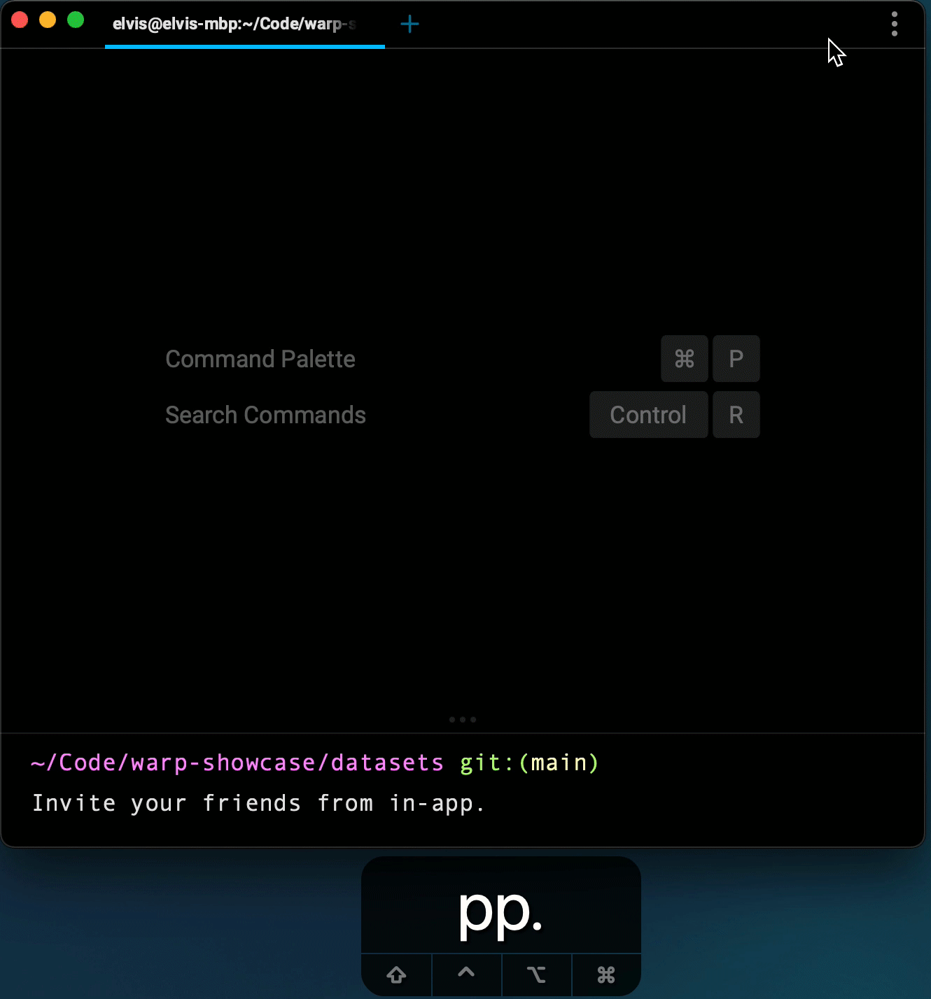

# Refer a friend

Think Warp would be the ideal product for someone you know?
You can invite your team or friends within the app!
Open the invite modal from the top-right menu.

There are two ways you can invite a friend:

1. Send them an invite link. This will redirect them to our product download page.
2. Input their email address which we use to send them an email.

Note (July 2021):
As Warp is in closed beta right now, we only enable a limited number of invites per user.
The number of invites remaining only decreases once someone actually uses your link / invite code to download the app.
If you run out of invites, you can always request more!
