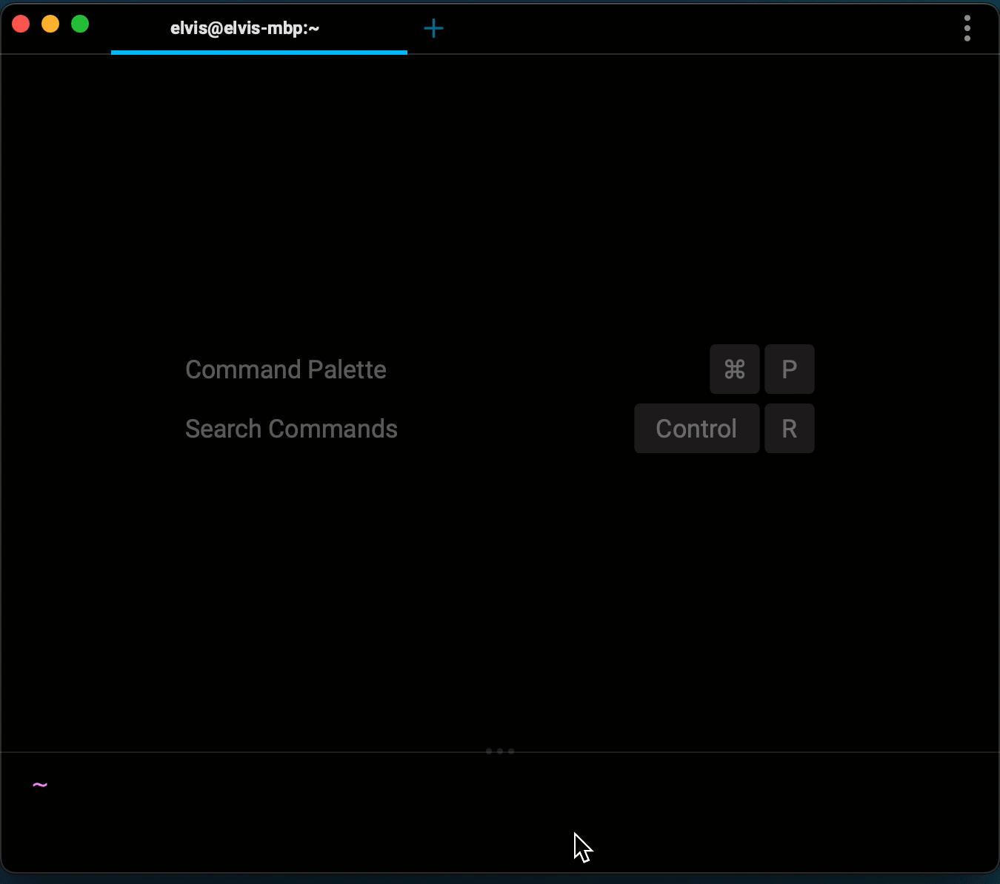

# Sending us Feedback

We would love to hear your feedback, bugs, and blockers to using Warp.

You can send us feedback:

* Opening a new issue in our GitHub [repository](https://github.com/warpdotdev/warp/issues/new/choose).
* By joining our [Discord](https://www.warp.dev/discord) server.
Send us a message in `#bugs` and `#feature-requests`!
* Using our in-app feedback form: navigate to the app menu -> Send Feedback -> Open Feedback Form

