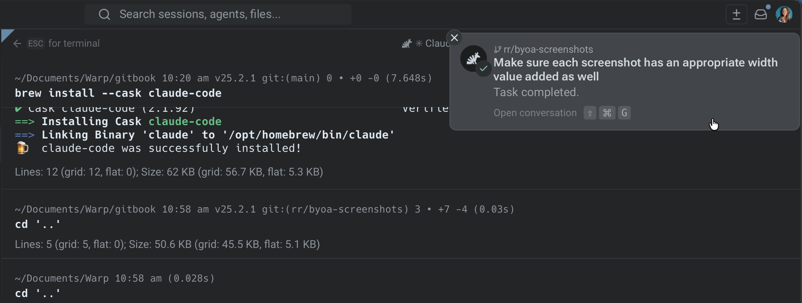
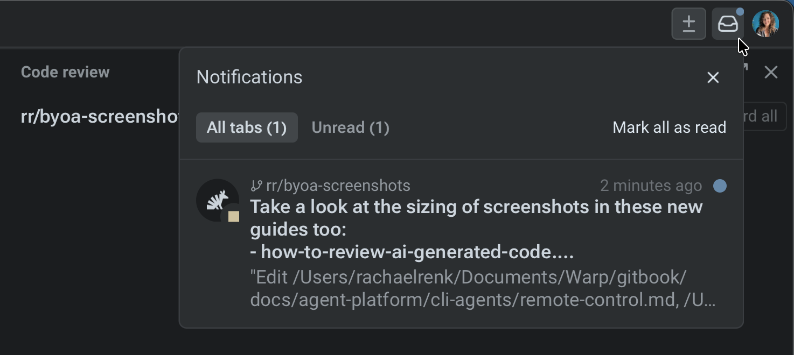
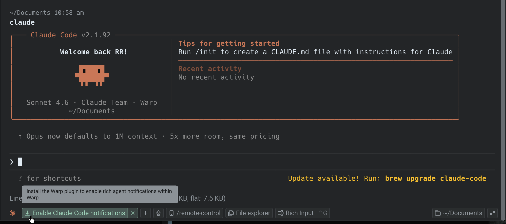

Warp delivers notifications from any supported coding agent so you always know when an agent finishes a task, encounters an error, or needs your input. Notifications work whether you're in a different tab or a different app.

## Notification types

Warp categorizes agent notifications by what happened:

* **Complete** - the agent finished its task successfully. You can review the output and continue working.
* **Request** - the agent is blocked and needs your input. This includes command approval, permission requests, and idle prompts where the agent is waiting for you.
* **Error** - the agent encountered an error that requires your attention.

## In-app notifications

When you're working in Warp but not looking at the agent's tab, Warp provides several visual signals.

### Toast notifications

Floating toast notifications appear in the corner of the Warp window when an agent in another tab needs attention. Toasts auto-dismiss after a few seconds. Hover over a toast to pause the timer, or click it to jump directly to the agent's session.

Up to two toasts are visible at a time. If additional notifications arrive, the oldest toast is replaced.

### Notification mailbox

The notification mailbox is a sidebar panel that collects all agent notifications in one place. Open it from the bell icon in the top-right corner of Warp.

The mailbox includes:

* **Filter tabs** - switch between **All tabs**, **Unread**, and **Errors** to find what needs attention. If there are no unreads or errors, those filters don't appear.
* **Mark all as read** - clear all unread indicators at once
* **Click to navigate** - click any notification to jump directly to that agent's tab

**Keyboard shortcuts:**

* `↑` / `↓` - select previous / next notification
* `Enter` - open the selected notification's session
* `Shift-Tab` - cycle through filter tabs
* `Esc` - close the mailbox

### Tab status indicators

Each tab displays an icon reflecting its agent's current state — working, blocked, completed, or errored. Tabs with unread notifications show an attention badge so you can spot which sessions need action, even with many tabs open.

{/* TODO: Add screenshot showing tab bar with status icons and attention badges */}

Notifications are automatically marked as read when you navigate to the agent's tab.

## Desktop notifications

When Warp is in the background or minimized, agent notifications are delivered as native system-level desktop alerts. This ensures you're aware of agent activity even while working in other apps.

{/* TODO: Add screenshot showing a native desktop notification from Warp */}

:::note
Desktop notifications require system permissions. If you're not receiving them, check your OS notification settings for Warp. See [Desktop Notifications](/terminal/more-features/notifications/) for setup and troubleshooting.
:::

## Supported agents

Agent notifications currently work with:

* **Oz agent** - supported out of the box. No setup required.
* **Claude Code** - full support via notification plugin.
* **Codex** - full support via native Codex configuration.
* **OpenCode** - full support via notification plugin.

## Setting up notifications

For the **Oz agent**, notifications work out of the box — no setup needed.

For **third-party CLI agents**, each agent requires a one-time setup. The process varies by agent:

* **Claude Code** - one-click auto-install via a chip in Warp, or manual plugin commands. See [Claude Code setup](/agent-platform/cli-agents/claude-code/#setting-up-notifications).
* **Codex** - add `notification_condition = "always"` under `[tui]` in `~/.codex/config.toml`, then restart Codex. See [Codex setup](/agent-platform/cli-agents/codex/#setting-up-notifications).
* **OpenCode** - add `"@warp-dot-dev/opencode-warp"` to the `plugin` array in your OpenCode config. See [OpenCode setup](/agent-platform/cli-agents/opencode/#setting-up-notifications).

If auto-install doesn't work or you're running an agent over SSH, Warp displays an installation-instructions chip in the terminal with setup steps you can follow directly.

## Related pages

* [Desktop Notifications](/terminal/more-features/notifications/) - configure system-level notification permissions and troubleshoot delivery
* [Managing Agents](/agent-platform/cloud-agents/managing-cloud-agents/) - monitor all agent conversations, filter by status, and inspect sessions
* [Third-Party CLI Agents](/agent-platform/cli-agents/overview/) - overview of supported CLI agents and Warp features
* [Claude Code](/agent-platform/cli-agents/claude-code/) - setup and notification plugin installation
* [Codex](/agent-platform/cli-agents/codex/) - setup and notification configuration
* [OpenCode](/agent-platform/cli-agents/opencode/) - setup and notification plugin installation
