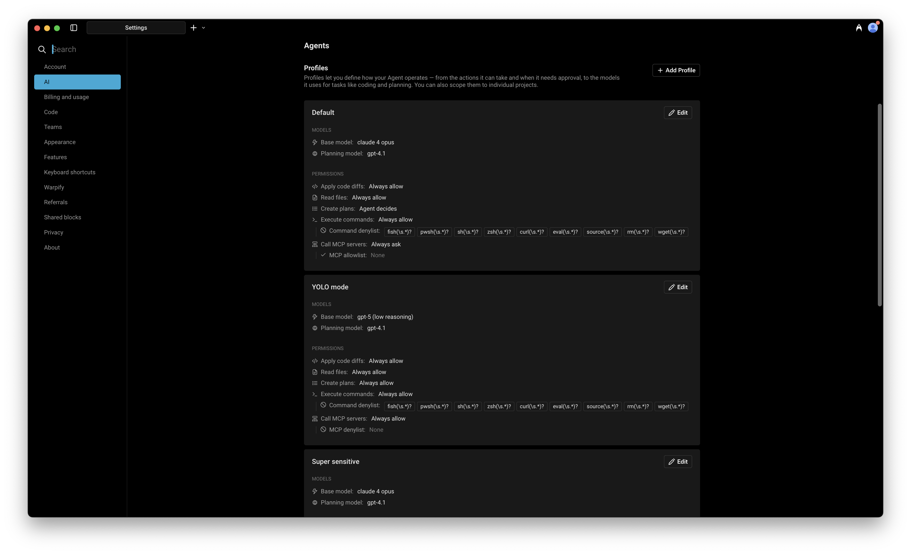
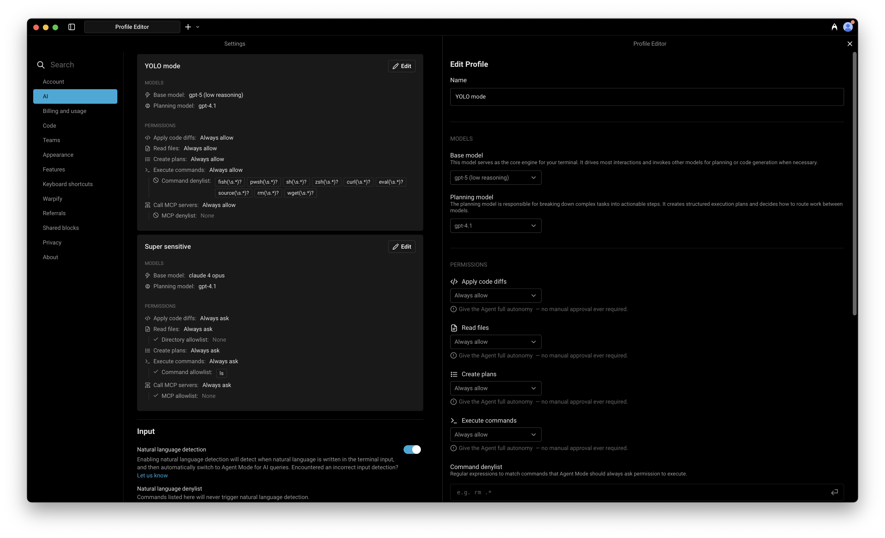
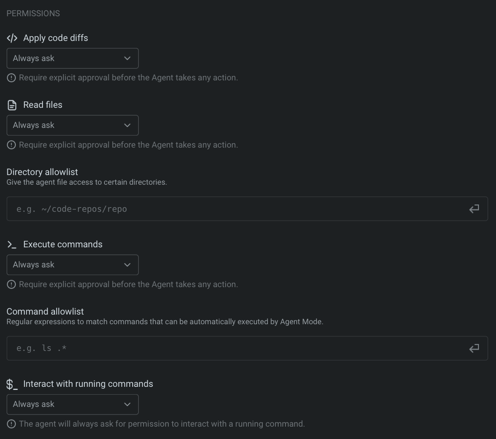
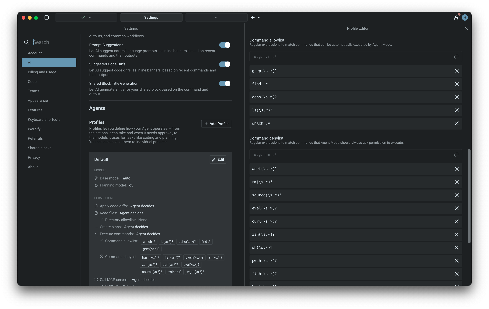
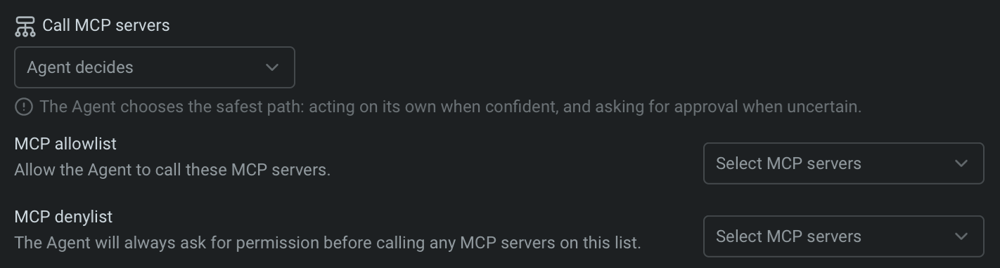
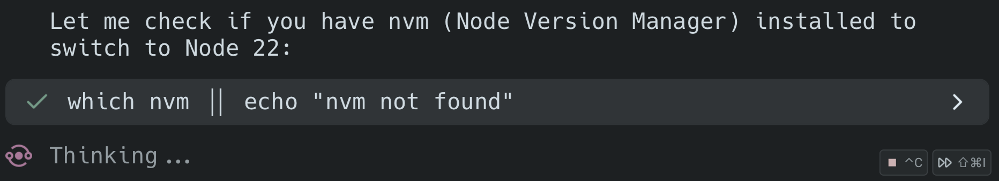

import { Tabs, TabItem } from '@astrojs/starlight/components';

## Agent Profiles

Agent Profiles let you configure how your Agent behaves in different situations. Each profile defines the Agent's autonomy, base models, and tool access. You can create multiple profiles and edit them directly in **Settings** > **Agents** > **Profiles**.

* **Default profile**: Every user starts with a default profile, you can edit it at any time, and new profiles will copy its settings as a starting point.
* **Other profiles**: Set up different profiles for different workflows (e.g., "Safe & cautious", "YOLO mode", etc.). Manage them in the Profiles settings menu.

**In each Agent Profile, you can configure:**

* The name of the profile
* **Base model**: The core engine for your Agent. It handles most interactions and invokes other models when needed (e.g. for code generation). This model is also used for [Planning](/agent-platform/capabilities/planning/) by default, though you can configure a separate planning model.
* Agent autonomy and permissions

## Agent Permissions

Agent Permissions let you define how your Agent in a specific Profile operates — control its autonomy, choose what tools or MCP servers it can access, and set when it should act independently or ask for approval.

:::caution
**Still getting approval prompts?** If the Agent keeps asking for permission to run certain commands (like `curl`, `rm`, or `wget`) even though you've set permissions to "Always allow," check your **Command denylist** in **Settings** > **Agents** > **Profiles**. The denylist always takes precedence over other permission settings. Remove commands from the denylist to allow them to auto-execute, or use [Run until completion](#run-until-completion) to bypass the denylist for the current task.
:::

You can control how much autonomy the Agent has when performing different types of actions under **Settings** > **Agents** > **Profiles** > **Permissions** . Agent permission types:

* Apply code diffs
* Read files
* Create plans
* Execute commands
* Interact with running commands (via [Full Terminal Use](/agent-platform/capabilities/full-terminal-use/))

**Each permission has different levels of autonomy:**

<table><thead><tr><th width="196.3369140625">Autonomy level</th><th>Description</th></tr></thead><tbody><tr><td>Agent Decides</td><td>Agent will act autonomously when it's confident, but prompt for approval when uncertain. This option balances speed with control, allowing the Agent to go ahead with common workflows while keeping you in the loop for more complex or risky steps.</td></tr><tr><td>Always ask</td><td>Agent will request explicit user approval before taking any action. Choose this for sensitive actions.</td></tr><tr><td>Always allow</td><td>Agent will perform the action without ever requesting explicit confirmation. Use this for tasks you fully trust the Agent to handle on its own.</td></tr><tr><td>Never</td><td>Agent will not ever take the action (i.e. Create plans).</td></tr></tbody></table>

:::note
For **Apply code diffs**, `Agent decides` currently behaves the same as `Always ask` — the Agent always prompts you to review diffs before applying them. Only `Always allow` skips the review prompt.

When all Agent permissions are set to **Always allow**, the Agent gains full autonomy (“YOLO mode”); however, any denylist rules will still override these settings.
:::

### Command allowlist

The Agent lets you define an allowlist of commands that run automatically without confirmation. It’s empty by default, but users often add read-only commands such as:

* `which .*` - Find executable locations
* `ls(\s.*)?` - List directory contents
* `grep(\s.*)?` - Search file contents
* `find .*` - Search for files
* `echo(\s.*)?` - Print text output

You can add your own regular expressions to this list in **Settings** > **Agents** > **Profiles** > **Command allowlist**. Commands in the allowlist will always auto-execute, even if they are not read-only operations.

### Command denylist

For safety, the Agent always prompts for confirmation before executing potentially risky commands. The default denylist includes several examples, such as:

* `wget(\s.*)?` - Network downloads
* `curl(\s.*)?` - Network requests
* `rm(\s.*)?` - File deletion
* `eval(\s.*)?` - Shell code execution

The denylist takes precedence over both the allowlist and `Agent decides`. If a command matches the denylist, user permission will always be required, regardless of other settings. You can add your own regular expressions to this list in **Settings** > **Agents** > **Profiles** > **Command denylist**.

### MCP permissions

MCP servers let you extend the Agent with custom tools and data sources using standardized, plugin-like modules.

In this settings menu, you can configure which MCP servers the Agent is allowed to call:

* Use the MCP allowlist to give the Agent permission to call specific servers without asking.
* Use the MCP denylist to require approval before calling certain servers, even if they’re also in the allowlist.
* Or set the Agent to “decide” — it will act autonomously when confident, and ask for confirmation when uncertain.

:::note
To learn how to build and configure your own MCP server, check out the [MCP feature docs](/agent-platform/capabilities/mcp/).
:::

## Run until completion

During an Agent interaction, you can give the Agent full autonomy for the current task. When auto-approve is on, every suggested command runs immediately until the task finishes, or you stop it with `Ctrl + C`.

<Tabs>
  <TabItem label="macOS">
    Auto-approve all Agent actions with: `CMD + SHIFT + I`
  </TabItem>
  <TabItem label="Windows">
    Auto-approve all Agent actions with: `CTRL + SHIFT + I`
  </TabItem>
  <TabItem label="Linux">
    Auto-approve all Agent actions with: `CTRL + SHIFT + I`
  </TabItem>
</Tabs>

:::note
_Run until completion_ ignores the denylist entirely. It's the purest form of “YOLO” mode and essentially a fully "autonomous mode" where the Agent proceeds without asking for confirmation.
:::

---

## Next steps

Once you've configured how your agent operates, try giving it a larger task to plan and execute.

* **[Planning](/agent-platform/capabilities/planning/)** - Break down complex tasks into structured, executable plans that the agent runs step by step.
* **[Code diffs](/agent-platform/local-agents/code-diffs/)** - Review, refine, and apply code changes the agent generates.
* **[Interactive Code Review](/agent-platform/local-agents/interactive-code-review/)** - Leave inline comments on agent-generated diffs and have the agent address your feedback.
