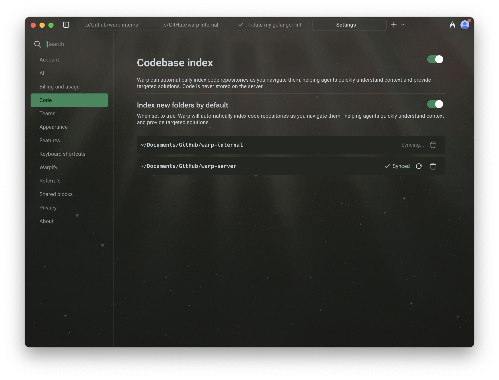
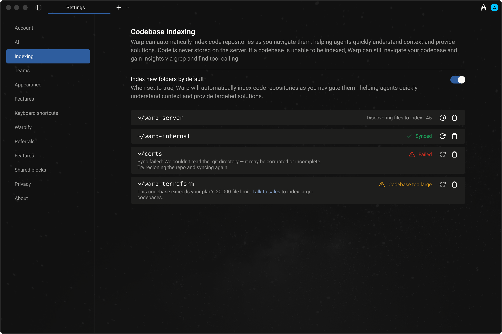

import VideoEmbed from '@components/VideoEmbed.astro';

Codebase Context helps Agents understand your project by indexing your local codebase. This allows Agents to generate more accurate completions, suggest context-aware edits, and answer questions using real knowledge of your code.

## Get started

Index a project and see the difference in agent responses in a few minutes.

:::note
**Don't have a project to try?** Clone a popular open-source repo to test out codebase indexing:
```bash
git clone https://github.com/vercel/next.js.git && cd next.js
```
:::

1. **Open a project folder in Warp.** Navigate to a Git repository using `cd` or open a folder from the file tree. Warp automatically detects the Git repo and begins indexing.
2. **Verify indexing status.** In Warp, go to **Settings** > **Code** > **Indexing and projects** and check the status under "Initialized / indexed folders." Once the status shows **Synced**, your codebase is ready.
3. **Ask the Agent a question about your code.** Start an Agent conversation (`⌘+Enter` on macOS, `Ctrl+Shift+Enter` on Windows/Linux) and try a prompt like:
   * "Explain the architecture of this project"
   * "What are the main entry points?"
   * "Walk me through the most important modules"
4. **See the difference.** The Agent grounds its responses in actual files, functions, and line numbers from your codebase, producing more accurate and context-aware answers.

---

## Indexing your codebase

When you open a directory in Warp, we check if it is part of a Git repository. If it is, Warp begins indexing the source code to provide rich context for Agents. Warp also detects [Git worktree](/code/git-worktrees/) checkouts — each worktree is indexed as its own repository, so Agents always have accurate context for the branch you're working on.&#x20;

:::note
Code indexed with Codebase Context is never stored on our servers. Codebase Context works with both local agent sessions and [cloud agent runs](/agent-platform/cloud-agents/overview/). Without Codebase Context enabled, agents will still be able use terminal commands (i.e. `grep`, `sed`) to navigate your code.
:::

:::caution
**Codebase Context (semantic indexing and search) is not yet available in SSH or WSL sessions.**

Other coding features over SSH on macOS and Linux — file tree, native file reads, and native code diffs — already work via Warp's [SSH extension](/terminal/warpify/ssh/#installing-the-ssh-extension), and Codebase Context is on the SSH roadmap. See [Feature support over SSH](/code/ssh-feature-support/) for the current matrix.

Feature requests:

* SSH: [GitHub #6831](https://github.com/warpdotdev/Warp/issues/6831)
* WSL: [GitHub #6744](https://github.com/warpdotdev/Warp/issues/6744)
:::



**Codebase indexing intervals and triggers:**

* Initially when you have Codebase Context enabled.
* Warp automatically triggers a codebase index periodically.
* Whenever a new Agent conversation begins.
* When you click on the sync 🔄 button in **Settings** > **Code** > **Indexing and projects**.

**This embeddings index helps Agents:**

* Understand your project structure and reference relevant code
* Generate completions that match your style and patterns
* Suggest edits in the correct locations based on real context

For large projects, indexing may take a few minutes. Agents will not use Codebase Context until indexing is complete, but **agentic coding features remain fully available in the meantime**.

:::note
You can view and manage your indexed codebases in **Settings** > **Code** > **Indexing and projects** under "Initialized / indexed folders". You can also choose whether to automatically index new folders as you navigate them.
:::

<VideoEmbed url="https://youtu.be/11rz9OYQ8Hg" />

### **Codebase indexing states**

When viewing indexed codebases in Warp under **Settings** > **Code** > **Indexing and projects**, you may see different status indicators:

* **Synced** — Indexing is complete and the codebase is ready to be used as context.
* **Discovering files** – Warp is currently scanning and indexing files in the codebase.
* **Failed** – Indexing failed. Common reasons include unreadable `.git` directories or corrupted repositories. Try re-cloning the repo and syncing again.
* **Codebase too large** – The number of files in the codebase exceeds your current plan’s limit. You can either reduce the number of files being indexed using `.warpindexingignore`, or [contact sales](https://warp.dev/contact-sales) for support with larger codebases.



### When does codebase syncing happen?

Warp automatically triggers a codebase sync initially and periodically, when you click on the sync 🔄 button in **Settings** > **Code** > **Indexing and projects**, or when you start a new Agent conversation. However, if many files have changed or the network is slow, the sync may not complete before the Agent tries to access context.

:::note
In large projects (e.g. after a branch switch), there may be a short delay where the Agent references stale or outdated files.
:::

### File and codebase limits

The number of codebases you can index and the maximum number of files per codebase vary by plan. All plans support indexing **at least 5,000 files per codebase**, with higher tiers including support for more files and additional codebases.

For full details, visit our [pricing page](https://www.warp.dev/pricing).

### Ignore files

For large codebases, Warp supports several ignore files to give you control over what gets indexed. This allows each developer to focus context on the parts of the codebase most relevant to their work.

Warp respects the following ignore files:

* `.gitignore`
* `.warpindexingignore`
* `.cursorignore`
* `.cursorindexingignore`
* `.codeiumignore`

Use these files to skip indexing of folders, generated files, or any content you don't want agents to reference. This can improve performance and result quality.

:::note
Files excluded by ignore rules **do not** count toward your codebase's file limit.
:::

## Codebase Context in cloud agent runs

Codebase Context is available in all Oz cloud agent runs — including runs triggered from the CLI, API/SDK, integrations (Slack, Linear, GitHub Actions), and schedules — as long as Codebase Context is enabled for your account.

**No additional configuration is needed.** If Codebase Context is enabled, cloud agents use it automatically.

## Multi-repo context

Warp supports referencing context across multiple indexed repositories. Note that you don’t need to be inside a specific repo for agents to use its context.&#x20;

**This is especially useful when:**

* Implementing a feature across multiple repos, such as full-stack work across client and server
* Using one repo as a reference while building in another, for example: “copy the implementation from repo A into my repo B”

Agents will only reference other repositories if they are already indexed. During cross-repo tasks, Warp's Agents have access to the file paths of all indexed repos. It is more likely to use cross-repo context when you mention the exact name of the repo in your prompt.

## Demo: Explain my codebase with Warp

Here's an example from [Warp Guides](/guides/), where Zach demonstrates how Warp uses Codebase Context to search for and use the relevant files as context:

<VideoEmbed url="https://www.youtube.com/watch?v=11rz9OYQ8Hg" />

---

## Next steps

With your codebase indexed, you can browse your project directly in Warp and start letting agents take action on your code.

* **[File Tree](/code/code-editor/file-tree/)** - Browse your project structure in Warp's sidebar and open files directly.
* **[Code editor](/code/code-editor/)** - Edit files with syntax highlighting, LSP support, and find-and-replace without leaving Warp.
* **[Agent profiles and permissions](/agent-platform/capabilities/agent-profiles-permissions/)** - Configure how much autonomy the agent has when working with your code.
