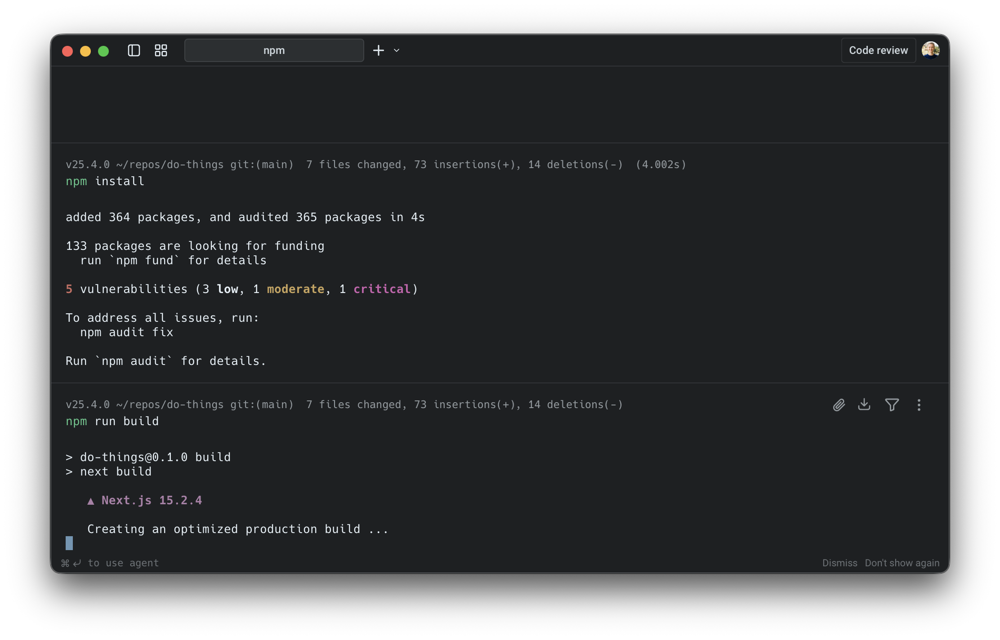
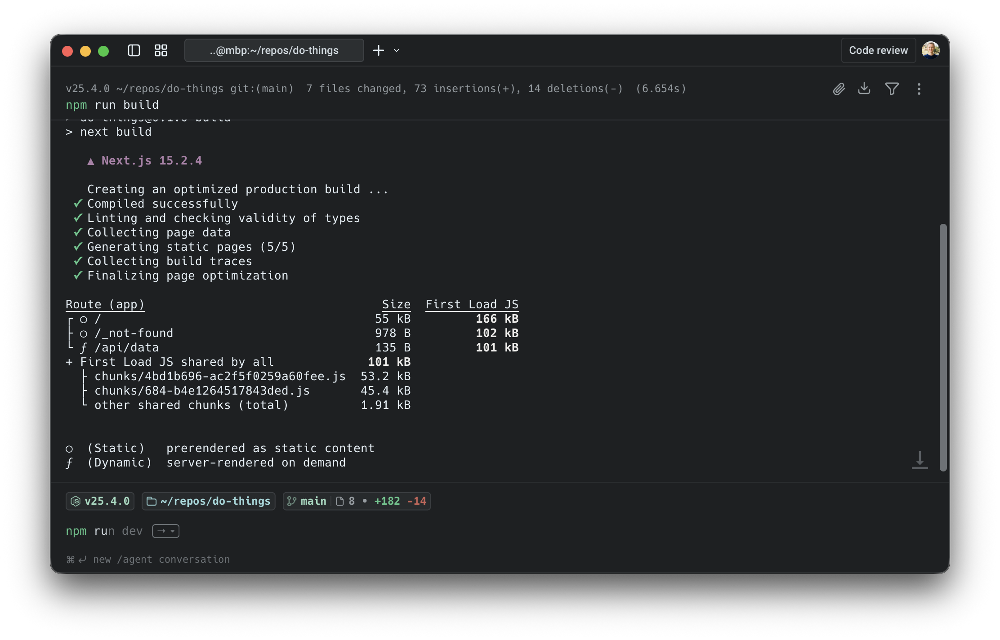
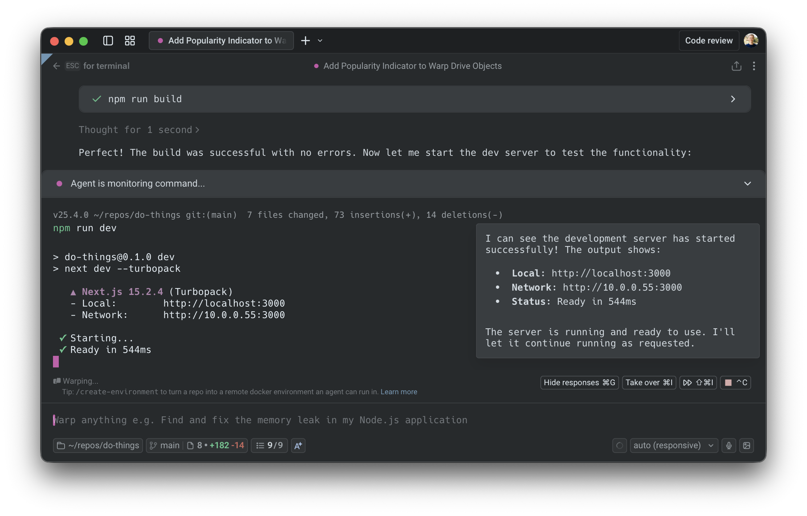
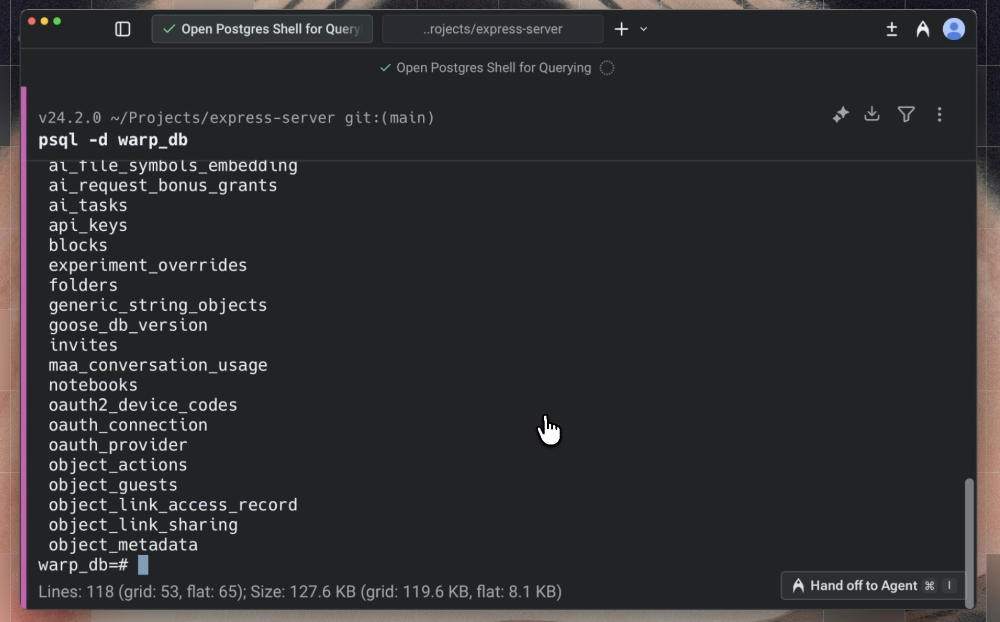
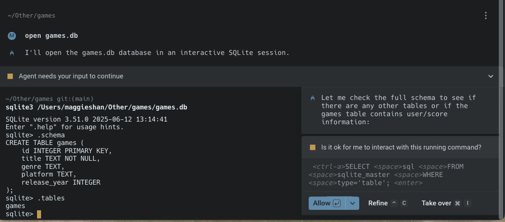
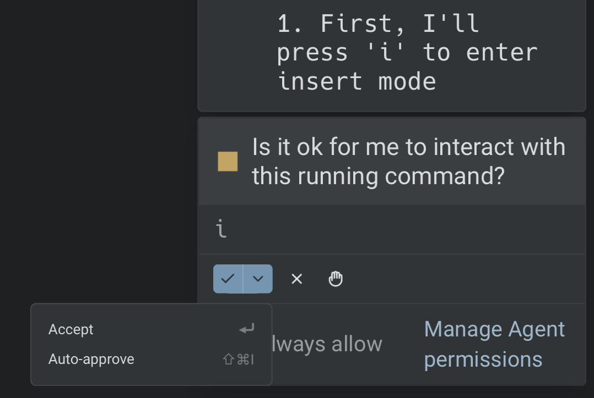

import { Tabs, TabItem } from '@astrojs/starlight/components';
import VideoEmbed from '@components/VideoEmbed.astro';

Full Terminal Use lets Warp's agent operate directly inside interactive terminal applications, such as database shells, debuggers, text editors, long-running servers, and more.

The agent can see the live terminal buffer (terminal state), write to the PTY to run commands, respond to prompts, and continue working inside the running process while you stay in control.

<VideoEmbed url="https://youtu.be/gBdehHrtb94?si=-vvl4ipGwwoWxEJq" />

## Overview

With Full Terminal Use, Warp’s agent can attach to interactive tools like `psql`, `vim`, `python`, `gdb`, `top`, or your dev server, read the terminal output as it changes, and interact with the application as if you were typing.

You can either ask the agent to start an interactive program, or you can start it yourself and then tag the agent in once the tool is already running. In both cases, the agent sees the same terminal buffer (and PTY session) you do and can act on it.

## How Full Terminal Use works

#### Start an interactive command

You can either ask the agent to run an interactive command, or start one manually and then tag the agent in:

* **Ask the agent to start an interactive tool**
  * Example:
    * “Open a Postgres shell and help me inspect the orders table.”
    * “Start the dev server and debug this 500 error.”
* **Or start the command yourself, then tag the agent in**
  * Example:
    * If you’ve already launched an interactive tool (for example `psql` or `npm run dev`), you can bring the agent into the running session using the "Use Agent" button in the terminal footer or via `CMD + I` .

    
    *   Once the agent is tagged in, you can follow up with natural-language requests such as:

        “Watch this process and help debug the error on the /session endpoint.”
    * Warp then attaches the agent to the active PTY so it can see the current terminal buffer and propose actions inside the session.

<VideoEmbed url="https://www.loom.com/share/bcedc521071a4b6a9bbcf74b5156f903" title="Tagging in the agent." />

Warp attaches the agent to the running command so it can see and control the terminal buffer.

#### Agents propose actions inside the session

Once attached, you can continue using natural language and the agent turns your requests into concrete terminal actions. For example, in a Postgres shell:

* You: “Show me all the tables and describe the orders table.”
* Agent: proposes running commands like: `\dt` --> `\d+ orders`

In the UI, you’ll see a request to:

* Run a specific command
* Optionally enable auto-approval for similar commands in this session

#### Switching control between user and the agent

You can swap control at any time.

**Take over**

* Use the Takeover control to stop the agent from typing or performing any actions.
* The shell stays open, and you can type directly into the same session.

**Hand back control**

* When you’re ready for the agent to continue, click the control again.
* The agent resumes where you left off, with full access to the current terminal state.

This makes it easy to:

* Let the agent do mechanical work (paging output, trying variants of a command)
* Step in for delicate or security-sensitive actions
* Then let the agent continue once the critical step is done

#### Long-running commands in terminal vs agent view

The behavior differs based on where you start the long-running command:

<Tabs>
  <TabItem label="From terminal view">
    1. Run an interactive command (e.g., `python`, `psql`)
    2. Press `⌘↩` (macOS) or `Ctrl+Shift+Enter` (Windows/Linux), or use `⌘I` (macOS) / `Ctrl+I` (Windows/Linux), to tag in the agent
    3. The input switches to Agent Mode with full controls
    4. When you exit, an agent conversation block appears in your terminal blocklist
    5. Click the block to reopen the full conversation with your LRC interaction context
  </TabItem>
  <TabItem label="From agent view">
    1. The agent runs an interactive command as part of your conversation
    2. Use `⌘↩` (macOS) or `Ctrl+Shift+Enter` (Windows/Linux) to tag in if the agent isn't already interacting
    3. The UI stays the same since you're already in agent view
    4. When you exit, the interaction remains part of your conversation. No separate block is created in the terminal blocklist
    5. Commands run in agent view are automatically included as context
  </TabItem>
</Tabs>

:::note
You can also use `CMD + I` (macOS) or `CTRL + I` (Windows/Linux) to toggle agent control in either view.
:::

#### Showing and hiding agent responses

Warp gives you control over how much agent output appears in Full Terminal Use.

**Toggle visibility**

Use the `Hide responses` or `Show responses` button or `CMD + G` in the interactive command footer to switch between showing all agent output or hiding it from the terminal view.

Note that this only affects the agent's messages and proposals; your terminal state and command output remain unchanged.

**Behavior when hidden**

* When agent responses are hidden, your own agent requests automatically dismiss after **4 seconds** to keep the terminal clear.
* You can also manually dismiss any user query at any time by hovering over it and clicking the X.

<VideoEmbed url="https://www.loom.com/share/c639fb4ab33343a39037b2083c66858a" />

---

### Configuring agent permissions and autonomy

You control how much autonomy the agent has when interacting with the terminal.

#### Session-level approvals

Each time the agent wants to take an action inside an interactive shell, you’ll see the agent’s reasoning, a brief explanation, and the proposed command. From there you can:

* Allow the command once (for example by approving it or pressing `ENTER`).
* Turn on auto-approval for similar commands in this session (for example with `CMD + SHIFT + I`).
* Refine the request with `CTRL + C`, which clears the proposed action and lets you follow up with a different query.
* Take over manually with `CMD + I`, which stops the agent from issuing any further PTY writes until you hand control back.

This lets you tighten or loosen control for the current task:

* For exploratory work, use **Always allow** to reduce friction.
* For production systems or sensitive operations, use **Allow once** and review each step.

#### Global permission settings

You can configure global defaults from your [Agent Profiles & Permissions](/agent-platform/capabilities/agent-profiles-permissions/) settings:

* **Ask on first write**: The first write to a shell process requires approval. After that, all subsequent writes for that specific process/command will be approved.
* **Always ask**: Every write to the shell process from the agent requires your explicit approval.
* **Always allow**: The agent can write to the shell process without prompting you each time.

These settings apply to every session that uses Full Terminal Use. You can still override them on a per-session basis when prompted. For example, you can enable **auto-approval** for similar commands in the current session using the fast-forward control, or switch to a **different AI profile** with its own permission settings for that conversation.

:::note
**Note**: All [Secret Redaction](/support-and-community/privacy-and-security/secret-redaction/) features still apply during Full Terminal Use, so sensitive values in your environment or output remain protected.
:::

### Credits usage

All AI interactions from Full Terminal Use consume [credits](/support-and-community/plans-and-billing/credits/), including understanding your natural language requests.

Credits are consumed in a similar way as other Oz actions that use the same model and a similar context size.

**Interactive sessions can consume more credits if:**

* The agent runs many commands in an interactive shell on your behalf.
* There is a significant amount of terminal output to read and summarize.

**To manage credit usage:**

* Use tighter scopes:
  * “Describe just the orders table.” instead of “Explain the entire database.”
* Pause autonomy for high-volume tasks with copious terminal output:
  * Take over manual control when running large batches or long logs.
* Use stricter permissions:
  * Set global permissions to "Ask on first write" or "Always ask", then approve only what you need.

:::note
To learn more about what goes into a credit and how to get more value from AI usage in Warp, see: [_Getting the most out of credits in Warp_](https://www.warp.dev/blog/warp-ai-requests).
:::

## Example workflows

Here’s a demo from one of our engineers, Maggie, that walks through a couple of Full Terminal Use examples.

<VideoEmbed url="https://www.loom.com/share/d47ee09153df417983df65a339a9d6f2" />

Below are some common interactive tools where Full Terminal Use is particularly useful: database shells (Postgres, MySQL, SQLite), debuggers such as gdb, language-specific REPLs like python or node, text editors and file explorers, and long-running dev servers or monitoring tools such as top and htop.

<table><thead><tr><th width="158.5418701171875">Tool</th><th width="326.64208984375">Example tasks</th><th>Agents can...</th></tr></thead><tbody><tr><td><strong>Database shells (REPLs)</strong>  e.g. <code>psql</code>, <code>mysql</code>, <code>sqlite</code>, etc.</td><td><ul><li>“List all tables and describe the users and orders tables.”</li><li>“Create a new table to store archived user sessions.”</li><li>“Show me all rows in orders from the last 30 days, grouped by status.”</li><li>“Generate and run a query that finds the top 10 customers by revenue.”</li></ul></td><td><ul><li>Navigate <code>\d</code>, <code>\dt</code>, <code>DESCRIBE</code>, etc.</li><li>Write and execute SQL queries</li><li>Summarize results in plain language</li></ul></td></tr><tr><td><strong>Text editors</strong>  e.g. <code>vim</code>, <code>nano</code>, etc.</td><td><ul><li>“Open this file in vim and add a Markdown header and a boilerplate section.”</li><li>“Insert a docstring above this function explaining what it does.”</li><li>“Generate a CSS utility class block and insert it in this file.”</li></ul></td><td><ul><li>Navigate within the editor using keystrokes</li><li>Insert, edit, and delete text</li><li>Save and quit when done</li></ul></td></tr><tr><td><strong>Python REPLs</strong>  e.g. <code>python</code>, <code>ipython</code></td><td><ul><li>“Start a Python REPL and define a function that calculates a moving average.”</li><li>“Write a unit test for this function and run it.”</li><li>“Plot x from 0 to 10 and y = sin(x).”</li></ul></td><td><ul><li>Import modules</li><li>Define functions and classes</li><li>Run tests and small scripts</li><li>Print or summarize results back to you</li></ul></td></tr><tr><td><strong>Debuggers</strong>  e.g. <code>gdb</code>, <code>lldb</code>, language-specific debuggers</td><td><ul><li>“Start gdb for this binary and set a breakpoint on <code>handle_request</code>.”</li><li>“Run until the breakpoint, then show the stack and local variables.”</li><li>“Inspect this pointer and tell me if it looks invalid.”</li></ul></td><td><ul><li>Issue debugger commands (break, run, next, continue, bt, etc.)</li><li>Walk through execution step by step</li><li>Summarize relevant state so you don’t have to remember every command</li></ul></td></tr><tr><td><strong>Long-running servers and services</strong>  e.g. <code>npm run dev</code>, <code>uvicorn</code>, Rails servers, etc</td><td><ul><li>“Run the dev server and debug the internal server error on /session.”</li><li>“Send a sample request to this endpoint and explain the failure.”</li><li>“Kill the server once you identify the error and propose a code diff.”</li></ul></td><td><ul><li>Watch server logs in real time</li><li>Notice new errors as they appear</li><li>Stop the server when appropriate</li><li>Propose code changes (for example, via a diff) based on what it observes</li></ul></td></tr><tr><td><strong>Version control workflows</strong>  e.g. <code>git rebase -i</code>, complex git commands</td><td><ul><li>“Interactively rebase master onto <code>feature-branch</code> to squash these commits into one.”</li><li>“Resolve these merge conflicts and ensure tests pass.”</li></ul></td><td><ul><li>Navigate interactive rebase prompts</li><li>Edit commit messages</li><li>Apply conflict resolutions you approve</li></ul></td></tr><tr><td><strong>Cloud provider CLIs</strong>  e.g. <code>gcloud</code>, <code>aws</code>, <code>az</code>, etc.</td><td><ul><li>“Use gcloud to create a new Kubernetes cluster with these settings.”</li><li>“Provision a new RDS instance for staging and show me the connection details.”</li></ul></td><td><ul><li>Walk through multi-step CLI workflows</li><li>Handle prompts and confirmations</li><li>Summarize the resulting resources</li></ul></td></tr></tbody></table>
