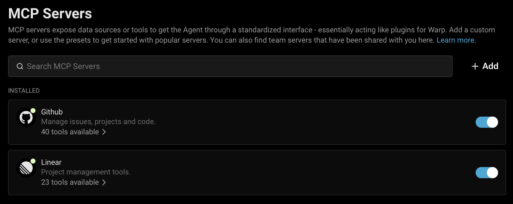
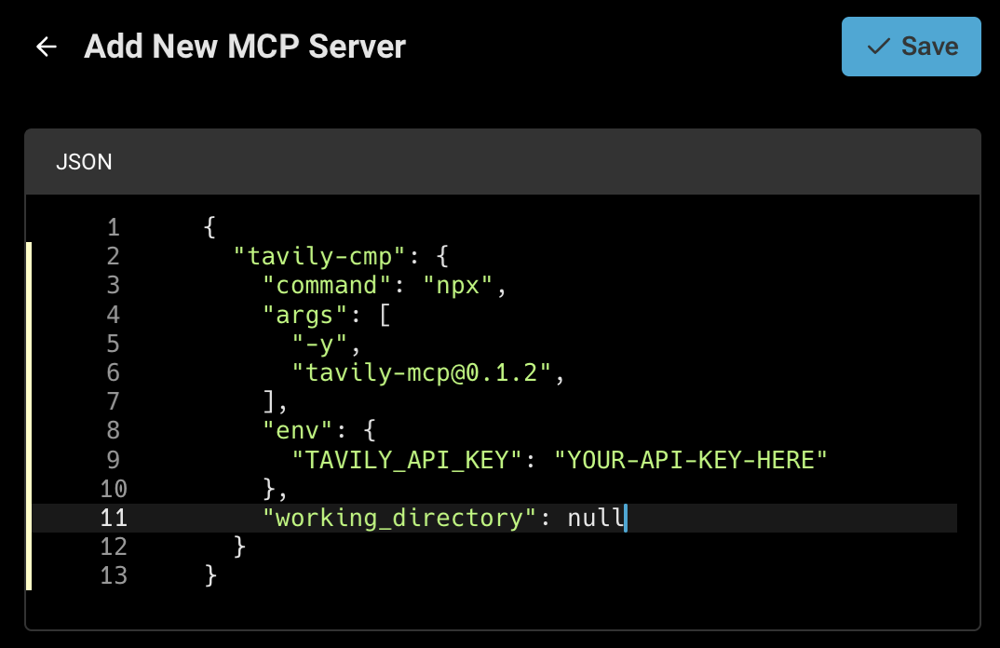
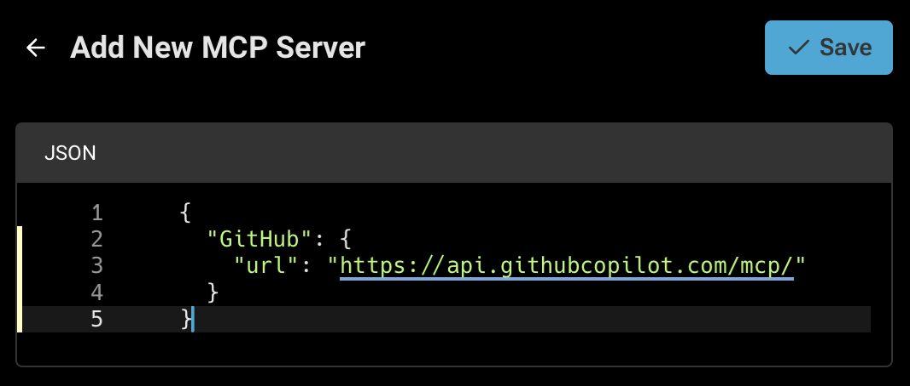
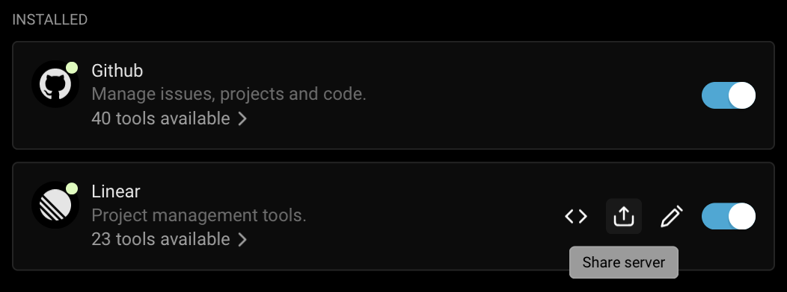

import { Tabs, TabItem } from '@astrojs/starlight/components';

MCP servers extend Warp's [local agents](/agent-platform/local-agents/interacting-with-agents/) in a modular, flexible way by exposing custom tools or data sources through a standardized interface — essentially acting as plugins for Warp. Warp supports a variety of connection protocols, including Streamable HTTPS and SSE, along with custom headers and environment variables.

MCP is an open source protocol. Check out the official [MCP documentation](https://modelcontextprotocol.io/introduction) for more detailed information on how this protocol is engineered.

:::note
This page covers MCP servers for local agents in the Warp desktop app. If you're using cloud agents, see [MCP Servers for cloud agents](/agent-platform/cloud-agents/mcp/).
:::

### How to access MCP Server settings

You can navigate to the MCP servers page in any of the following ways:

* From the [Settings Page](warp://settings/mcp): **Settings** > **Agents** > **MCP servers**
* From [Warp Drive](/knowledge-and-collaboration/warp-drive/): under **Personal** > **MCP Servers**
* From the [Command Palette](/terminal/command-palette/): search for `Open MCP Servers`
* From the Warp app: **Settings** > **Agents** > **Warp Agent** > **Manage MCP servers**

This will show a list of all configured MCP servers, including which are currently running. If you close Warp with an MCP server running, it will run again on next start of Warp. MCP servers that are stopped will remain so on next launch of Warp.



### Adding an MCP Server

To add a new MCP server, you can click the **+ Add** button. Configurations from most MCP Clients can be directly copied and pasted.

MCP server types you can add:

<Tabs>
  <TabItem label="CLI Server (Command)">
    Provide a startup command. Warp will launch this command when starting up and shut it down on exit.

    

    :::note
    Always set `working_directory` explicitly when your MCP server command or args include relative paths. This ensures consistent and predictable behavior across machines and sessions.
    :::

    **CLI Server (Command) MCP Configuration Properties**

    | Property            | Type      | Required | Description                                                                         |
    | ------------------- | --------- | -------- | ----------------------------------------------------------------------------------- |
    | `command`           | string    | Yes      | The executable to launch (e.g., `npx`).                                             |
    | `args`              | string\[] | Yes      | Array of command-line arguments passed to `command` (e.g., module name, paths).     |
    | `env`               | object    | No       | Key-value object of environment variables (e.g., API Tokens).                       |
    | `working_directory` | string    | No       | Working directory path where the command is run, used for resolving relative paths. |
  </TabItem>
  <TabItem label="Streamable HTTP or SSE Server (URL)">
    Provide a URL where Warp can reach an already-running MCP server that supports Server-Sent Events.

    

    **Streamable HTTP or SSE Server (URL) MCP Configuration Properties**

    | Property  | Type   | Required | Description                                                       |
    | --------- | ------ | -------- | ----------------------------------------------------------------- |
    | `url`     | string | Yes      | The HTTP endpoint URL to connect to via Server-Sent Events (SSE). |
    | `headers` | object | No       | Key-value object of header variables (e.g., Authorization).       |
  </TabItem>
</Tabs>

### Adding multiple MCP servers

Warp supports configuring **multiple MCP servers** using a JSON snippet. Each entry under `mcpServers` is keyed by a unique name (`filesystem`, `github`, `notes`, etc). All servers defined in the example are added automatically — no manual setup required.

To add a multiple MCP servers, you can click the **+ Add** button then paste in a JSON snippet like the example below:

```json
{
  "mcpServers": {
    "filesystem": {
      "command": "npx",
      "args": ["-y", "@modelcontextprotocol/server-filesystem", "/path/to/allowed/files"]
    },
    "notes": {
      "command": "npx",
      "args": ["-y", "@modelcontextprotocol/server-notes", "--notes-dir", "/Users/you/Documents/notes"]
    },
    "externalDocs": {
      "url": "http://localhost:4000/mcp/stream",
      "headers": {
            "my-header": "my-header-value"
      }
    }
  }
}
```

### File-based MCP servers

Warp detects MCP server configurations saved in supported config files and can spawn them alongside your manually configured servers.

Warp-managed file-based servers use `.warp/.mcp.json` files. The built-in `/add-mcp-server` skill can help create or update these files for you:

* **Global:** `~/.warp/.mcp.json`
* **Project-scoped:** `{repo_root}/.warp/.mcp.json`

Global Warp servers are detected and auto-spawned by default, even if the third-party auto-spawn setting is off.

To auto-spawn supported global servers from third-party agents, go to **Settings** > **Agents** > **MCP servers** and toggle **Auto-spawn servers from third-party agents** on.


When this setting is enabled:

* **Global third-party servers** are spawned on Warp startup and available in any session.
* **Project-scoped servers** are detected when you enter a repo containing a supported config file, but are not spawned automatically.

Project-scoped servers from any provider, including Warp, must be toggled on individually from the MCP servers page. This is intentional: cloned repositories can contain MCP config files that run arbitrary commands, so Warp never starts project-scoped file-based servers automatically. Project-scoped servers started from the MCP servers page are session-scoped; after restarting Warp, toggle them on again if you still trust the repo and want to use those tools.

:::note
File-based servers that require OAuth show an authentication modal on their first spawn. Credentials are saved for future spawns, the same as manually configured MCP servers.
:::

Supported providers:

* **Warp** - reads global config (`~/.warp/.mcp.json`) and project-scoped config (`.warp/.mcp.json` at project root). Global Warp servers auto-spawn by default. Use `/add-mcp-server` in Agent Mode to add or update Warp-managed MCP config files.
* **Claude Code** - reads user-scoped config (`~/.claude.json`) and project-scoped config (`.mcp.json` at project root). Global Claude Code servers auto-spawn only when **Auto-spawn servers from third-party agents** is enabled. See [user scope](https://code.claude.com/docs/en/mcp#user-scope) and [project scope](https://code.claude.com/docs/en/mcp#project-scope) in the Claude Code docs.
* **Codex** - reads global config (`~/.codex/config.toml`) and project-scoped config (`.codex/config.toml` at project root). Global Codex servers auto-spawn only when **Auto-spawn servers from third-party agents** is enabled. See [Codex MCP docs](https://developers.openai.com/codex/mcp/#connect-codex-to-an-mcp-server).
* **Other agents** - reads global config (`~/.agents/.mcp.json`) and project-scoped config (`.agents/.mcp.json` at project root). Global servers from this provider auto-spawn only when **Auto-spawn servers from third-party agents** is enabled.

Warp recognizes MCP servers under the `mcpServers`, `servers`, `mcp.servers`, and `mcp_servers` wrapper keys in JSON config files. Codex configs are read from TOML under `mcp_servers`.

#### Suggested demos

Add short demos for these flows:

* Using `/add-mcp-server` to create a global Warp MCP server, then restarting Warp to show it auto-spawns by default.
* Enabling **Auto-spawn servers from third-party agents** and showing a global Claude Code or Codex MCP server start automatically.
* Opening a cloned repo with a project-scoped MCP config and showing that the server appears under the relevant **Detected from** section but must be toggled on manually after each restart.

### Managing MCP servers

After MCP servers are registered in Warp, you can **Start** or **Stop** them from the MCP servers page. Each running server will have a list of available tools and resources.

You can rename and edit a server's name, as well as delete the server. If you are a part of a Team, you can also share a MCP with your teammates.

### Sharing MCP servers

MCP servers can be shared with your teammates by clicking the share icon. When sharing, sensitive values in the `env` configuration will be automatically scrubbed and replaced with variables.



Your teammates can find shared MCP servers under the `Shared` section of their MCP settings. When your teammates install your server configuration, they will be prompted to enter any scrubbed `env` values.

Warp also provides out-of-the-box MCP servers that can be installed by anyone. These can be found under the `Shared` section of your MCP settings.

### Authentication in MCP servers

Most MCP servers require authentication to connect to external services. Warp supports the following methods:

* **Environment variables**: pass an API key or access token via the server's environment variables.
* **OAuth login (one-click installation)**: simplifies configuration by handling authentication through your browser. Warp stores credentials securely on your device and reuses them for future sessions. Re-authentication is required when opening Warp on a new machine.
  * Starting a server without existing credentials automatically opens a browser-based authentication flow.
  * Credentials can be revoked at any time from the MCP Servers pane in Warp.
* **Custom Headers**: pass an Authentication Bearer token via the headers variable.

### Debugging MCP

If you're having trouble with an MCP server, you can check the logs for any errors or messages to help you diagnose the problem by clicking the `View Logs` button on a server from the MCP servers page.

:::caution
If you choose to share your MCP server logs with anybody, **make sure to remove any sensitive information before sharing**, as they may contain API keys.

Many SSE based MCP servers will state that your URL should be treated like a password, and can be used with no additional authentication.
:::

:::note
Tip: We've noticed that some models often work better with MCP servers than others. If you're having trouble calling or using an MCP server, try using a different model.
:::

#### Debugging MCP Authentication issues

In some cases you may need to reset the auth token for some MCP servers. To do this delete the local MCP auth files by running the following: `rm -rf ~/.mcp-auth`

:::caution
Note this will delete all your MCP auth tokens stored locally so you will need to login and re-authenticate.
:::

If the above doesn't help and you need to reset or change authentication, you may need to switch to a CLI-based MCP server configuration and provide the token via environment variables. See [Sentry CLI MCP Example](/agent-platform/capabilities/mcp/#sentry).

### Where MCP logs are stored

Warp saves the MCP logs locally on your computer. You can open the files directly and inspect the full contents in the following location:

<Tabs>
  <TabItem label="macOS">
    ```bash
    cd "$HOME/Library/Group Containers/2BBY89MBSN.dev.warp/Library/Application Support/dev.warp.Warp-Stable/mcp"
    ```
  </TabItem>
  <TabItem label="Windows">
    ```powershell
    Set-Location $env:LOCALAPPDATA\warp\Warp\data\logs\mcp
    ```
  </TabItem>
  <TabItem label="Linux">
    ```bash
    cd "${XDG_STATE_HOME:-$HOME/.local/state}/warp-terminal/mcp"
    ```
  </TabItem>
</Tabs>

## MCP server configuration examples

Below are examples for popular Model Context Protocol (MCP) servers.

* **CLI Server (Command)** — local `npx` or `docker` command based MCP servers.
* **Streamable HTTP or SSE Server (URL)** — remote or locally hosted MCP endpoints.

### **Engineering & Ops**

<Tabs>
  <TabItem label="GitHub">
    [GitHub MCP Docs](https://github.com/github/github-mcp-server)

    **GitHub CLI Server (Command)**

    ```json
    {
      "GitHub": {
        "command": "docker",
        "args": ["run","-i","--rm","-e","GITHUB_PERSONAL_ACCESS_TOKEN","ghcr.io/github/github-mcp-server"],
        "env": {
          "GITHUB_PERSONAL_ACCESS_TOKEN": "<your_github_token>"
        }
      }
    }
    ```

    **GitHub SSE Server (URL)**

    ```json
    {
      "GitHub": {
        "url": "https://api.githubcopilot.com/mcp/"
      }
    }
    ```
  </TabItem>
  <TabItem label="Sentry">
    [Sentry MCP Docs](https://docs.sentry.io/product/sentry-mcp/)

    **Sentry CLI Server (Command)**

    ```json
    {
      "Sentry": {
        "command": "npx",
        "args": ["-y","mcp-remote@latest","https://mcp.sentry.dev/mcp"]
      }
    }
    ```

    **Sentry SSE Server (URL)**

    ```json
    {
      "Sentry": {
        "url": "https://mcp.sentry.dev/sse"
      }
    }
    ```
  </TabItem>
  <TabItem label="Grafana">
    [Grafana MCP Docs](https://github.com/grafana/mcp-grafana)

    **Grafana CLI Server (Command)**

    ```json
    {
      "Grafana": {
        "command": "docker",
        "args": ["run","--rm","-i","-e","GRAFANA_URL","-e","GRAFANA_API_KEY","mcp/grafana","-t","stdio","-debug"],
        "env": {
          "GRAFANA_URL": "http://localhost:3000",
          "GRAFANA_API_KEY": "<your_grafana_key>"
        }
      }
    }
    ```

    **Grafana SSE Server (URL)**

    ```json
    {
      "Grafana": {
        "url": "https://your-mcp-host.com/api/mcp/grafana/sse"
      }
    }
    ```
  </TabItem>
  <TabItem label="Linear">
    [Linear MCP Docs](https://linear.app/docs/mcp)

    **Linear CLI Server (Command)**

    ```json
    {
      "Linear": {
        "command": "npx",
        "args": ["-y","mcp-remote","https://mcp.linear.app/sse"]
      }
    }
    ```

    **Linear SSE Server (URL)**

    ```json
    {
      "Linear": {
        "url": "https://mcp.linear.app/sse"
      }
    }
    ```
  </TabItem>
  <TabItem label="Chroma">
    **Chroma Package Search CLI Server (Command)**

    1. Visit Chroma's [Package Search](http://trychroma.com/package-search) page.
    2. Click "Get API Key" to create or log into your Chroma account and issue an API key for Package Search.
    3. After issuing your API key, click the "Other" tab and copy your API key.
    4. Add the following to your Warp MCP config. Make sure to click "Start" on the server after adding.

    More info in [Chroma's Package Search MCP Docs](https://docs.trychroma.com/cloud/package-search/mcp)

    ```json
    {
        "package-search": {
          "command": "npx",
          "args": ["mcp-remote", "https://mcp.trychroma.com/package-search/v1", "--header", "x-chroma-token: ${X_CHROMA_TOKEN}"],
          "env": {
            "X_CHROMA_TOKEN": "<YOUR_CHROMA_API_KEY>"
          }
        }
    }
    ```
  </TabItem>
</Tabs>

### **Design & Collaboration**

<Tabs>
  <TabItem label="Figma">
    **Figma Remote MCP Server (Recommended)**

    The official Figma remote MCP server supports OAuth for simple, one-click setup.

    1. In Warp, go to **Warp Drive** > **MCP Servers** > **+ Add** and paste the configuration below.
    2. Warp will open a browser window to authenticate with Figma.
    3. After approving access, credentials are stored securely on your device.

    :::note
    Note: A Figma account with [Dev Mode](https://www.figma.com/dev-mode/) enabled is required.
    :::

    ```json
    {
      "Figma": {
        "url": "https://mcp.figma.com/mcp"
      }
    }
    ```

    **Figma Local MCP Server**

    1. Enable the Official Figma MCP Server. [Figma MCP Docs](https://help.figma.com/hc/en-us/articles/32132100833559-Guide-to-the-Figma-MCP-server)
    2. Open the [Figma desktop app](https://www.figma.com/downloads/) and make sure you’ve [updated to the latest version](https://help.figma.com/hc/en-us/articles/5601429983767-Guide-to-the-Figma-desktop-app#h_01HE5QD60DG6FEEDTZVJYM82QW).
    3. Create or open a Figma Design file.
    4. In the upper-left corner, open the Figma menu.
    5. Under **Preferences**, select **Enable local MCP Server**.
    6. Enter the following configuration into **Warp** > **Warp Drive** > **MCP Servers** > **+ Add**.

    ```json
    {
      "Figma (Local)": {
        "url": "http://127.0.0.1:3845/mcp"
      }
    }
    ```
  </TabItem>
  <TabItem label="Slack">
    [Slack MCP Docs](https://github.com/korotovsky/slack-mcp-server/)

    **Slack CLI Server (Command)**

    Enter the following configuration into **Warp** > **Warp Drive** > **MCP Servers** > **+ Add**.

    ```json
    {
      "Slack": {
        "command": "npx",
        "args": ["-y", "@modelcontextprotocol/server-slack"],
        "env": {
          "SLACK_BOT_TOKEN": "xoxb-<your-bot-token>",
          "SLACK_APP_TOKEN": "xapp-<your-app-token>",
          "SLACK_TEAM_ID": "T<your_workspace_id>",
          "SLACK_CHANNEL_IDS": "<your_channel_id-1>, <your_channel_id-2>",
          "MCP_MODE": "stdio"
        }
      }
    }
    ```

    **Slack SSE Server (URL)**

    Enter the following configuration into **Warp** > **Warp Drive** > **MCP Servers** > **+ Add**.

    ```json
    {
      "Slack": {
        "url": "https://your-mcp-host.com/api/mcp/slack/sse"
      }
    }
    ```
  </TabItem>
  <TabItem label="Atlassian">
    [Atlassian MCP Docs](https://support.atlassian.com/rovo/docs/setting-up-ides/)

    **Atlassian CLI Server (Command)**

    Enter the following configuration into **Warp** > **Warp Drive** > **MCP Servers** > **+ Add**.

    ```json
    {
      "Atlassian": {
        "command": "npx",
        "args": ["-y", "mcp-remote", "https://mcp.atlassian.com/v1/sse"]
      }
    }
    ```
  </TabItem>
  <TabItem label="Notion">
    [Notion MCP Docs](https://developers.notion.com/docs/mcp)

    **Notion CLI Server (Command)**

    Enter the following configuration into **Warp** > **Warp Drive** > **MCP Servers** > **+ Add**.

    ```json
    {
      "Notion": {
        "command": "npx",
        "args": ["-y", "mcp-remote", "https://mcp.notion.com/mcp"]
      }
    }
    ```

    **Notion SSE Server (URL)**

    Enter the following configuration into **Warp** > **Warp Drive** > **MCP Servers** > **+ Add**.

    ```json
    {
      "Notion": {
        "url": "https://mcp.notion.com/sse"
      }
    }
    ```
  </TabItem>
</Tabs>

### MCP server demos

[Warp Guides](/guides/) hosts a collection of demos and walkthroughs showing how MCP servers can extend your workflows. Each example highlights practical use cases you can try today:

* [**GitHub**](/guides/external-tools/github-mcp-summarizing-open-prs-and-creating-gh-issues/) — access repositories, issues, and pull requests through MCP.
* [**Sentry**](/guides/external-tools/sentry-mcp-fix-sentry-error-in-empower-website/) — surface error monitoring and alerts as agent-usable data.
* [**Linear**](/guides/external-tools/linear-mcp-retrieve-issue-data/) — integrate project management tasks and tickets.
* [**Puppeteer**](/guides/external-tools/puppeteer-mcp-scraping-amazon-web-reviews/) — run automated browser workflows via MCP.
* [**Context7**](/guides/external-tools/context7-mcp-update-astro-project-with-best-practices/) — experiment with external data integrations.
